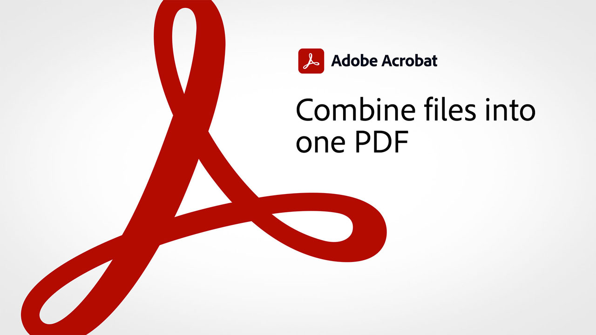

# 60秒Acrobat概述

60秒Acrobat可为您提供小小的教程，帮助您在Acrobat中在一分钟内学会新技巧。 这些基于PDF的提示可帮助您解锁某些Acrobat的隐藏项，从而获取处理任务文件的新技能。 您可以观看1以快速获得答案，或观看5以提高文档工作效率 — 同时仍有时间享受茶歇。

## 60秒Acrobat教程

## 编辑

<table style="table-layout:fixed">
<tr>
   <td>
    
    

    <a href="edit.md"><strong>使用Acrobat Web编辑PDF</strong></a>
    

    <em>对文本和图像进行简单编辑，甚至无需下载PDF</em>
     
  </td>
  <td>
    
    

     <a href="textrecognition.md"><strong>识别扫描的PDF文件</strong></a>
    

    <em>转换扫描的PDF，以便您可以在PDF中搜索文本</em>
     
  </td>
  <td>
    
    

    <a href="combine-to-one-pdf.md"><strong>将文件合并为一个PDF</strong></a>
    

    <em>通过将几种不同类型的文件合并到一个PDF中，快速创建新文档</em>
     
  </td>
   <td>
    
    

    <a href="organize.md"><strong>快速组织页面</strong></a>
    

    <em>了解如何使用“组织页面”工具以鸟瞰方式查看PDF</em>
     
  </td>
</tr>
<tr>
  <td>
    
    

    <a href="editphoto.md"><strong>在您的PDF中编辑照片</strong></a>
    

    <em>了解如何使用Photoshop对PDF中的照片进行高级编辑</em>
     
  </td>
  <td>
    
    

    <a href="editgraphic.md"><strong>编辑PDF中的图形</strong></a>
    

    <em>了解如何使用Illustrator对PDF中的图形进行高级编辑</em>
     
  </td>
  <td>
      
        

         
  </td>
  <td>
      
        

         
  </td>
</tr>
</table>

## 转换

<table style="table-layout:fixed">
<tr>
  <td>
    
    

    <a href="exportwordphone.md"><strong>Export PDF到手机中的Word</strong></a>
    

    <em>使用AcrobatPDF应用程序将Microsoft文件转换为完全可编辑的Word文档</em>
     
  </td>
  <td>
      
        

         
  </td>
  <td>
      
        

         
  </td>
  <td>
      
        

         
  </td>
</tr>
</table>

## 创建

<table style="table-layout:fixed">
<tr>
  <td>
    
    

     <a href="wordform.md"><strong>将Word转换为PDF（包括表单域）</strong></a>
    

    <em>将Word文件和表单转换为PDF并自动构建表单域</em>
     
  </td>
  <td>
      
      

      <a href="photo.md"><strong>立即创建PDF照片</strong></a>
      

      <em>了解如何将一组JPG拖放到Acrobat图标上以创建PDF</em>
       
  </td>
  <td>
    
    

    <a href="phone.md"><strong>将PPT文件转换为手机上的PDF</strong></a>
    

    <em>了解如何将电子邮件PowerPoint附件转换为PDF手机</em>
     
  </td>
  <td>
      
      

      <a href="optimize.md"><strong>快速创建更高效的PDF文件</strong></a>
      

      <em>使用“Optimize PDF”工具显著减小PDF文件的大小</em>
       
  </td>
</tr>
</table>

## 签名

<table style="table-layout:fixed">
<tr>
  <td>
    
    

    <a href="sign.md"><strong>对纸质文档进行电子签名</strong></a>
    

    <em>了解如何使用Adobe Scan签署打印表单</em>
     
  </td>
  <td>
      
        

         
  </td>
  <td>
      
        

         
  </td>
  <td>
      
        

         
  </td>
</tr>
</table>

## 保护

<table style="table-layout:fixed">
<tr>
  <td>
    
    

    <a href="protect.md"><strong>使用密码Protect您的PDF文件</strong></a>
    

    <em>ProtectPDF，以便需要密码才能打开或编辑PDF</em>
     
  </td>
  <td>
      
        

         
  </td>
  <td>
      
        

         
  </td>
  <td>
      
        

         
  </td>
</tr>
</table>

## 准备

<table style="table-layout:fixed">
<tr>
  <td>
    
    

    <a href="accessible.md"><strong>让Acrobat帮助您创建可访问PDF</strong></a>
    

    <em>检查PDF是否可访问</em>
     
  </td>
  <td>
      
        

         
  </td>
  <td>
      
        

         
  </td>
  <td>
      
        

         
  </td>
</tr>
</table>

## 其他主题

<table style="table-layout:fixed">
<tr>
  <td>
    
    

     <a href="search.md"><strong>一次搜索多个PDF文件</strong></a>
    

    <em>在PDF文件中开始搜索，然后打开“高级搜索”并搜索整个PDF文件</em>
     
  </td>
  <td>
    
    

    <a href="indesign.md"><strong>将PDF注释载入InDesign</strong></a>
    

    <em>了解在Acrobat共享审阅后，如何将PDF注释重新加载到InDesign中</em>
     
  </td>
  <td>
      
        

         
  </td>
  <td>
      
        

         
  </td>
</tr>
</table>