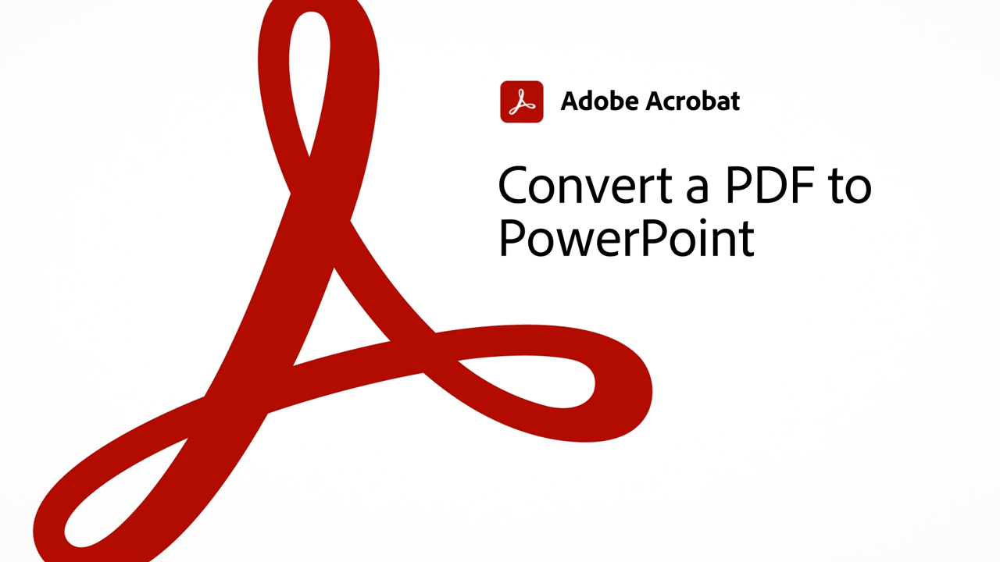

# 60秒Acrobat概述

60秒的Acrobat为您提供小型教程，可帮助您在1分钟或更短的时间内学会Acrobat中的新技巧。 这些基于任务的提示可帮助您通过解锁一些Acrobat的隐藏宝石，掌握处理PDF文件的新技能。 您可以观看其中一项快速获得答案，或观看五项以提高文档工作效率，同时还有时间享受茶歇。

## 60秒Acrobat教程

## 编辑

<table style="table-layout:fixed">
<tr>
   <td>
    
    

    <a href="edit.md"><strong>使用Acrobat Web版编辑PDF</strong></a>
    

    <em>甚至无需下载PDF，即可对文本和图像进行简单的编辑</em>
     
  </td>
  <td>
    
    

     <a href="textrecognition.md"><strong>识别扫描PDF文件中的文本</strong></a>
    

    <em>转换扫描的PDF，以便您可以在PDF中搜索文本</em>
     
  </td>
  <td>
    
    

    <a href="combine-to-one-pdf.md"><strong>将多个文件合并为一个PDF</strong></a>
    

    <em>通过将多种不同类型的文件合并为单个PDF来快速创建新文档</em>
     
  </td>
   <td>
    
    

    <a href="organize.md"><strong>快速整理页面</strong></a>
    

    <em>了解如何使用“整理页面”工具以鸟瞰方式查看PDF</em>
     
  </td>
</tr>
<tr>
  <td>
    
    

    <a href="editphoto.md"><strong>在您的PDF中编辑照片</strong></a>
    

    <em>了解如何使用Photoshop在PDF中对照片进行高级编辑</em>
     
  </td>
  <td>
    
    

    <a href="editgraphic.md"><strong>在PDF中编辑图形</strong></a>
    

    <em>了解如何使用Illustrator对PDF中的图形进行高级编辑</em>
     
  </td>
  <td>
      
        

         
  </td>
  <td>
      
        

         
  </td>
</tr>
</table>

## 转换

<table style="table-layout:fixed">
<tr>
  <td>
    
    

    <a href="convert-pdf-word.md"><strong>将PDF转换为Word</strong></a>
    

    <em>将PDF文件转换为完全可编辑的Microsoft Word文档</em>
     
  </td>
 <td>
    
    

    <a href="convert-pdf-excel.md"><strong>将PDF转换为Excel</strong></a>
    

    <em>将PDF文件转换为完全可编辑的Microsoft Excel文档</em>
     
  </td>
  <td>
    
    

    <a href="convert-pdf-powerpoint.md"><strong>将PDF转换为PowerPoint</strong></a>
    

    <em>将PDF文件转换为完全可编辑的Microsoft PowerPoint文档</em>
     
  </td>
  <td>
    
    

    <a href="exportwordphone.md"><strong>从手机Export PDF到Word</strong></a>
    

    <em>使用Acrobat移动应用程序将PDF文件转换为完全可编辑的Microsoft Word文档</em>
     
  </td>
</tr>
</table>

## 创建

<table style="table-layout:fixed">
<tr>
  <td>
    
    

     <a href="word-to-pdf.md"><strong>从Microsoft Word创建PDF</strong></a>
    

    <em>从Microsoft Word创建PDF</em>
     
  </td>
  <td>
    
    

     <a href="create-from-acrobat.md"><strong>从Acrobat创建PDF</strong></a>
    

    <em>直接在Acrobat桌面应用程序中从Microsoft 365文件创建PDF</em>
     
  </td>
  <td>
    
    

     <a href="wordform.md"><strong>将Word转换为PDF（包括表单字段）</strong></a>
    

    <em>将Word文件和表单转换为PDF并自动构建表单字段</em>
     
  </td>
  <td>
      
      

      <a href="photo.md"><strong>立即创建照片PDF</strong></a>
      

      <em>了解如何将一组JPG拖放到Acrobat图标上以创建PDF</em>
       
  </td>
</tr>
<tr>
  <td>
    
    

    <a href="phone.md"><strong>在手机上将PPT文件转换为PDF</strong></a>
    

    <em>了解如何将电子邮件PowerPoint附件转换为手机上的PDF</em>
     
  </td>
  <td>
      
      

      <a href="optimize.md"><strong>快速创建更高效的PDF文件</strong></a>
      

      <em>使用Optimize PDF工具可显着减小PDF文件的大小</em>
       
  </td>
  <td>
      
        

         
  </td>
  <td>
      
        

         
  </td>
</tr>
</table>

## 签名

<table style="table-layout:fixed">
<tr>
  <td>
    
    

    <a href="sign.md"><strong>对纸质文档进行电子签名</strong></a>
    

    <em>了解如何使用Adobe Scan签署打印的表单</em>
     
  </td>
  <td>
      
        

         
  </td>
  <td>
      
        

         
  </td>
  <td>
      
        

         
  </td>
</tr>
</table>

## 保护

<table style="table-layout:fixed">
<tr>
  <td>
    
    

    <a href="protect.md"><strong>使用密码Protect您的PDF文件</strong></a>
    

    <em>ProtectPDF，因此打开或编辑PDF时需要密码</em>
     
  </td>
  <td>
    
    

    <a href="redaction.md"><strong>密文：正确方法</strong></a>
    

    <em>了解从PDF中删除敏感信息的正确方法</em>
     
  </td>
  <td>
      
        

         
  </td>
  <td>
      
        

         
  </td>
</tr>
</table>

## 共享和审阅

<table style="table-layout:fixed">
<tr>
  <td>
    
    

    <a href="share-comment.md"><strong>共享PDF以供注释</strong></a>
    

    <em>了解如何共享PDF，以便在单个文件中快速收集多个人的反馈</em>
     
  </td>
  <td>
    
    

    <a href="share-comment-teams.md"><strong>在Teams中共享和注释PDF文件</strong></a>
    

    <em>了解如何在Microsoft Teams中实时协作处理PDF文件</em>
     
  </td>
  <td>
    
    

    <a href="summarize-comments.md"><strong>使用摘要整理PDF注释</strong></a>
    

    <em>了解如何创建PDF文件中所有注释和标记的摘要</em>
     
  </td>
   <td>
    
    

    <a href="indesign.md"><strong>将PDF注释加载到InDesign中</strong></a>
    

    <em>了解如何在Acrobat共享审阅后将PDF注释加载回InDesign</em>
     
  </td>
</tr>
</table>

## 准备

<table style="table-layout:fixed">
<tr>
  <td>
    
    

    <a href="accessible.md"><strong>让Acrobat帮助您创建可访问的PDF</strong></a>
    

    <em>检查PDF是否可访问</em>
     
  </td>
 <td>
    
    

    <a href="conform.md"><strong>将PDF匹配到标准格式</strong></a>
    

    <em>了解如何根据PDF标准(如PDF/X、PDF/A或PDF/E)验证PDF内容</em>
     
  </td>
  <td>
      
        

         
  </td>
  <td>
      
        

         
  </td>
</tr>
</table>

## 其他主题

<table style="table-layout:fixed">
<tr>
  <td>
    
    

     <a href="compare.md"><strong>使用“PDF比较”发现差异</strong></a>
    

    <em>了解如何使用Acrobat中的“比较文件”工具找出两个PDF文件之间的差异</em>
     
  </td>
 <td>
    
    

     <a href="search.md"><strong>一次搜索多个PDF文件</strong></a>
    

    <em>在PDF文件中开始搜索，然后打开“Advanced Search”（高级搜索）并搜索PDF文件的整个文件夹</em>
     
  </td>
  <td>
      
        

         
  </td>
  <td>
      
        

         
  </td>
</tr>
</table>