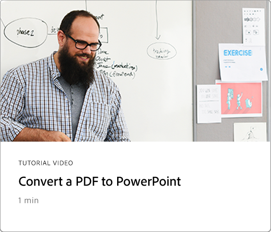

# 60秒Acrobat概述

60秒的Acrobat为您提供小型教程，可帮助您在1分钟或更短的时间内学会Acrobat中的新技巧。 这些基于任务的提示可帮助您通过解锁一些Acrobat的隐藏宝石，掌握处理PDF文件的新技能。 您可以观看其中一项快速获得答案，或观看五项以提高文档工作效率，同时还有时间享受茶歇。

## 60秒Acrobat教程

## 编辑

<table style="table-layout:fixed">
<tr>
   <td>
    
    

    <a href="edit.md"><strong>使用Acrobat Web编辑PDF</strong></a>
    

    了解如何在Acrobat Web版中进行编辑
     
  </td>
  <td>
    
    

    <a href="textrecognition.md"><strong>识别扫描PDF文件中的文本</strong></a>
    

    了解如何识别扫描图像中的文本
     
  </td>
  <td>
    
    

    <a href="combine-to-one-pdf.md"><strong>将文件合并为一个PDF</strong></a>
    

    了解如何快速将文件合并到单个PDF中
     
  </td>
   <td>
    
    

    <a href="organize.md"><strong>快速整理页面</strong></a>
    

    了解如何快速整理PDF中的页面
     
  </td>
</tr>
<tr>
  <td>
    
    

    <a href="editphoto.md"><strong>在您的PDF中编辑照片</strong></a>
    

    了解如何在PDF中编辑照片
  </td>
  <td>
    
    

    <a href="editgraphic.md"><strong>在您的PDF中编辑图形</strong></a>
    

    了解如何在PDF中编辑图形
  </td>
  <td>
      
        

         
  </td>
  <td>
      
        

         
  </td>
</tr>
</table>

## 转换

<table style="table-layout:fixed">
<tr>
  <td>
    
    

    <a href="convert-pdf-word.md"><strong>将PDF转换为Word</strong></a>
    

    了解如何将格式转换为WordPDF
  </td>
 <td>
    
    

    <a href="convert-pdf-excel.md"><strong>将PDF转换为Excel</strong></a>
    

    了解如何将格式转换为ExcelPDF
  </td>
  <td>
    
    

    <a href="convert-pdf-powerpoint.md"><strong>将PDF转换为PowerPoint</strong></a>
    

    了解如何将PDF转换为PowerPoint格式
  </td>
  <td>
    
    

    <a href="exportwordphone.md"><strong>从您的手机Export PDF到Word</strong></a>
    

    了解如何从手机将PDF导出为Word
  </td>
</tr>
</table>

## 创建

<table style="table-layout:fixed">
<tr>
  <td>
    
    

    <a href="word-to-pdf.md"><strong>从Microsoft Word创建PDF</strong></a>
    

    了解如何直接从Word创建PDF
  </td>
  <td>
    
    

    <a href="create-from-acrobat.md"><strong>从Acrobat创建PDF</strong></a>
    

    了解如何从Acrobat内部创建PDF
  <td>
    
    

    <a href="wordform.md"><strong>将Word转换为PDF（包括表单字段）</strong></a>
    

    将Word文件转换为PDF并自动生成表单字段
  </td>
  <td>
    
    

    <a href="photo.md"><strong>立即创建照片PDF</strong></a>
    

    创建多张照片的PDF
  </td>
</tr>
<tr>
  <td>
    
    

    <a href="phone.md"><strong>在手机上将PPT文件转换为PDF</strong></a>
    

    将PowerPoint文件转换为手机上的PDF
  </td>
  <td>
    
    

    <a href="optimize.md"><strong>快速创建更高效的PDF文件</strong></a>
    

    快速优化PDF文件
  </td>
  <td>
      
        

         
  </td>
  <td>
      
        

         
  </td>
</tr>
</table>

## 签名

<table style="table-layout:fixed">
<tr>
  <td>
    
    

    <a href="sign.md"><strong>对纸质文档进行电子签名</strong></a>
    

    了解如何对纸质文档进行电子签名
  </td>
  <td>
      
        

         
  </td>
  <td>
      
        

         
  </td>
  <td>
      
        

         
  </td>
</tr>
</table>

## 保护

<table style="table-layout:fixed">
<tr>
  <td>
    
    

    <a href="protect.md"><strong>使用密码Protect您的PDF文件</strong></a>
    

    了解如何使用密码保护您的PDF
  </td>
  <td>
    
    

    <a href="redaction.md"><strong>密文：正确的方式</strong></a>
    

    了解如何以正确的方式将PDF中的敏感信息标记为密文
  </td>
  <td>
      
        

         
  </td>
  <td>
      
        

         
  </td>
</tr>
</table>

## 共享和审阅

<table style="table-layout:fixed">
<tr>
  <td>
    
    

    <a href="share-comment.md"><strong>共享PDF以供注释</strong></a>
    

    了解如何共享PDF以供他人发表评论
  </td>
  <td>
    
    

    <a href="share-comment-teams.md"><strong>在Teams中共享和注释PDF文件</strong></a>
    

    在Microsoft Teams中共享和注释PDF文件
  </td>
  <td>
    
    

    <a href="summarize-comments.md"><strong>整理包含摘要的PDF注释</strong></a>
    

    将所有注释汇总到单个PDF中
  </td>
   <td>
    
    

    <a href="indesign.md"><strong>将PDF注释加载到InDesign</strong></a>
    

    了解如何将您的所有PDF注释导入InDesign
  </td>
</tr>
</table>

## 准备

<table style="table-layout:fixed">
<tr>
  <td>
    
    

    <a href="accessible.md"><strong>让Acrobat帮助您创建可访问的PDF</strong></a>
    

    了解如何使您的PDF可普遍访问
  </td>
 <td>
    
    

    <a href="conform.md"><strong>将PDF匹配为标准格式</strong></a>
    

    了解如何使PDF符合特定标准
  </td>
  <td>
      
        

         
  </td>
  <td>
      
        

         
  </td>
</tr>
</table>

## 其他主题

<table style="table-layout:fixed">
<tr>
  <td>
    
    

    <a href="compare.md"><strong>使用PDF比较发现差异</strong></a>
    

    了解如何快速比较两个PDF之间的差异
  </td>
 <td>
    
    

    <a href="search.md"><strong>一次搜索多个PDF文件</strong></a>
    

    了解如何跨多个PDF文件进行搜索
  </td>
  <td>
      
        

         
  </td>
  <td>
      
        

         
  </td>
</tr>
</table>