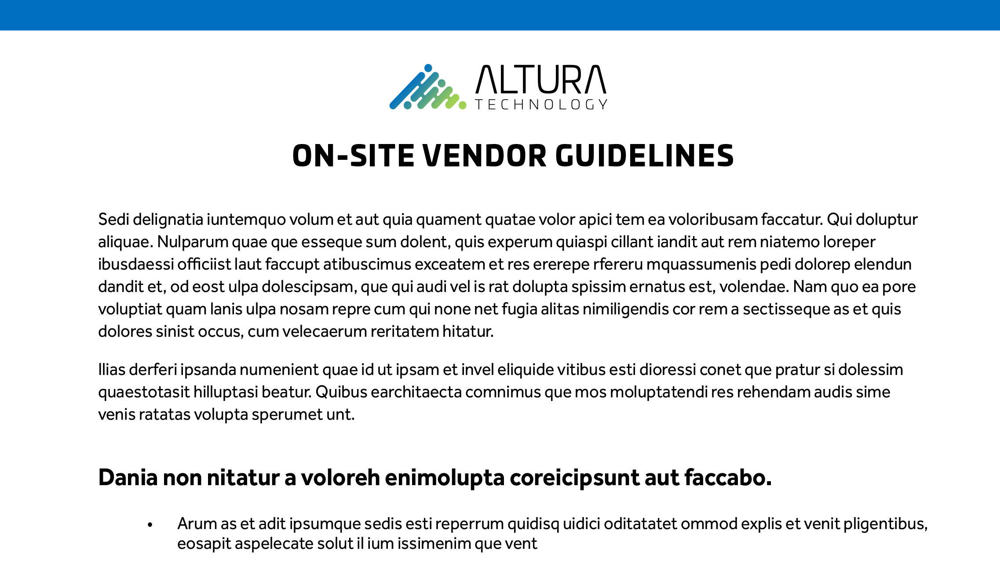

# 60秒Acrobat概述

60秒的Acrobat为您提供小型教程，可帮助您在1分钟或更短的时间内学会Acrobat中的新技巧。 这些基于任务的提示可帮助您通过解锁一些Acrobat的隐藏宝石，掌握处理PDF文件的新技能。 您可以观看其中一项快速获得答案，或观看五项以提高文档工作效率，同时还有时间享受茶歇。

## 60秒Acrobat教程

## 编辑

<table style="table-layout:fixed">
<tr>
   <td>
    
  </td>
  <td>
    
  </td>
  <td>
    
  </td>
   <td>
    
  </td>
</tr>
<tr>
  <td>
    
  </td>
  <td>
    
  </td>
  <td>
      
        

         
  </td>
  <td>
      
        

         
  </td>
</tr>
</table>

## 转换

<table style="table-layout:fixed">
<tr>
  <td>
    
  </td>
 <td>
    
  </td>
  <td>
    
  </td>
  <td>
    
  </td>
</tr>
</table>

## 创建

<table style="table-layout:fixed">
<tr>
  <td>
    
  </td>
  <td>
    
  <td>
    
  </td>
  <td>
      
  </td>
</tr>
<tr>
  <td>
    
  </td>
  <td>
      
  </td>
  <td>
      
        

         
  </td>
  <td>
      
        

         
  </td>
</tr>
</table>

## 签名

<table style="table-layout:fixed">
<tr>
  <td>
    
  </td>
  <td>
      
        

         
  </td>
  <td>
      
        

         
  </td>
  <td>
      
        

         
  </td>
</tr>
</table>

## 保护

<table style="table-layout:fixed">
<tr>
  <td>
    
  </td>
  <td>
    
  </td>
  <td>
      
        

         
  </td>
  <td>
      
        

         
  </td>
</tr>
</table>

## 共享和审阅

<table style="table-layout:fixed">
<tr>
  <td>
    
  </td>
  <td>
    
  </td>
  <td>
    
  </td>
   <td>
    
  </td>
</tr>
</table>

## 准备

<table style="table-layout:fixed">
<tr>
  <td>
    
  </td>
 <td>
    
  </td>
  <td>
      
        

         
  </td>
  <td>
      
        

         
  </td>
</tr>
</table>

## 其他主题

<table style="table-layout:fixed">
<tr>
  <td>
    
  </td>
 <td>
    
  </td>
  <td>
      
        

         
  </td>
  <td>
      
        

         
  </td>
</tr>
</table>