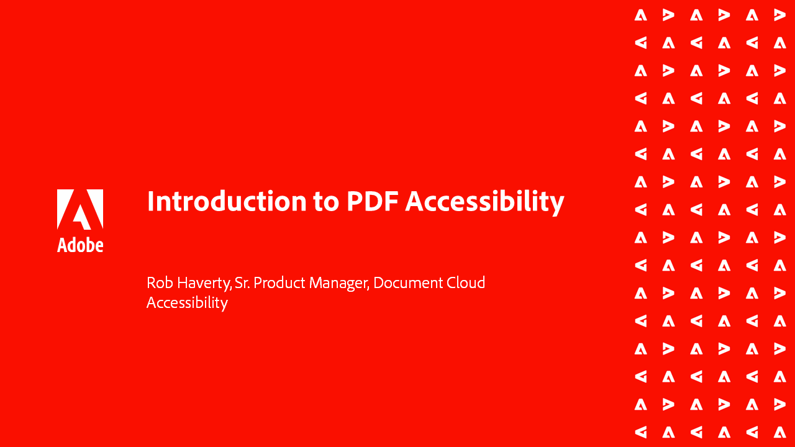

# Acrobat辅助功能系列

在本系列由六个部分组成的按需网络研讨会中，从辅助功能的基础知识到为PDF文件添加标签进行了深入的探索。 每个会话都包含练习文件，您可以跟着视频上手操作。

<table style="table-layout:fixed">
<tr>
  <td>
    
    

    <a href="accessibilitysession1.md"><strong>PDF辅助功能简介</strong></a>
    

    <em>在此按需会话中，了解使PDF可访问意味着什么，如何设置Acrobat Pro以处理可访问性PDF，以及如何从源文档转换为PDF</em>
     
  </td>
  <td>
    
    

    <a href="accessibilitysession2.md"><strong>正在修正无法访问的PDF</strong></a>
    

    <em>在此按需会话中，了解转换Word文档的工作流程，并使用简介网络研讨会中显示的Acrobat Pro工具修复一些基本的标记问题</em>
     
  </td>  
  <td>
    
    

    <a href="accessibilitysession3.md"><strong>复杂表</strong></a>
    

    <em>此按需会话解决了为辅助功能修正PDF时比较常见且更具挑战性的问题之一 — 复杂表格</em>
     
  </td>
</tr>
<tr>
  <td>
    
    

    <a href="accessibilitysession4.md"><strong>扫描的文档和复杂列表</strong></a>
    

    <em>此按需会话解决了人们经常遇到的更复杂的问题，如扫描文档和复杂列表</em>
     
  </td>
  <td>
    
    

    <a href="accessibilitysession5.md"><strong>将表单域添加到加标签的PDF</strong></a>
    

    <em>此按需会话侧重于将表单字段添加到之前标记的PDF</em>
     
  </td>  
  <td>
    
    

    <a href="accessibilitysession6.md"><strong>将表单字段添加到未加标签的PDF</strong></a>
    

    <em>此按需会话更深入地探讨了创建手动表单字段和其他表单字段属性</em>
     
  </td> 
</tr>
</table>
