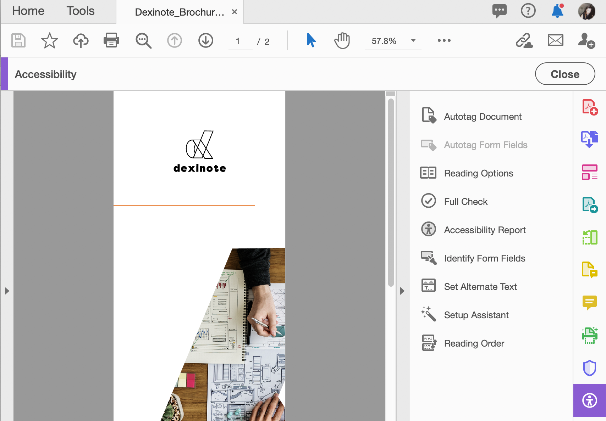

# 检查PDF辅助功能

了解如何检查您的PDF是否可普遍为残障人士使用，包括行动不便、失明、视力低下、失聪、听力困难或认知障碍人士。

>[!NOTE]
>
>仅适用于Acrobat Pro。

## 辅助工具检查

1. 从“工具”中心或右侧窗格中选择&#x200B;**[!UICONTROL 辅助功能]**。

   

1. 在右侧窗格中选择&#x200B;**[!UICONTROL 辅助功能检查]**。

   

1. 从下拉菜单中选择类别，然后从清单中选择项目。

   保持选中每个复选框以生成完整的报告。

1. 选择&#x200B;**[!UICONTROL 开始检查]**&#x200B;以开始报告。

   

   左侧导览窗格将打开，以显示报告结果。 展开某个部分以查看详细信息。

   

您还可以使用[工具](https://experienceleague.adobe.com/docs/document-cloud-learn/acrobat-learning/advanced-tasks/action.html)Action Wizard中的[!UICONTROL 使其可访问]操作，该操作将逐步完成一组创建可访问PDF的基本步骤。

## 修复辅助功能问题

在辅助功能报告窗口中，右键单击某个项目以显示上下文菜单。 任何未通过辅助功能检查的项目的上下文菜单都为您提供了修复该问题的选项。

>[!NOTE]
>
>某些问题无法自动修复，需要手动干预以更正此问题。 在这种情况下，>Acrobat会显示一个对话框，告诉您应如何校正。