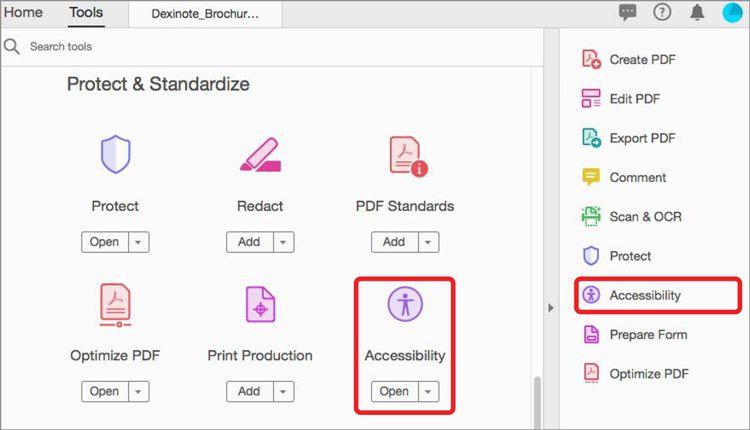

# 检查PDF辅助功能

了解如何检查残疾人士是否普遍可使用您的PDF，包括行动不便、失明、视力低下、耳聋、听力困难或有认知障碍的人。

>[!NOTE]
>
>仅适用于Acrobat Pro。

## 辅助工具检查

1. 选择 **[!UICONTROL 辅助功能]** （从“工具”中心或右侧窗格中）。

   

1. 选择 **[!UICONTROL 辅助工具检查]** 图标。

   

1. 从下拉列表中选择一个类别，然后从清单中选择多个项目。

   选中每个框以获取完整报告。

1. 选择 **[!UICONTROL 开始检查]** 开始报告。

   

   将打开左侧导航窗格以显示报告结果。 展开部分以查看详细信息。

   

您也可以使用 [!UICONTROL 添加辅助工具] 中的操作 [Action Wizard](https://experienceleague.adobe.com/docs/document-cloud-learn/acrobat-learning/advanced-tasks/action.html) 该工具将完成一组基本步骤以创建可访问的PDF。

## 修复辅助工具问题

在辅助功能报告窗口中，右键单击项目以显示上下文菜单。 任何未通过辅助工具检查的项目的上下文菜单会为您提供用于修复该问题的选项。

>[!NOTE]
>
>有些问题无法自动修复，您需要手动干预才能更正此问题。 在这些情况下，>Acrobat会显示一个对话框，告诉您应该更正哪些内容。