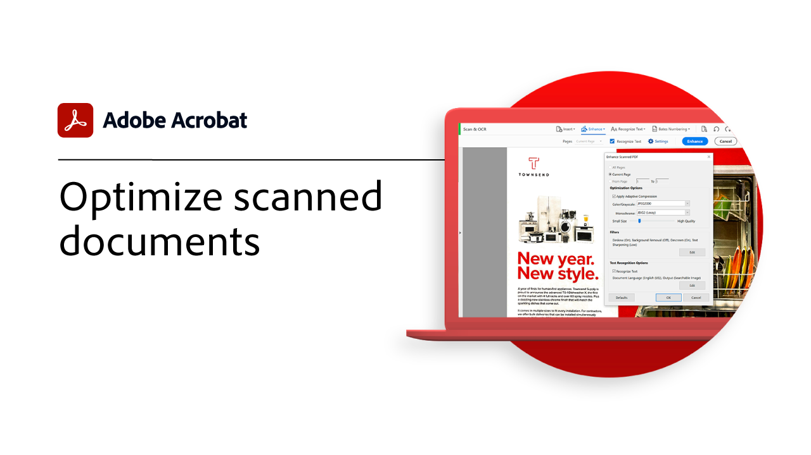

# 高级任务概述

使用Acrobat中的这些高级工具，超越基础知识。 了解如何创建动作以重复平凡的任务、删除敏感信息、减少和优化大型文件、快速收集表单数据以及创建可普遍访问的PDF文件。

## 新增功能

* [用于SEO（搜索引擎优化）的Optimize PDF](optimizeseo.md)
了解如何优化PDF以提高可发现性并改善搜索引擎在Web上的排名

## 高级任务教程

<table style="table-layout:fixed">
<tr>
  <td>
    
    

    <a href="bookmarks.md"><strong>添加书签和超链接</strong></a>
    

    <em>了解如何添加书签和超链接以便更好地导航和交互</em>
     
  </td>
  <td>
    
    

    <a href="optimizescan.md"><strong>优化扫描的文档</strong></a>
    

    <em>了解如何增强扫描的文档，以获得更好的PDF查看和搜索体验</em>
     
  </td>
  <td>
    
    

    <a href="custom.md"><strong>自定义命令和工具</strong></a>
    

    <em>使用自定义命令和工具提高文档工作流程的工作效率</em>
     
  </td>
  <td>
    
    

    <a href="advancedforms.md"><strong>高级表单字段</strong></a>
    

    <em>学习构建专业PDF forms的高级技巧</em>
     
  </td>
</tr>
<tr>
 <td>
    
    

    <a href="optimizeseo.md"><strong>用于SEO（搜索引擎优化）的Optimize PDF</strong></a>
    

    <em>优化PDF以提高可发现性和搜索引擎在Web上的排名</em>
     
  </td>
  <td>
    
    

    <a href="workforms.md"><strong>处理表单域</strong></a>
    

    <em>添加各种类型的表单域，设置表单域属性，并添加安全性以创建高质量的专业表单</em>
     
  </td>
  <td>
    
    

    <a href="enhance.md"><strong>增强您的PDF</strong></a>
    

    <em>通过添加图形增强功能和自动编号功能来转换PDF</em>
     
  </td>
 <td>
    
    

    <a href="compare.md"><strong>检测两个PDF之间的差异</strong></a>
    

    <em>快速准确地检测两个PDF文件之间的差异</em>
     
  </td>
</tr>
<tr>
  <td>
    
    

    <a href="action.md"><strong>Action Wizard</strong></a>
    

    <em>通过使用操作将一组命令自动应用于一个或多个文件，从而节省时间和按键</em>
     
  </td>
  <td>
    
    

    <a href="redact.md"><strong>标记密文并进行整理</strong></a>
    

    <em>从PDF中永久删除私人或敏感信息</em>
     
  </td>
 <td>
    
    

    <a href="reduce.md"><strong>减小文件大小并进行优化</strong></a>
    

    <em>在不影响共享、发布或归档质量的情况下，减少大型文件并优化您的PDF</em>
     
  </td>
  <td>
    
    

    <a href="formdata.md"><strong>使用表单数据</strong></a>
    

    <em>将表单数据编译到单个电子表格中</em>
     
  </td>
</tr>
<tr>
 <td>
    
    

    <a href="accessibility.md"><strong>检查PDF辅助功能</strong></a>
    

    <em>检查您的PDF是否可供残障人士普遍访问</em>
     
  </td>
 <td>
    
    

    <a href="accessibility-series.md"><strong>Acrobat辅助功能系列</strong></a>
    

    <em>在本次六部分点播网络研讨会系列中，从辅助功能的基础知识到为PDF文件添加标签的深入探索</em>
     
  </td>
  <td>
   
    

     
  </td> 
  <td>
   
    

     
  </td>  
</tr>
</table>
