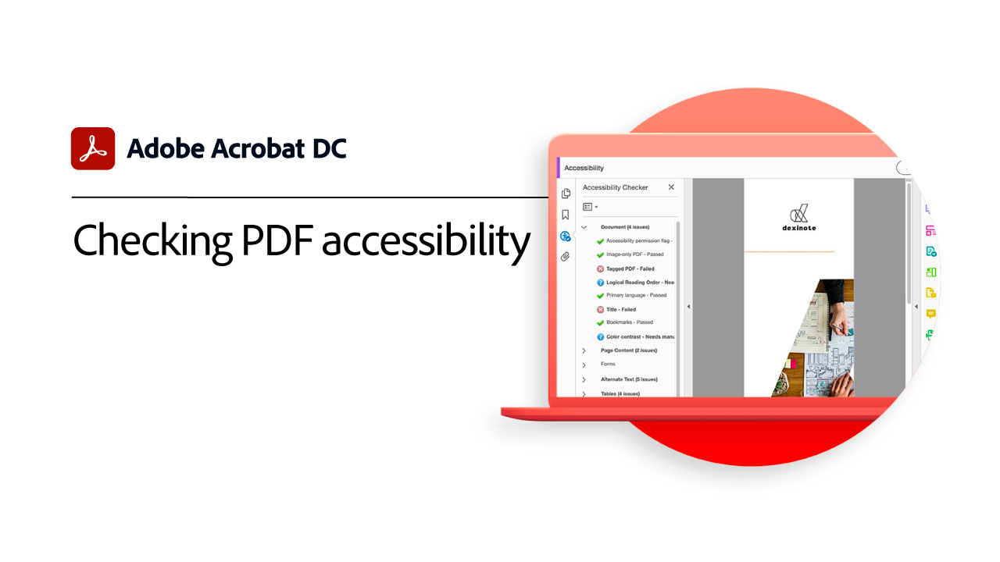

# 高级任务概述

借助Acrobat中的这些高级工具，超越基础知识。 了解如何创建动作以重复普通任务、删除敏感信息、减少和优化大型文件、快速收集表单数据以及创建可普遍访问的PDF文件。

## Acrobat教程

<table style="table-layout:fixed">
<tr>
  <td>
    
    

    <a href="optimizeseo.md"><strong>SEO的Optimize PDF</strong></a>
    

    <em>优化PDF以提高Web上的可发现性和搜索引擎排名</em>
     
  </td>
  <td>
    
    

    <a href="workforms.md"><strong>使用表单域</strong></a>
    

    <em>添加各种类型的表单域，设置表单域属性，并添加安全性以创建高质量的专业表单</em>
     
  </td>
  <td>
    
    

    <a href="enhance.md"><strong>增强您的PDF</strong></a>
    

    <em>通过添加图形增强PDF和自动编号功能转变字体</em>
     
  </td>
</tr>
<tr>
  <td>
    
    

    <a href="compare.md"><strong>检测两个PDF之间的差异</strong></a>
    

    <em>快速准确地检测两个PDF文件</em>
     
  </td> 
  <td>
    
    

    <a href="action.md"><strong>Action Wizard</strong></a>
    

    <em>通过使用动作将一组命令自动应用于一个或多个文件，节省时间和按键操作</em>
     
  </td>  
  <td>
    
    

    <a href="redact.md"><strong>标记密文和整理</strong></a>
    

    <em>从您的PDF中永久删除隐私或敏感信息</em>
     
  </td>
</tr>
<tr>
  <td>
    
    

    <a href="reduce.md"><strong>减小文件大小并优化</strong></a>
    

    <em>减少大型文件并优化PDF，同时不影响共享、发布或存档的质量</em>
     
  </td>
   <td>
    
    

    <a href="formdata.md"><strong>使用表单数据</strong></a>
    

    <em>将表单数据编译成单个电子表格</em>
     
  </td>
   <td>
    
    

    <a href="accessibility.md"><strong>检查PDF辅助功能</strong></a>
    

    <em>了解如何检查是否残障人士能够普遍访问PDF</em>
     
  </td>
</tr>
<tr>
  <td>
    
    

    <a href="accessibility-series.md"><strong>Acrobat Accessibility系列</strong></a>
    

    <em>在这个六部分点播网络研讨会系列中，从辅助功能的基础知识到为PDF文件添加标签的深入探索</em>
     
  </td>
  <td>
   
    

     
  </td>
  <td>
   
    

     
  </td>
</tr>
</table>
