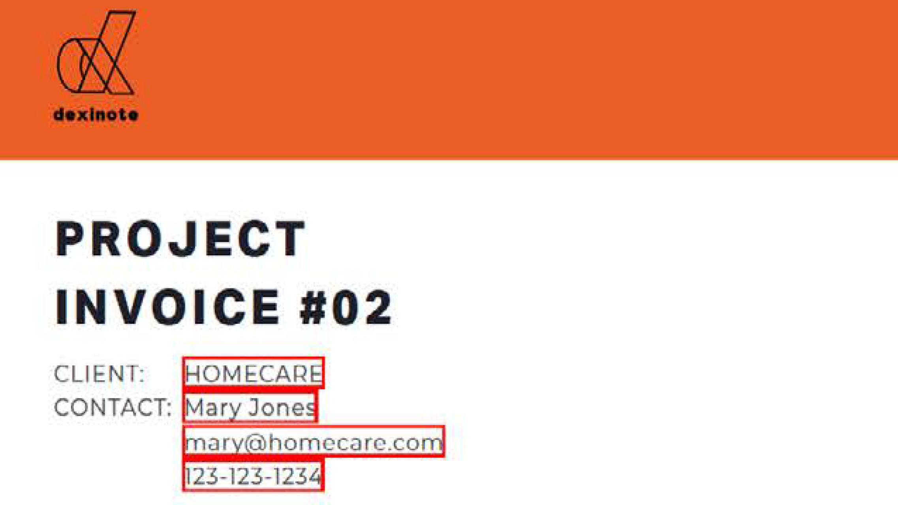

# 高级任务概述

使用Acrobat中的这些高级工具，超越基础知识。 了解如何创建动作以重复平凡的任务、删除敏感信息、减少和优化大型文件、快速收集表单数据以及创建可普遍访问的PDF文件。 查看这组精心编制的[播放列表](https://experienceleague.adobe.com/en/playlists/acrobat-peform-advanced-tasks)，了解如何在Acrobat中执行高级任务。

## 新增功能

>[!BEGINTABS]

>[!TAB 引导式操作]

了解如何使用[引导式操作](action.md)提高效率。

>[!TAB SEO（搜索引擎优化）的Optimize PDF]

了解如何[优化PDF](optimizeseo.md)以提高可发现性并改善搜索引擎在Web上的排名。

>[!ENDTABS]

## 高级任务教程

<table style="table-layout:fixed">
<tr>
  <td>
    
    

      <a href="bookmarks.md"><strong>添加书签和超链接</strong></a>
      

      添加书签和超链接以便更好地导航
  </td>
  <td>
    
    

      <a href="optimizescan.md"><strong>优化扫描的文档</strong></a>
      

      了解如何增强扫描的文档
  </td>
  <td>
    
    

      <a href="custom.md"><strong>自定义命令和工具</strong></a>
      

      了解如何提高文档工作流程的效率
  </td>
  <td>
    
    

      <a href="advancedforms.md"><strong>高级表单字段</strong></a>
      

      了解如何构建高级表单字段
  </td>
</tr>
<tr>
 <td>
    
    

      <a href="optimizeseo.md"><strong>SEOOptimize PDF</strong></a>
      

      为SEO优化PDF（搜索引擎优化）
  </td>
  <td>
    
    

      <a href="workforms.md"><strong>处理表单域</strong></a>
      

      了解如何添加各种类型的表单域和属性
  </td>
  <td>
    
    

      <a href="enhance.md"><strong>增强您的PDF</strong></a>
      

      了解如何转变您的PDF
  </td>
 <td>
    
    

      <a href="compare.md"><strong>检测两个PDF之间的差异</strong></a>
      

      快速检测两个PDF文件之间的差异
  </td>
</tr>
<tr>
  <td>
    
    

      <a href="action.md"><strong>引导式操作</strong></a>
      

      了解如何使用引导式操作提高效率
  </td>
  <td>
    
    

      <a href="redact.md"><strong>标记密文并进行整理</strong></a>
      

      了解如何永久删除敏感信息
  </td>
 <td>
    
    

      <a href="reduce.md"><strong>减小文件大小并优化</strong></a>
      

      在不影响质量的情况下减少大型文件
  </td>
  <td>
    
    

      <a href="formdata.md"><strong>处理表单数据</strong></a>
      

      了解如何编译表单数据
  </td>
</tr>
<tr>
 <td>
    
    

      <a href="accessibility.md"><strong>检查PDF辅助功能</strong></a>
      

      了解如何检查您的PDF是否可普遍访问
  </td>
 <td>
    
    

      <a href="accessibility-series.md"><strong>Acrobat辅助功能系列</strong></a>
      

      六节点播PDF辅助功能系列
  </td>
  <td>
   
    

     
  </td> 
  <td>
   
    

     
  </td>  
</tr>
</table>
