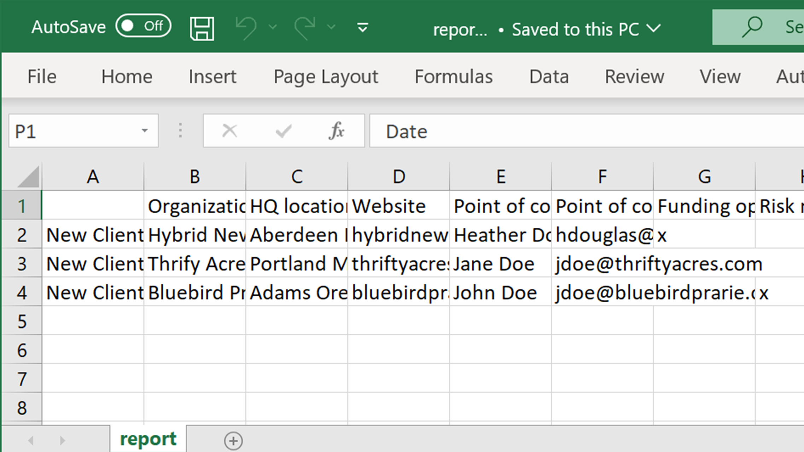

# 高级任务概述

使用Acrobat中的这些高级工具，超越基础知识。 了解如何创建动作以重复平凡的任务、删除敏感信息、减少和优化大型文件、快速收集表单数据以及创建可普遍访问的PDF文件。

## 新增功能

* [SEO（搜索引擎优化）的Optimize PDF](optimizeseo.md)
了解如何优化PDF以提高可发现性并改善搜索引擎在Web上的排名

## 高级任务教程

<table style="table-layout:fixed">
<tr>
  <td>
    
  </td>
  <td>
    
  </td>
  <td>
    
  </td>
  <td>
    
  </td>
</tr>
<tr>
 <td>
    
  </td>
  <td>
    
  </td>
  <td>
    
  </td>
 <td>
    
  </td>
</tr>
<tr>
  <td>
    
  </td>
  <td>
    
  </td>
 <td>
    
  </td>
  <td>
    
  </td>
</tr>
<tr>
 <td>
    
  </td>
 <td>
    
  </td>
  <td>
   
    

     
  </td> 
  <td>
   
    

     
  </td>  
</tr>
</table>
