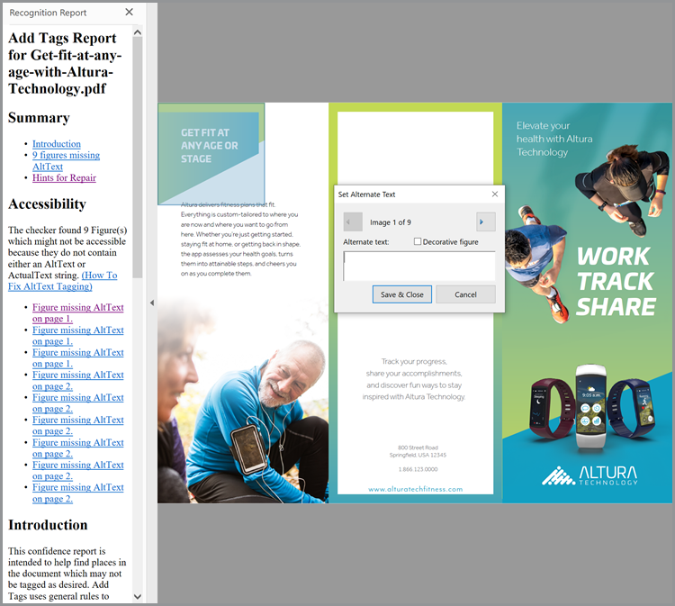

# SEO（搜索引擎优化）的Optimize PDF

了解如何优化PDF以提高发现能力和搜索引擎在Web上的排名。

## 1.创建独特的内容

创建PDF内容，这些内容与网页中的信息不同。

+++查看有关如何创建独特内容的详细信息

PDF内容应独特且结构如下：

* 使用以关键字开头的单个主标题/标题
* 使用按层次结构组织的关键字小标题
* 使用包含关键字和列表的短段落
* 添加内部和外部超链接（您的网站或其他网站上的内容）
* 为超过25页的文档添加超链接目录
* 运行 [文本识别](https://experienceleague.adobe.com/docs/document-cloud-learn/acrobat-learning/getting-started/scan-and-ocr.html) 在所有扫描的文档上
* 构建PDF以方便移动查看要查看PDF的移动查看体验，请在 [Acrobat Reader移动应用程序](https://www.adobe.com/acrobat/mobile/acrobat-reader.html) 并打开Liquid Mode。 如果需要以改善导航，则包括附加副标题。

   

+++

  

## 2.添加文档属性

PDF文件具有标题和元说明，就像网页一样。

+++查看有关如何添加文档属性的详细信息

添加键 **[!UICONTROL 文档属性]** 如下：

1. 选择 **[!UICONTROL “文件”>“属性”]** 或者使用键盘快捷键 *Ctrl + D* 在Windows或 *Cmd + D* ，然后选择 **[!UICONTROL 说明]** 选项卡。
1. 在 **[!UICONTROL 标题：]** 字段。
1. 确保 **[!UICONTROL 作者：]** 此字段不标识组织内的特定个人。
1. 在 **[!UICONTROL 主题：]** 字段。
尝试使用“学习”、“发现”、“探索”等动作动词启动小结。
1. 选择 **[!UICONTROL 其他元数据]** 添加版权或公共域信息（如果适用）。

   

+++

  

## 3.标记您的PDF

为内容添加标签到PDF中不仅会生成您的文件 [可访问](https://experienceleague.adobe.com/docs/document-cloud-learn/acrobat-learning/advanced-tasks/accessibility.html) 对于残障人士，它还可以提高SEO。

+++查看有关如何标记PDF

按如下方式为PDF添加标签：

1. 选择 **[!UICONTROL 辅助功能]** 的 **[!UICONTROL 工具]** 中心。
1. 选择 **[!UICONTROL 自动为文档添加标签]** 图标。
1. 按照左侧窗格中的修复提示进行操作 **[!UICONTROL 确认报告]**&#x200B;的
1. 运行 **[!UICONTROL 设置替代文本]** 如有必要。
1. 使用关键字来描述 **[!UICONTROL 替代文本]**&#x200B;的

   

+++

>[!NOTE]
>
>仅适用于Acrobat Pro。

  

## 4.为Web做准备

通过为Web查看和 [减小PDF文件大小](https://www.adobe.com/acrobat/online/compress-pdf.html){target="_blank"}的

+++查看有关如何为Web准备PDF的详细信息

按如下方式准备PDF以用于Web:

要准备PDF以用于Web，请选择 **[!UICONTROL “文件”>“另存为其它”>“缩小大小”PDF]**&#x200B;的

此步骤可减少文件大小并启用 **快速Web查看** 在PDF中。 **快速Web查看** 允许在对整个文件进行流式处理或下载之前立即打开、查看和搜索文件 — 创建最佳的最终用户体验。 打开 **[!UICONTROL 文档属性]** (*Ctrl + D* 在Windows或 *Cmd + D* 在Mac上)，以确定是否 **快速Web查看** 选项。

>[!TIP]
>
>如果您拥有Acrobat Pro，请在“Action Wizard”工具中运行“针对Web和移动设备优化”。 此动作将颜色转换为sRGB并嵌入字体，以便跨浏览器和移动设备一致显示PDF。

+++

  

## 5.创建关键字文件名

+++查看有关如何创建关键字文件名的详细信息

按如下方式创建关键字文件名：

在Web上发布PDF时，文件名将成为URL的一部分。 好的做法是将关键字优化的标题与文件名匹配。 为了便于搜索，应使用小写、无标点符号或哈希，并避免使用单词（a、an、and、it、for或，但in、my、your、our和their等）。 如果您使用单独的单词，请在单词之间添加连字符或下划线。

+++

  

## 6.保护您的PDF

最后一步是 [保护您的PDF](https://www.adobe.com/acrobat/online/password-protect-pdf.html){target="_blank"} 以防止未经授权的更改。

+++查看有关如何保护您的PDF

按以下方式保护PDF:

1. 打开 **[!UICONTROL 文档属性]** (*Ctrl + D* 在Windows或 *Cmd + D* 在Mac上)，然后选择 **[!UICONTROL 安全性]** 选项卡。
1. 检查 **[!UICONTROL 打印编辑和打印文档。 更改这些设置需要密码。]**
1. 在 **[!UICONTROL 允许更改：]** 选择 **[!UICONTROL 无]**&#x200B;的
1. 检查 **[!UICONTROL 为视力不佳者启用屏幕阅读器设备的文本辅助工具。]**
1. 输入并确认强密码。
1. 选择 **[!UICONTROL 确定]** 并保存文件。

   

+++

现在，您的PDF已准备好发布到Web上 — 具有最佳关键字排名潜力和最终用户交互。
