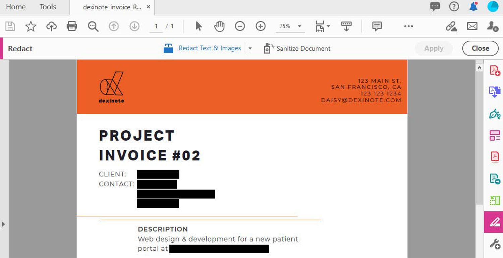

# 标记密文并进行整理

了解如何使用“Redact Tool”（标记密文）工具永久删除PDF中的私人或敏感信息。 使用整理工具移除文件中不可见的信息，如注释、元数据或隐藏的图层。

>[!NOTE]
>
>仅适用于Acrobat Pro。

[!BADGE 组织影响]
客户数据保护、风险管理

## 将文本和图像标记为密文

1. 从[!UICONTROL 工具]中心或右侧窗格中选择&#x200B;**[!UICONTROL 标记密文]**。

   标记为密文

1. 选择&#x200B;**[!UICONTROL 将文本和图像标记为密文]** **>** **[!UICONTROL 属性]**&#x200B;以自定义密文的外观，包括密文框或文本叠加的颜色。

   标记为密文

要将信息标记为密文，请首先标记要删除的项目，然后应用密文。 您可以将整个页面或所选内容标记为密文。

1. 选择“**[!UICONTROL 将页面标记为密文]**”，然后选择要标记为密文的页面或页面范围，并选择“**[!UICONTROL 确定]**”。

   标记为密文

或者，使用光标选择要标记密文的内容。 将鼠标悬停在选定内容上，可以看到密文的预览。

   标记为密文

1. 选择&#x200B;**[!UICONTROL 将文本和图像标记为密文]** **>** **[!UICONTROL 查找文本和密文]**&#x200B;以查找要标记为密文的特定内容。

使用搜索框可搜索特定的单词或短语。

1. 选择&#x200B;**[!UICONTROL 图案]**&#x200B;以查找某些类型 of 信息，然后选中这些框并选择&#x200B;**[!UICONTROL 搜索并删除文本]**。

   

1. 在[!UICONTROL 标记密文]顶部菜单中选择&#x200B;**[!UICONTROL 应用]**&#x200B;以应用标记的密文并保存密文处理后的文件。

   标记为密文

## 整理文档

1. 在[!UICONTROL 标记密文]顶部菜单中选择&#x200B;**[!UICONTROL 整理文档]**。

1. 选择“**[!UICONTROL 确定]**”以确认删除隐藏信息。 或者，选择&#x200B;**[!UICONTROL 单击此处]**&#x200B;以有选择地删除隐藏信息。

   

>[!TIP]
>
>要加快密文过程，请查看[Action Wizard](../advanced-tasks/action.md)。

>[!TIP]
>
>此视频是Experience League上免费提供的播放列表[“在Adobe Acrobat中执行高级任务”](https://experienceleague.adobe.com/zh-hans/playlists/acrobat-peform-advanced-tasks)的一部分！
