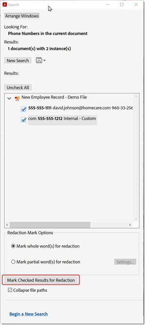

# 标记密文并整理

了解如何使用“标记密文”工具从PDF中永久删除私人或敏感信息。 使用“清理”工具可删除文件中不可见的信息，如注释、元数据或隐藏图层。

>[!NOTE]
>
>仅在Acrobat Pro DC中可用。

## 将文本和图像标记为密文

1. 在Acrobat Pro DC中，从[!UICONTROL 工具]中心或窗格中选择&#x200B;**[!UICONTROL 标记]**。

   

1. 打开&#x200B;**[!UICONTROL 属性]**&#x200B;可自定义密文的外观，包括密文框或文本叠加的颜色。

   

1. 要将信息标记为密文，请标记要删除的项，然后应用密文。

   您可以将整个页面或选定内容标记为密文。

1. 要将整个页面标记为密文，请选择&#x200B;**[!UICONTROL 将页面标记为密文]**，选择要标记为密文的页面或页面范围，然后单击&#x200B;**[!UICONTROL 确定]**。

   

1. 要查找要标记密文的特定内容，请选择&#x200B;**[!UICONTROL 标记密文和图像，查找文本和标记密文]**。

   使用光标选择要标记密文的内容，并通过将鼠标悬停在所选内容上来查看密文预览。

   

   使用搜索框搜索特定的单词或短语，或选择&#x200B;**[!UICONTROL 模式]**&#x200B;以查找特定类型的信息。 选择项目旁边的框，然后单击&#x200B;**[!UICONTROL 搜索并删除文本]**。

   

1. 单击[!UICONTROL 标记密文]顶部菜单栏中的&#x200B;**[!UICONTROL 应用]**，以应用标记的密文并保存密文文件。

   

## 整理文档

1. 在&#x200B;**[!UICONTROL “标记密文]**”工具栏打开时，单击顶部菜单栏中的“清理文档&#x200B;]**”。**[!UICONTROL 

1. 单击&#x200B;**确定**&#x200B;以确认从文档中删除所有隐藏信息。

   或者，单击以有选择地删除隐藏信息，选择要隐藏的信息，然后单击&#x200B;**[!UICONTROL 删除]**。

   

>[!TIP]
>
>要加快密文过程，请查看[Action Wizard](../advanced-tasks/action.md)。

单击以下载&#x200B;*标记密文和整理*&#x200B;教程的PDF。

。
