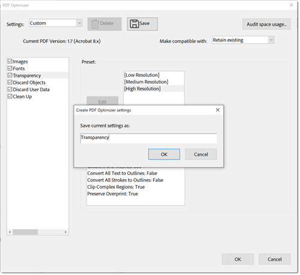

# 压缩和优化PDF

了解如何压缩和优化PDF文件的大小。 通过压缩PDF，可以更轻松地通过电子邮件共享内容或上传到文件大小有限的网站。 您还可以通过优化PDF来增强观看体验并节省存储成本。

## 如何在Acrobat桌面版中压缩PDF

1. 打开文件并从工具栏中选择&#x200B;**[!UICONTROL 所有工具]**，然后选择&#x200B;**[!UICONTROL 压缩PDF]**。

   

1. 在&#x200B;**[!UICONTROL 压缩PDF]**&#x200B;面板中选择&#x200B;**[!UICONTROL 单个文件]**&#x200B;或&#x200B;**[!UICONTROL 多个文件]**，然后选择&#x200B;**[!UICONTROL 保存]**。

   在保持文档质量的同时，文件会尽可能减小到最小。

   

1. 选择&#x200B;**[!UICONTROL 保存]**。

   

## 如何在Acrobat Web版中压缩PDF

1. 在浏览器中登录到[acrobat.adobe.com](https://acrobat.adobe.com/cn)。

1. 从顶部菜单中选择&#x200B;**[!UICONTROL 转换>压缩PDF]**。

   

1. 选择&#x200B;**[!UICONTROL 选择文件]**，选择您的文件，然后选择[!UICONTROL 打开]。

   

1. 选择压缩级别并选择&#x200B;**[!UICONTROL 压缩]**。

   

## 如何在Acrobat桌面版中优化PDF

>[!NOTE]
>
>优化PDF功能仅在桌面版Acrobat Pro中可用。

1. 打开文件并从工具栏中选择&#x200B;**[!UICONTROL 所有工具]**，然后选择&#x200B;**[!UICONTROL 压缩PDF]**。

   

1. 从&#x200B;**[!UICONTROL 压缩PDF]**&#x200B;面板中选择&#x200B;**[!UICONTROL 高级优化]**。

   

   默认情况下，在&#x200B;**设置**&#x200B;菜单中选择了&#x200B;**标准**。 如果在“PDF优化器”对话框中更改任何设置，**设置**&#x200B;菜单将自动切换到&#x200B;**自定义**。

1. 从&#x200B;**“使其与**&#x200B;兼容”下拉列表中，选择&#x200B;**“保留现有版本”**&#x200B;以保留当前PDF版本，或选择Acrobat版本。 选中某个面板（例如，“图像”、“字体”、“透明度”）旁边的复选框，然后在该面板中选择选项，再选择“**[!UICONTROL 确定]**”，然后保存该文件。

   

   要防止在优化期间执行面板中的所有选项，请取消选中该面板的复选框。

1. （可选）要保存自定义设置，请选择&#x200B;**[!UICONTROL 保存]**&#x200B;并命名设置。 要删除保存的设置，请在&#x200B;**设置**&#x200B;菜单中选择该设置，然后选择&#x200B;**[!UICONTROL 删除]**。

   

>[!TIP]
>
>若要优化多个PDF文件，请尝试使用[Action Wizard](../advanced-tasks/action.md)。

<table style="table-layout:fixed">
  <td>
    
    

    <a href="reduce.md"><strong>压缩和优化PDF</strong></a>
    

    <em>在不影响共享、发布或存档质量的情况下，减少大型文件并优化您的PDF</em>
     
  </td>
  <td>
        
        

         
      </td>
    <td>
        
        

         
    </td>
    <td>
        
        

         
    </td>
</tr>
</table>