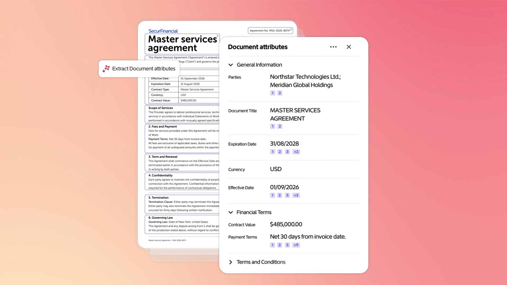

# Acrobat Studio中的Analyzer概述

Acrobat Studio中的Analyzer可帮助业务用户从数以万计的非结构化文档中提取结构化、可审核的见解，以自动化以文档为中心的业务流程。

## 新增功能

>[!BEGINTABS]

>[!TAB 开始使用]

[开始](get-started.md)学习如何从大量文档中提取结构化、引用的数据。

>[!TAB 使用收藏集]

了解如何创建手动和链接的[收藏集](collections.md)、应用属性以及随着内容的增长保持文档井然有序。

>[!TAB 使用属性]

了解如何在Acrobat Studio中使用Analyzer创建、测试和优化[属性](attributes.md)。

>[!ENDTABS]

## Acrobat Studio教程中的Analyzer

<table style="table-layout:fixed">
<tr>
  <td>
    
    

    <a href="get-started.md"><strong>开始使用</strong></a>
    

    了解Acrobat Studio中的Analyzer如何帮助您从大量文档中抽取结构化、引用的数据
     
  </td>
  <td>
    
    

    <a href="collections.md"><strong>使用收藏集</strong></a>
    

    了解如何创建手动收藏夹和链接收藏夹、应用属性以及随着内容的发展保持文档井然有序
     
  </td>
  <td>
    
    

    <a href="attributes.md"><strong>使用属性</strong></a>
    

    了解如何在Acrobat Studio中使用Analyzer创建、测试和优化属性
     
  </td>
  <td>
    
    

    &lt;a href="/help/acrobat/analyzer/use-case/m-and-a-post-audit.md&gt;<strong>Analyzer用例</strong></a>
    

    探索真实使用案例，这些案例可展示组织如何简化审核流程、发现洞察力，以及将文档内容转化为业务就绪型数据
     
  </td>
</tr>
</table>