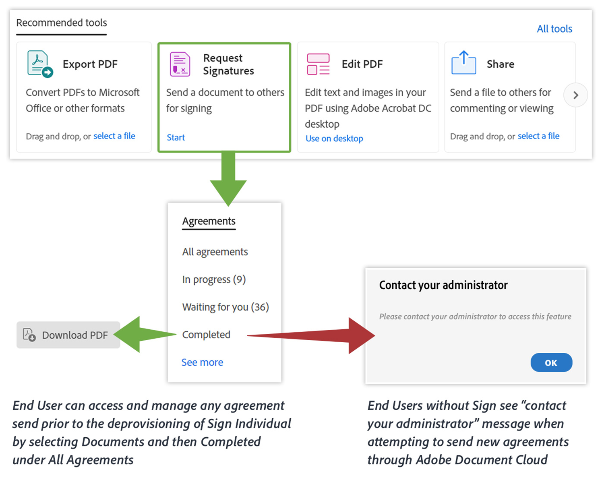

# 面向ETLA客户的重要Acrobat DC产品更新

仅从2020年8月开始，将从ETLA（企业定期许可协议）中包含的所有Acrobat DC权利中取消配置[!DNL Adobe Sign Individual] (也称为Adobe Sign Pro)，并将持续到2020年11月20日。 [!DNL Adobe Sign Individual]不提供企业级功能，应替换为Adobe Sign Enterprise企业版客户。 其中包括作为独立应用程序许可的Acrobat DC以及作为企业版Creative Cloud — 所有应用程序的一部分许可的Acrobat DC。

可通过&#x200B;**Adobe Sign**&#x200B;工具或&#x200B;**Fill &amp; Sign**&#x200B;工具在Acrobat中访问[!DNL Adobe Sign Individual] （[请求签名](https://www.adobe.com/acrobat/online/request-signature.html){target="_blank"}）。

在Acrobat DC中访问[!DNL Adobe Sign Individual]

如果您尚未将Acrobat DC更新到最新版本，则该工具可能被标记为“Send for Signature”。

## 我们为什么要取消配置此项？

[2018年10月，我们发布了全新的Acrobat DC](https://news.adobe.com/news/news-details/2018/Adobe-Redefines-What-Is-Possible-With-PDF-With-All-New-Acrobat-DC)。 此最新版本包括可更好地在移动设备、Web和桌面上使用PDF的新工具和功能，以及全新的协作工具。 作为Acrobat DC订阅用户，您应该已经拥有这些出色的功能。 我们发布的另一个主要更新是我们的电子签名解决方案Adobe Sign。

在2018年10月版本之前，Acrobat DC用户可以使用配置了[!DNL Adobe Sign Individual]权限的Acrobat中标记为“Fill &amp; Sign”(或者“Adobe Sign”或“Send for Signature”)的工具发送文档以进行电子签名。

虽然拥有此选项为捕获电子签名提供了绝佳方法，但我们正在取消配置[!DNL Adobe Sign Individual]，因为它不提供通过Adobe Sign Enterprise提供的企业级功能，例如：

* 能够集中管理有权发送协议或签名的用户
* 允许管理员管理在整个组织内发送和使用的协议
* 提供精细的控制，以便在整个组织内管理电子签名

此外，与[!DNL Adobe Sign Individual]权利中可用的功能相比，Adobe Sign Enterprise提供了更多功能，包括但不限于：

* 管理
   * 单点登录
   * 帐户委派
* 集成
   * 与Dropbox、Salesforce、Workday等预建的企业集成
   * Adobe Sign是[Microsoft](https://acrobat.adobe.com/us/en/business/integrations/microsoft.html)企业产品组合中的首选电子签名解决方案，包括Office 365、SharePoint、Dynamics、Teams和Flow
* 自定义和优化
   * 增强的电子签名身份验证、基于ID的高级签名者身份验证、工作流程设计器、高级语言支持等。

Adobe Sign是业界领先的全球公认解决方案，用于捕获符合法律规范的签名。 Adobe Sign专为满足您组织的任何电子签名需求而构建，使用IT管理员友好型工具可确保您和您的用户所使用的电子签名完全符合关于电子签名的各种区域和行业法规。 请访问[此处](https://helpx.adobe.com/cn/enterprise/using/verify-domain-ownership.html)，了解有关通过[Adobe Admin Console](https://helpx.adobe.com/cn/enterprise/using/admin-console.html)管理Sign的更多信息。

请联系您的Adobe联系人，以讨论如何通过我们更广泛的数字文档平台(包括Acrobat DC和Adobe Sign Enterprise)继续为您的组织提供电子签名功能。

## 访问现有协议

通过在https://documentcloud.adobe.com上使用用户的Adobe ID登录，用户仍可以访问在此操作之前通过Adobe Document Cloud发送的任何协议。 如果计划将此用户迁移到Sign Enterprise，他们将需要遵循以下[说明](https://helpx.adobe.com/cn/sign/kb/how-to-download-signed-documents---adobe-sign.html)。

## 没有[!DNL Sign Individual]权限的Acrobat DC体验

拥有Adobe Sign企业版权利的用户将能够使用Adobe Sign或[!UICONTROL Fill &amp; Sign]（请求签名）工具在Acrobat中发送协议。
没有Adobe Sign企业版权利的用户将无法发送新协议，并将收到一条错误消息。 下图概述了可能的结果。

## 无Sign个人版权利的Adobe Document Cloud Web Experience

用户将能够登录https://documentcloud.adobe.com/以访问和下载在取消配置Adobe Sign个人版权利之前已发送的任何协议。

## 有关更多信息，请访问以下页面：

* [登录 Adobe Document Cloud](https://helpx.adobe.com/document-cloud/help/sign-in.html)
* [管理文件（我的文件在哪里？）](https://helpx.adobe.com/document-cloud/help/manage-files.html)
* [使用[!UICONTROL AcrobatCustomization Wizard]进行配置](https://www.adobe.com/devnet-docs/acrobatetk/tools/Wizard/WizardDC/index.html)
* [[!UICONTROL Admin Console]](https://helpx.adobe.com/cn/enterprise/using/admin-console.html)概述
* [在[!UICONTROL Admin Console]](https://helpx.adobe.com/cn/enterprise/using/verify-domain-ownership.html)上管理Adobe Sign

**修订** 2020年5月20日；原稿 — 2019年8月
