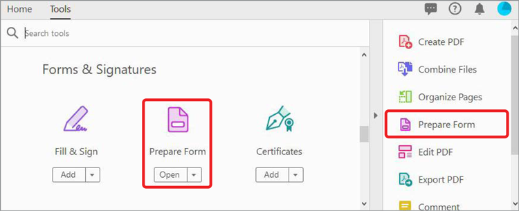

# 创建可填写的表单

将在InDesign、Microsoft Word、Excel或其他应用程序中创建的扫描纸质表单或文档转换为可填写的PDF表单。

1. 选择 **[!UICONTROL Prepare Form]** 从 [!UICONTROL 工具] 中置或右侧窗格。

   

1. 选择要用作表单的现有文档(例如，Word、Excel、InDesign或PDF文件)，然后选择 **开始**.

   

   如果 [!UICONTROL 表单域自动检测] 是 **打开**，则会在PDF文件中自动检测表单域。 双击表单域的位置。

   从顶部菜单拖放字段，并在右侧窗格中编辑表单字段详细信息。

1. 选择 **[!UICONTROL 预览]** 查看表单。

   

1. 选择 **[!UICONTROL 编辑]** 继续工作，或选择 **[!UICONTROL 文件]** **>** **[!UICONTROL 另存为]** 来保存PDF表单。

   

选择PDF图标以下载 *创建可填写的表单* 教程。

