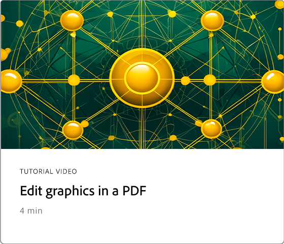

# 快速入门概述

通过这些简单的分步教程了解如何开始使用Adobe Acrobat。 从创建文档到保护或[编辑您的PDF文件](https://www.adobe.com/acrobat/online/pdf-editor.html){target="_blank"}，此内容旨在让您轻松使用PDF工作流程。 请查看此精心策划的[播放列表](https://experienceleague.adobe.com/en/playlists/acrobat-get-started-business-users)，了解如何开始使用Acrobat。

## 新增功能

>[!BEGINTABS]

>[!TAB 实时协作]

了解如何创建文档[审阅流程](collaborate.md)，以便不仅提高效率，而且还提高内容质量。

>[!TAB 设计新页面]

了解如何使用Adobe Express在PDF中[设计具有专业外观的新页面](add-custom-page.md)。

>[!TAB 在PDF中编辑图形]

了解如何[在您的PDF中创建、编辑和增强图形](edit-graphics.md)。

>[!TAB 新的工作区体验]

了解Acrobat中的[新工作区](new-workspace.md)，它可帮助您快速发现工具并高效完成PDF任务。

>[!ENDTABS]

## 快速入门教程

<!-- START CARDS HTML - DO NOT MODIFY BY HAND -->

    

        

            

                <figure class="image x-is-16by9">
                    
                </figure>
            

            

                

                    

                        <a href="https://experienceleague.adobe.com/en/docs/document-cloud-learn/acrobat-learning/getting-started/new-workspace" target="_blank" rel="referrer" title="新的工作区体验">新的工作区体验</a>
                    

                    
了解Acrobat中的新工作区

                

                <a href="https://experienceleague.adobe.com/en/docs/document-cloud-learn/acrobat-learning/getting-started/new-workspace" target="_blank" rel="referrer" class="spectrum-Button spectrum-Button--outline spectrum-Button--primary spectrum-Button--sizeM" style="align-self: flex-start; margin-top: 1rem;">
                    观看
                </a>
            

        

    

    

        

            

                <figure class="image x-is-16by9">
                    
                </figure>
            

            

                

                    

                        <a href="https://experienceleague.adobe.com/en/docs/document-cloud-learn/acrobat-learning/getting-started/get-to-know-the-acrobat-dc-interface" target="_blank" rel="referrer" title="工作区基础知识">工作区基础知识</a>
                    

                    
了解Acrobat工作区的基础知识

                

                <a href="https://experienceleague.adobe.com/en/docs/document-cloud-learn/acrobat-learning/getting-started/get-to-know-the-acrobat-dc-interface" target="_blank" rel="referrer" class="spectrum-Button spectrum-Button--outline spectrum-Button--primary spectrum-Button--sizeM" style="align-self: flex-start; margin-top: 1rem;">
                    观看
                </a>
            

        

    

    

        

            

                <figure class="image x-is-16by9">
                    
                </figure>
            

            

                

                    

                        <a href="https://experienceleague.adobe.com/en/docs/document-cloud-learn/acrobat-learning/getting-started/ai-assistant" target="_blank" rel="referrer" title="用AI助手发现PDF见解">使用AI Assistant发现PDF见解</a>
                    

                    
使用AI Assistant从PDF文件中获取见解

                

                <a href="https://experienceleague.adobe.com/en/docs/document-cloud-learn/acrobat-learning/getting-started/ai-assistant" target="_blank" rel="referrer" class="spectrum-Button spectrum-Button--outline spectrum-Button--primary spectrum-Button--sizeM" style="align-self: flex-start; margin-top: 1rem;">
                    观看
                </a>
            

        

    

<!-- END CARDS HTML - DO NOT MODIFY BY HAND -->

<table style="table-layout:fixed">
<tr>
  <td>
    
    

    <a href="acrobatweb.md"><strong>随时随地使用Acrobat Web</strong></a>
    

    了解如何随时随地工作
     
  </td>
  <td>
    
    

    <a href="productivity.md"><strong>随时随地提高工作效率</strong></a>
    

    了解如何通过平板电脑或手机执行更多操作
     
  </td>
  <td>
      
      

      <a href="../integrate/integrate-overview.md#microsoft"><strong>使用Microsoft 365</strong></a>
      

      直接在Microsoft 365中无缝使用PDF文件
        
  </td>
  <td>
      
      

      <a href="where-do-pdfs-come-from.md"><strong>PDF来自哪里？</strong></a>
      

      了解PDF来自何处以及如何使用它们
       
  </td>
  <td>
    
      

       
  </td>
</tr>
</table>

## 创建、合并和组织教程

<table style="table-layout:fixed">
  <tr>
    <td>
      
      

      <a href="create-pdf.md"><strong>创建PDF文件</strong></a>
      

      从所有不同类型的文档创建PDF
       
    </td>
    <td>
      
      

      <a href="combine-to-pdf.md"><strong>将文件合并为单个PDF</strong></a>
      

      将多种不同类型的文件无缝合并为一个PDF
       
    </td>
    <td>
      
      

      <a href="organize.md"><strong>组织页面</strong></a>
      

      了解如何按照您喜欢的方式重新排列页面
       
    </td>
    <td>
      
      

      <a href="add-custom-page.md"><strong>设计新页面</strong></a>
      

     了解如何在PDF中创建新的专业页面
       
    </td>
  </tr>
  </table>

## 编辑和导出教程

<table style="table-layout:fixed">
  <tr>
    <td>
      
      

      <a href="edit-pdf.md"><strong>编辑PDF中的文本</strong></a>
      

      在PDF中编辑单词、短语甚至整个页面
       
    </td>
    <td>
      
      

      <a href="edit-graphics.md"><strong>在PDF中编辑图形</strong></a>
      

      了解如何在PDF中创建、编辑和增强图形
       
    </td>
    <td>
      
      

      <a href="stylize-this-pdf.md"><strong>风格化此PDF</strong></a>
      

      了解如何创建具有专业外观的PDF
       
    </td>
   <td>
      
      

      <a href="auto-adjust-layout.md"><strong>自动调整布局</strong></a>
      

      了解用于重排内容的新编辑模式
       
    </td>
  </tr>
    <td>
      
      

      <a href="export-pdf.md"><strong>将PDF转换为其他文件格式</strong></a>
      

      将PDF文件转换为不同的文件格式
       
    </td>
    <td>
   
    

     
  </td>
  <td>
   
    

     
  </td>
   <td>
   
    

     
  </td>
</tr>
</table>

## 协作教程

<table style="table-layout:fixed">
  <tr>
    <td>
      
      

      <a href="collaborate.md"><strong>实时协作</strong></a>
      

      通过实时协作推进您的项目
    </td>
    <td>
      
      

      <a href="comment-on-pdf-files.md"><strong>对PDF发表评论</strong></a>
      

      添加注释，然后与他人共享您的PDF
       
    </td>
    <td>
    
      

       
    </td>
    <td>
    
      

       
    </td>
</tr>
</table>

## 其他教程

<table style="table-layout:fixed">
<tr>
  <td>
    
    

      <a href="create-fillable-forms.md"><strong>创建可填写表单</strong></a>
      

      将扫描的纸张转换为可填写的表格
       
  </td>
  <td>
    
    

    <a href="fill-and-sign.md"><strong>Fill &amp; SignPDF表单</strong></a>
    

    了解如何快速轻松地填写和签署PDF表单
     
  </td>
  <td>
    
    

    <a href="scan-and-ocr.md"><strong>扫描和OCR</strong></a>
    

    将扫描件或图像转换为可搜索、可编辑的PDF文件
     
  </td>
  <td>
    
    

    <a href="password-protect.md"><strong>Protect具有密码的PDF文件</strong></a>
    

    了解如何向PDF添加密码
     
  </td>
</tr>
<tr>
  <td>
    
    

    <a href="signatures.md"><strong>获取签名</strong></a>
    

    了解如何收集具有法律约束力的电子签名
     
  </td>
  <td>
    
    

    <a href="track.md"><strong>跟踪您的文档</strong></a>
    

    跟踪和管理您的电子签名文档
     
  </td>
  <td>
   
    

     
  </td>
  <td>
   
    

     
  </td>
</tr>
</table>
