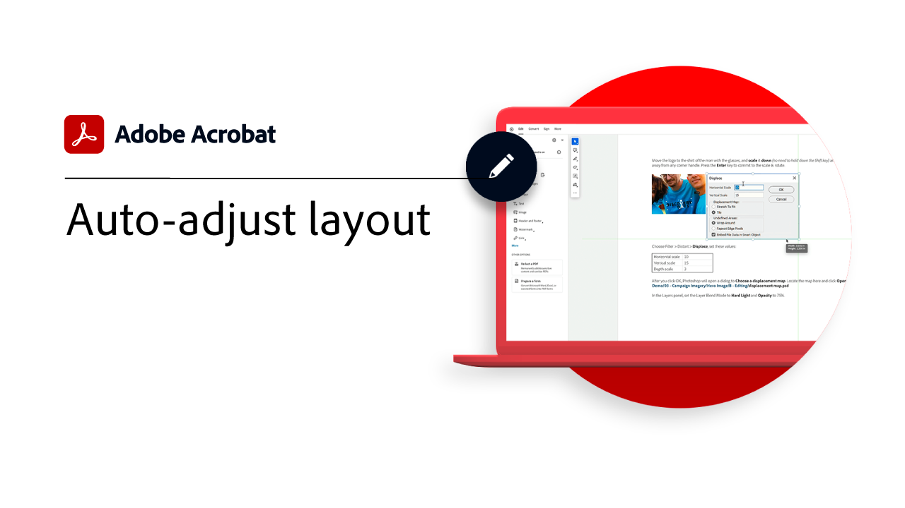
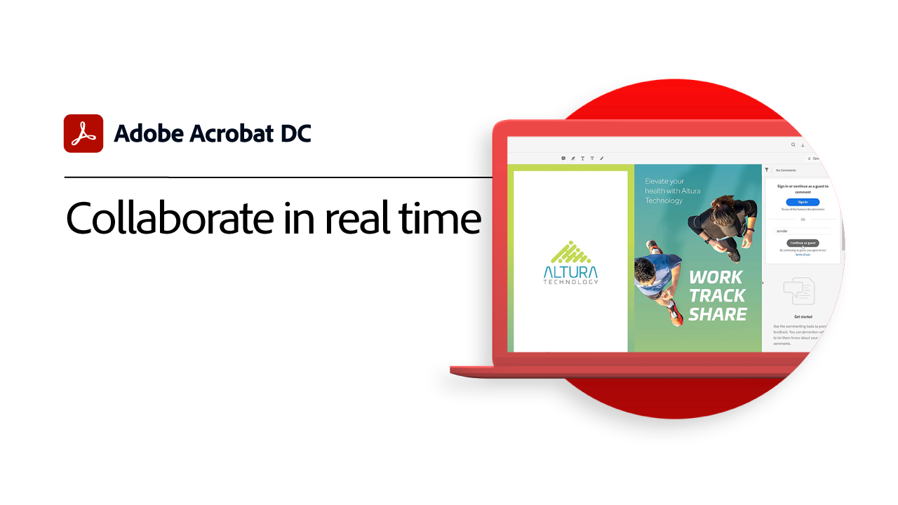

# 快速入门概述

通过这些简要的分步教程了解如何开始使用Adobe Acrobat。 从创建文档到保护或 [编辑PDF文件](https://www.adobe.com/acrobat/online/pdf-editor.html){target="_blank"}，此内容旨在简化您的PDF工作流程。

## 快速入门教程

<table style="table-layout:fixed">
<tr>
  <td>
    
    

    <a href="get-to-know-the-acrobat-dc-interface.md"><strong>工作区基础知识</strong></a>
    

    <em>了解Acrobat工作区如何让您在桌面、Web和移动设备上轻松访问文件和工具</em>
     
  </td>
  <td>
    
    

    <a href="new-workspace.md"><strong>全新的工作区体验</strong></a>
    

    <em>了解可在Acrobat中激活的新工作区体验</em>
     
  </td>
  <td>
    
    

    <a href="acrobatweb.md"><strong>随时随地使用Acrobat Web</strong></a>
    

    <em>了解如何在浏览器中使用Acrobat Web工具随时随地处理业务文档请求</em>
     
  </td>
  <td>
    
    

     <a href="productivity.md"><strong>随时随地提高工作效率</strong></a>
    

    <em>使用Acrobat Reader移动应用程序，直接在平板电脑或手机上执行更多操作</em>
     
  </td>
</tr>
<tr>
    <td>
      
      

      <a href="../integrate/integrate-overview.md#microsoft"><strong>使用Microsoft 365</strong></a>
      

      <em>借助Acrobat和 [!DNL Microsoft 365]</em>
       
    </td>
    <td>
      
      

      <a href="where-do-pdfs-come-from.md"><strong>PDF从何而来？</strong></a>
      

      <em>了解PDF的来源及其用途</em>
       
    </td>
    <td>
    
      

       
    </td>
    <td>
    
      

       
    </td>
  </tr>
  </table>

## 创建、合并和组织教程

<table style="table-layout:fixed">
  <tr>
    <td>
      
      

      <a href="create-pdf.md"><strong>创建PDF</strong></a>
      

      <em>从各种PDF创建文档</em>
       
    </td>
    <td>
      
      

      <a href="combine-to-pdf.md"><strong>将文件合并到PDF</strong></a>
      

      <em>将许多不同类型的文件合并为一个PDF</em>
       
    </td>
    <td>
      
      

      <a href="organize.md"><strong>整理页面</strong></a>
      

      <em>添加、替换、提取、旋转、删除和重新排列PDF</em>
       
    </td>
    <td>
      
      

      <a href="add-custom-page.md"><strong>添加自定义页面</strong></a>
      

      <em>了解如何使用集成的页面应用程序将自定义PDF添加到Adobe Express中</em>
       
    </td>
  </tr>
  </table>

## 编辑和导出教程

<table style="table-layout:fixed">
  <tr>
    <td>
      
      

      <a href="edit-pdf.md"><strong>编辑 PDF</strong></a>
      

      <em>编辑文本文件中的文本和PDF图像</em>
       
    </td>
    <td>
      
      

      <a href="auto-adjust-layout.md"><strong>自动调整版面</strong></a>
      

      <em>了解自动调整内容的新编辑模式</em>
       
    </td>
    <td>
      
      

      <a href="export-pdf.md"><strong>将PDF导出为可编辑格式</strong></a>
      

      <em>了解如何将PDF文件导出为可编辑格式</em>
       
    </td>
    <td>
    
      

       
    </td>
  </tr>
  </table>

## 协作教程

<table style="table-layout:fixed">
  <tr>
    <td>
      
      

      <a href="collaborate.md"><strong>实时协作</strong></a>
      

      <em>通过从任何地方收集注释、协作处理响应和实时跟踪文档进度，推动您的项目向前发展</em>
       
    </td>
    <td>
      
      

      <a href="comment-on-pdf-files.md"><strong>评论PDF</strong></a>
      

      <em>将注释添加到PDF文件，然后与他人共享</em>
       
    </td>
    <td>
    
      

       
    </td>
    <td>
    
      

       
    </td>
</tr>
</table>

## 其他教程

<table style="table-layout:fixed">
<tr>
  <td>
    
    

    <a href="create-fillable-forms.md"><strong>创建可填写的表单</strong></a>
    

    <em>将在其他应用程序中创建的文档转换为可填写的PDF表单</em>
     
  </td>
  <td>
    
    

    <a href="fill-and-sign.md"><strong>Fill &amp; SignPDF forms</strong></a>
    

    <em>快速填写并签署PDF表单</em>
     
  </td>
  <td>
    
    

    <a href="scan-and-ocr.md"><strong>扫描和OCR</strong></a>
    

    <em>减少大型文件并优化PDF，同时不影响共享、发布或存档的质量</em>
     
  </td>
  <td>
    
    

    <a href="password-protect.md"><strong>Protect带密码的PDF文件</strong></a>
    

    <em>向您的PDF添加密码，以防他人打开或编辑该文件</em>
     
  </td>
</tr>
<tr>
  <td>
    
    

    <a href="signatures.md"><strong>获取签名</strong></a>
    

    <em>通过从任何地方收集他人的具有法律约束力的电子签名来保持业务发展</em>
     
  </td>
  <td>
    
    

    <a href="track.md"><strong>跟踪文档</strong></a>
    

    <em>请始终了解等待签名的文件以及已签名的文件</em>
     
  </td>
  <td>
   
    

     
  </td>
  <td>
   
    

     
  </td>
</tr>
</table>
