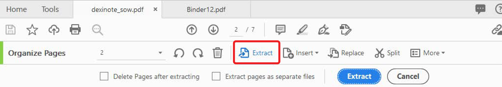

# 组织页面

使用 **[!UICONTROL 组织页面]** 在Acrobat中添加、替换、提取、旋转、删除和移动PDF。

1. 选择 **[!UICONTROL 组织页面]** 从 [!UICONTROL 工具] 中间或右侧窗格。

   

1. 将鼠标悬停在页面上以顺时针或逆时针旋转页面，或删除页面。

   要移动页面，请选择页面并将其拖动到新位置。

   

1. 选择 **[!UICONTROL Extract]** 工具栏中，从一个PDF或多个页面创建页面。

1. 选择一个或多个页面，然后选择 **[!UICONTROL Extract]**&#x200B;的

   您还可以 **[!UICONTROL 插入]** 或 **[!UICONTROL 替换]** 页面，并通过选择 **[!UICONTROL 更多]**&#x200B;的

   

1. 选择 **[!UICONTROL 拆分]** 将一个或多个PDF拆分为多个较小的PDF。

   拆分PDF时，可以按页数、文件大小或顶层书签进行拆分。

   
