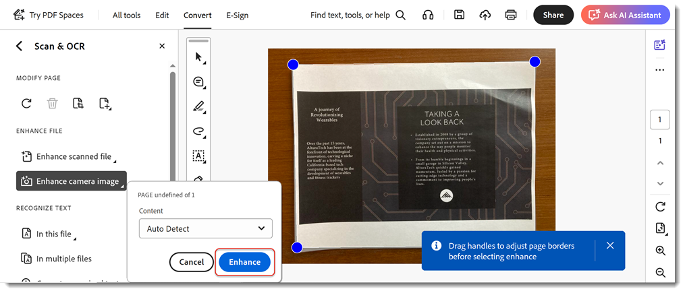

# 扫描和 OCR

通过将文档的扫描内容或图像转换为可搜索内容， [可编辑PDF文件](https://www.adobe.com/cn/acrobat/online/pdf-editor.html){target=&quot;_blank&quot;}。

>[!TIP]
>
>若要OCR多个PDF文件，请尝试使用 [Action Wizard](../advanced-tasks/action.md)的

1. 选择 **[!UICONTROL 扫描和OCR]** 从 [!UICONTROL 工具] 中间或右侧窗格。

   

1. 选择文件.

   此文件可以是文档的照片，或者是使用扫描仪或Adobe Scan移动应用程序创建的已扫描的文件。 或者，您可以使用连接的扫描仪扫描文档以创建新文件。

   

1. 选择 **[!UICONTROL 扫描的文档]** 或 **[!UICONTROL 相机图像]** 来增强文档。

1. 选择 **[!UICONTROL 增强]** 来清理图像。

   

   Acrobat可自动识别扫描文档中的文本。

1. 选择 **[!UICONTROL 识别文本]** 手动识别图像文件中的文本。

   

该文件现在是一个可搜索的可编辑PDF文件。

>[!TIP]
>
>本视频为课程的一部分 [使用Acrobat DC和Microsoft 365更巧妙地工作](https://experienceleague.adobe.com/?recommended=Acrobat-U-1-2021.microsoft365) 免费下载Experience League!
