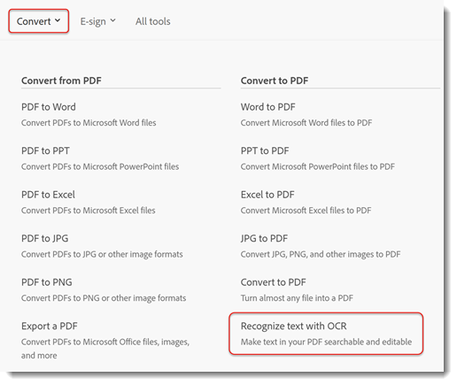
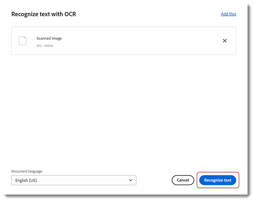
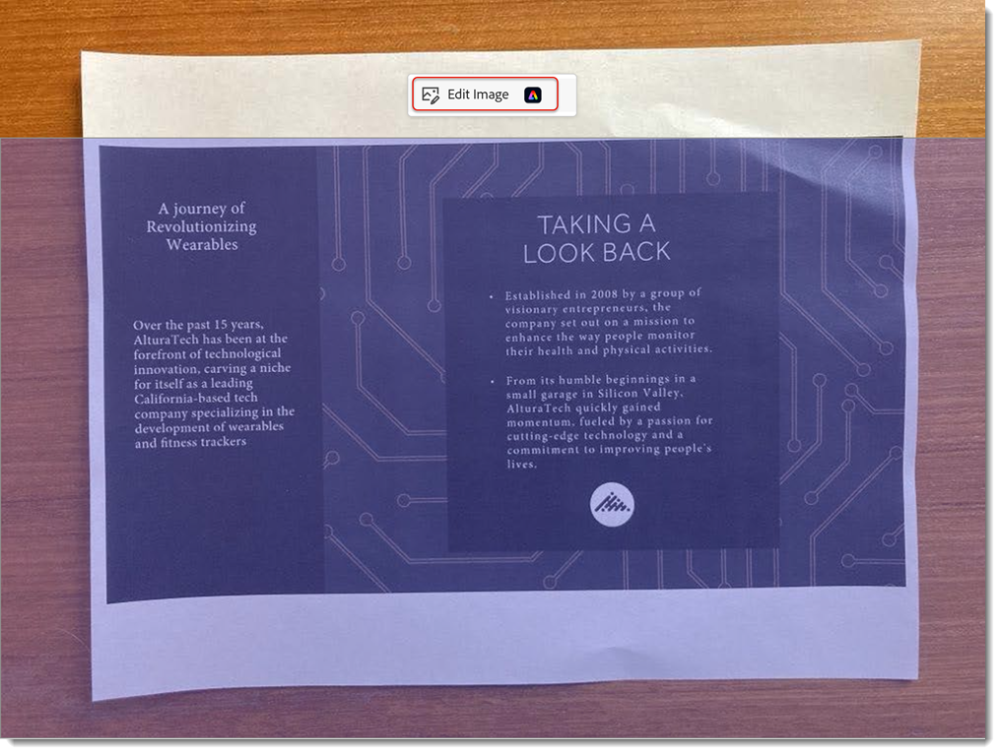

# 纸张到PDF

了解如何扫描（或拍照）纸质文档，并将其转换为可搜索且[可编辑的PDF文件](https://www.adobe.com/acrobat/online/pdf-editor.html){target="_blank"}。 将纸张转换为PDF可提高您快速查找信息的能力，并使残障人士能够访问这些信息。 本教程介绍了[新的Acrobat体验](new-workspace.md)。

## 如何在Acrobat桌面版中将纸张转换为PDF

1. 打开照片或文档的扫描图像。 或者，使用连接的扫描仪创建新文件或使用免费的[Adobe Scan移动应用程序](https://adobescan.app.link/GpBqG8Bkoeb)。

1. 从工具栏中选择&#x200B;**[!UICONTROL 所有工具]**，然后在左侧窗格中选择&#x200B;**[!UICONTROL 扫描和OCR]**。

   

1. 根据您的文件类型，选择&#x200B;**[!UICONTROL 增强扫描的图像]**&#x200B;或&#x200B;**[!UICONTROL 增强相机图像]**。

   

1. 拖动手柄以调整页面边框，然后选择&#x200B;**[!UICONTROL 增强]**。

   

   Acrobat会自动清理并拉直图像。

1. 选择“**[!UICONTROL 在此文件中]**”，然后选择“**[!UICONTROL 识别文本]**”，使文本可搜索且可编辑。

   

该文件现在是一个可搜索、可编辑的PDF文件。

## 如何在Acrobat Web中将纸张转换为PDF

1. 在浏览器中登录到[acrobat.adobe.com](https://acrobat.adobe.com/cn)。

1. 从顶部菜单中选择&#x200B;**[!UICONTROL 转换>识别带有OCR的文本]**。

   

1. 选择&#x200B;**[!UICONTROL 选择文件]**，选择您的文件，然后选择&#x200B;**[!UICONTROL 打开]**。

   

1. 选择&#x200B;**[!UICONTROL 识别文本]**。

   

   文件中的文本现在可搜索且可编辑。

1. 若要移除背景，请选择图像并选择&#x200B;**[!UICONTROL 编辑图像]**。

   

1. 从Adobe Express编辑器中选择&#x200B;**[!UICONTROL 移除背景]**。

   

1. 拖动手柄以调整页面边框，然后选择&#x200B;**[!UICONTROL 应用]**。

   

>[!TIP]
>
>要OCR多个PDF文件，请尝试在Acrobat Pro、Premium或Studio桌面版中使用[Action Wizard](../advanced-tasks/action.md)。