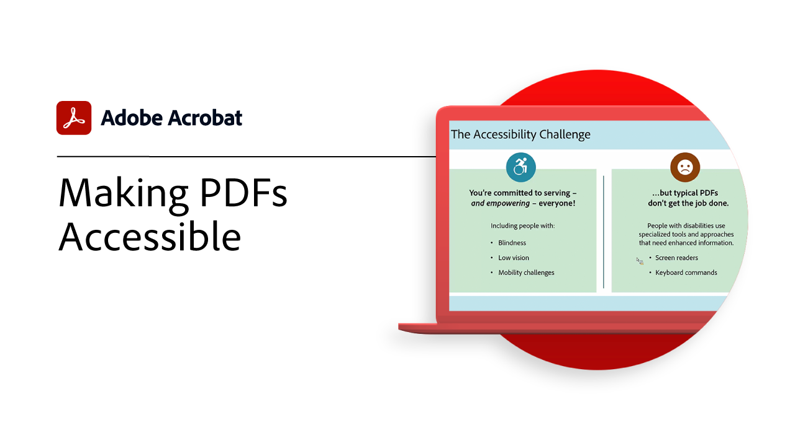
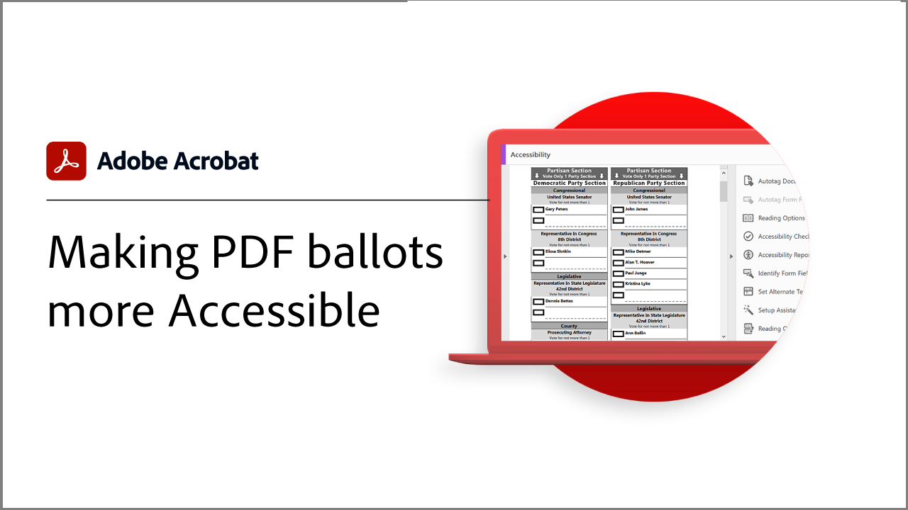

# Acrobat政府版

探索我们专为联邦、州和地方政府设计的Acrobat教程。

## 使用Acrobat随时随地工作的5个提示

<table style="table-layout:fixed">
<tr>
  <td>
    
    

    <a href="5-tips-for-working-anywhere-with-acrobat-dc-for-government.md"><strong>使用Acrobat随时随地工作的5个提示（15:12已完成）</strong></a>
    

    <em>了解如何获取和使用Acrobat及其配套移动应用程序中的工具，以便随时随地工作</em>
     
  </td>
  <td>
    
    

    <a href="get-your-tools.md"><strong>提示1：获取工具</strong></a>
    

    <em>从任意位置开始工作的第一步是获取Acrobat工具和配套移动应用程序</em>
     
  </td>  
  <td>
    
    

    <a href="collaborate-on-documents.md"><strong>提示2：协作处理文档</strong></a>
    

    <em>创建简单而轻松的工作流程来协作处理文档</em>
     
  </td>
  <td>
    
    

    <a href="protect-digital-documents.md"><strong>提示3： Protect数字文档</strong></a>
    

    <em>向PDF添加密码以防止复制、编辑或打印</em>
     
  </td>
</tr>
  <td>
    
    

    <a href="work-with-forms-and-signatures.md"><strong>提示4：处理表单和签名</strong></a>
    

    <em>了解如何在填写表单时保持数字化</em>
     
  </td>
  <td>
    
    

    <a href="scan-and-edit-on-mobile.md"><strong>提示5：在移动设备上扫描和编辑</strong></a>
    

    <em>了解如何使用Adobe Scan和Acrobat Reader移动应用程序，随时随地完成工作</em>
     
  </td>
  <td>
   
    

     
  </td>
  <td>
   
    

     
  </td>
</tr>
</table>

## 无障碍访问

<table>
<tr>
  <td>
    
    

    <a href="making-pdfs-accessible.md"><strong>使PDF可访问（完成14:11）</strong></a>
    

    <em>了解创建可访问PDF文件的最佳工作流程</em>
     
  </td>
  <td>
    
    

    <a href="understanding-accessibility.md"><strong>使PDF可访问：了解可访问性</strong></a>
    

    <em>了解使残障人士可访问PDF意味着什么</em>
     
  </td>  
  <td>
    
    

    <a href="collaborate-on-documents.md"><strong>使PDF可访问：在Word中创作</strong></a>
    

    <em>了解创建在[!DNL Microsoft Word]</em>中创建的PDF文件的最佳做法
     
  </td>
   <td>
    
    

    <a href="finishing-in-acrobat.md"><strong>使PDF可访问：在Acrobat中完成</strong></a>
    

    <em>了解如何使用Acrobat Pro中的工具完成对PDF文件的访问</em>
     
  </td>
</tr>
<tr>
  <td>
    
    

    <a href="making-pdf-ballots-accessible.md"><strong>使PDF选票更易于访问</strong></a>
    

    <em>此网络研讨会涵盖了辅助技术（如屏幕阅读器）用户阅读和完成选票所必需的PDF辅助功能关键领域</em>
     
  </td>  
  <td>
   
    

     
  </td>
  <td>
   
    

     
  </td>
  <td>
   
    

     
  </td>
</tr>
</table>
