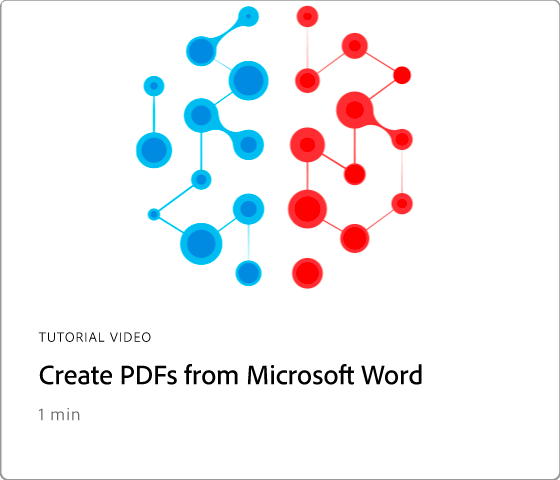

# 集成概述

将Acrobat与[!DNL Box]、[!DNL Dropbox]、[!DNL Google Drive]、[!DNL OneDrive]和[!DNL Microsoft]应用程序集成。

## Microsoft

了解团队中的每个人都如何能够直接在[Microsoft 365](https://www.adobe.com/documentcloud/integrations/microsoft-office-365.html)中无缝使用PDF文件。 查看这个在Acrobat和Microsoft 365集成上专业策划的[播放列表](https://experienceleague.adobe.com/en/playlists/acrobat-integrate-microsoft-365)。

<table style="table-layout:fixed">
<tr>
  <td>
    
    

    <a href="createfromword.md"><strong>从Microsoft Word创建PDF文件</strong></a>
    

    了解如何直接从Microsoft Word中创建丰富而强大的PDF文件
     
  </td>
  <td>
    
    

    <a href="createofficeweb.md"><strong>在[!DNL Office]中为Web创建PDF</strong></a>
    

    了解如何直接从Microsoft Word中创建丰富而强大的PDF文件
     
  </td> 
  <td>
    
    

    <a href="acrobatandsp.md"><strong>处理您的[!DNL SharePoint]文件</strong></a>
    

    使用[!DNL SharePoint]和Acrobat简化文档工作流程
     
  </td>
  <td>
    
    

    <a href="acrobatandteams.md"><strong>在[!DNL Microsoft Teams]</strong></a>中PDF协作
    

    无需离开[!DNL Microsoft Teams]，即可通过查看、注释和审阅PDF与同事协作和协作
     
  </td>
</tr>
<tr>
  <td>
    
    

    <a href="outlook.md"><strong>将电子邮件和附件转换为Outlook中的PDF</strong></a>
    

    了解如何在[!DNL Outlook]中以更专业、更安全的方式提供信息
     
  </td>
  <td>
    
    

    <a href="edge.md"><strong>使用[!DNL Microsoft Edge]</strong></a>浏览时创建PDF内容
    

    了解如何使用[!DNL Microsoft Edge]的Adobe Acrobat扩展开启网页以动态PDF
     
  </td>
  <td>
    
    

    <a href="microsoftsensitivitylabels.md"><strong>使用[!DNL Microsoft Purview Information]敏感度标签的ProtectPDF</strong></a>
    

    了解如何通过直接在Acrobat中添加、编辑、自定义和删除Microsoft Purview信息敏感度标签来保护PDF
     
  </td>
  <td>
   
    

     
  </td>
</tr>
</table>

## Google Drive

了解如何使用[!DNL Google Drive]中的基本PDF和电子签名工具，在更短的时间内完成更多工作。

<table style="table-layout:fixed">
<tr>
  <td>
    
    

    <a href="acrobatandgoogle.md"><strong>适用于Google云端硬盘的Adobe Acrobat</strong></a>
    

    了解如何直接在[!DNL Google Drive]应用程序中访问节省时间的PDF工具和电子签名工作流程
     
  </td>
  <td>
   
    

     
  </td>
  <td>
   
    

     
  </td>
  <td>
   
    

     
  </td>
</tr>
</table>

## Dropbox

了解访问和处理存储在[!DNL Dropbox]中的文件有多容易。

<table style="table-layout:fixed">
<tr>
  <td>
    
    

    <a href="acrobat-dropbox.md"><strong>处理来自[!DNL Dropbox]</strong></a>的文件
    

    了解如何在Acrobat中打开、创建、编辑、签名和保存对[!DNL Dropbox]文件所做的更改
     
  </td>
  <td>
   
    

     
  </td>
  <td>
   
    

     
  </td>
  <td>
   
    

     
  </td>
</tr>
</table>

## 产品包装盒

了解Acrobat和[Box](https://www.adobe.com/documentcloud/integrations/box.html){target="_blank"}如何让组织中的每个人都更轻松地保持业务运转。
