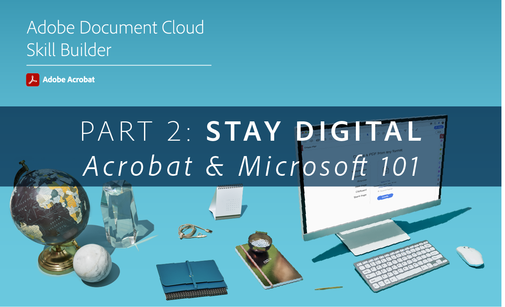
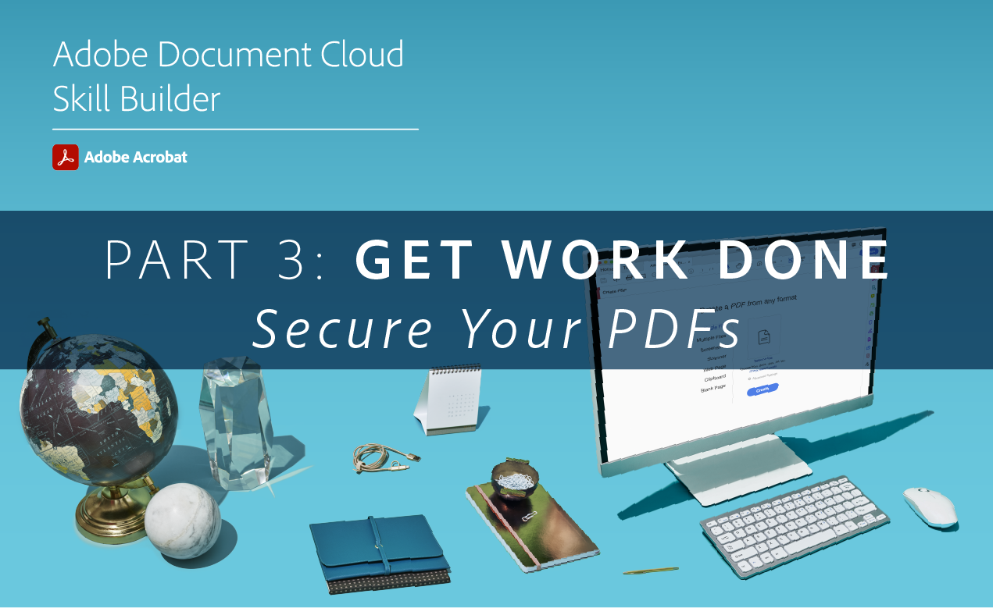

# Acrobat Skill Builders

借助这些交互式技能构建器快速掌握Acrobat DC。 或者，加入[每月实时会话](skill-builder-webinars.md)。

## Go Digital

<table style="table-layout:fixed">
<tr>
  <td>
    
    

    <a href="https://doccloud.adobeconnect.com/paperpdf/" target="_blank"><strong>从纸质文档转换为PDF</strong></a>
    

    <em>以数字方式将任何纸质文档转换为PDF</em>
     
  </td>
  <td>
    
    

    <a href="https://doccloud.adobeconnect.com/skillbuilder-sigforms/" target="_blank"><strong>准备签名</strong></a>
    

    <em>使用电子签名字段构建PDF</em>
     
  </td>
  <td>
    
    

     
  </td>
</tr>
</table>

## 保持数字化

<table style="table-layout:fixed">
<tr>
 <td>
    
    

    <a href="https://doccloud.adobeconnect.com/createpdfs/" target="_blank"><strong>创建和组织PDF</strong></a>
    

    <em>从任何类型的文件开始创建和组织PDF</em>
     
  </td>
  <td>
    
    

    <a href="https://doccloud.adobeconnect.com/micro/" target="_blank"><strong>Acrobat和Microsoft 101</strong></a>
    

    <em>直接在SharePoint中创建和管理PDF</em>
     
  </td>
  <td>
    
    

    <a href="https://doccloud.adobeconnect.com/editpdf/" target="_blank"><strong>编辑PDF</strong></a>
    

    <em>向PDF中添加文本、图像、链接和水印</em>
     
  </td>
</tr>
<tr>
  <td>
    
    

    <a href="https://doccloud.adobeconnect.com/sign/" target="_blank"><strong>签署您的作品</strong></a>
    

    <em>直接在Microsoft Outlook中对文档进行签名</em>
     
  </td>
  <td>
    
    

    <a href="https://doccloud.adobeconnect.com/convertpdfs/" target="_blank"><strong>转换PDF</strong></a>
    

    <em>将PDF转换为Word、Excel和PowerPoint</em>
     
  </td>
  <td>
    
    

    <a href="https://doccloud.adobeconnect.com/fillsign/" target="_blank"><strong>随处填写和签名</strong></a>
    

    <em>在任何设备上以电子方式填写、签署和发送表单</em>
     
  </td>
</tr>
<tr>
  <td>
    
    

    <a href="https://doccloud.adobeconnect.com/optimizepdfs/" target="_blank"><strong>优化PDF</strong></a>
    

    <em>准备要分发的PDF</em>
     
  </td>
  <td>
   
    

     
  </td>
  <td>
   
    

     
  </td>
</tr>
</table>

## 完成工作

<table style="table-layout:fixed">
<tr>
  <td>
    
    

    <a href="https://doccloud.adobeconnect.com/skillbuilder-share/" target="_blank"><strong>共享和收集反馈</strong></a>
    

    <em>收集PDF并获取反馈</em>
     
  </td>
  <td>
    
    

    <a href="https://doccloud.adobeconnect.com/securepdfs/" target="_blank"><strong>保护PDF</strong></a>
    

    <em>将PDF中的敏感信息加密成密文并加以保护</em>
     
  </td>
  <td>
   
    

     
  </td>
</tr>
</table>
