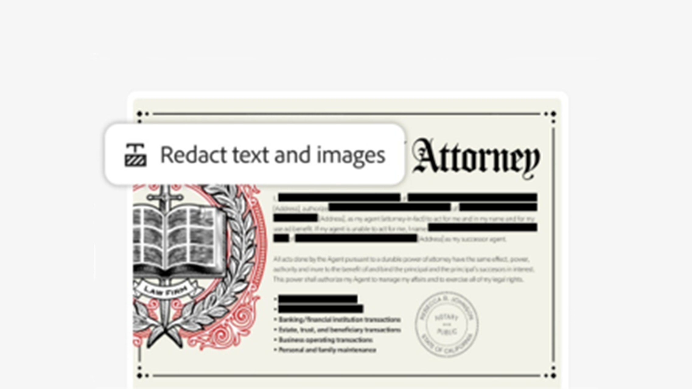
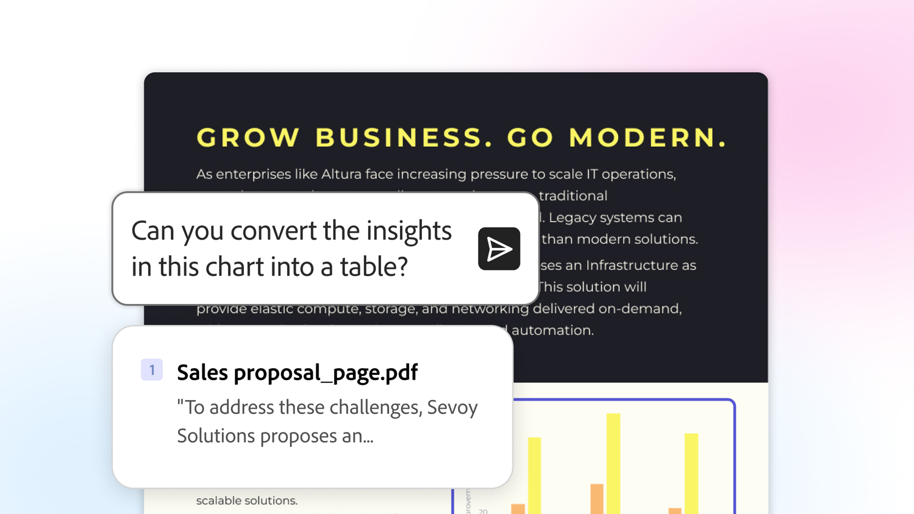

# 用例概述

了解如何使用Acrobat提高工作效率，并将信息转变为适用于您的团队和行业的见解。

## 业务线

了解不同业务领域的团队如何使用Acrobat解决日常文档难题、简化工作流程和支持关键业务工作。

<table style="table-layout:fixed">
<tr>
  <td>
    
    

    <a href="lob/finance/finance-overview.md"><strong>财务用例</strong></a>
    

    <em>了解财务团队如何使用Acrobat来创建、管理、分析和保护财务文档</em>
     
  </td>
  <td>
    
    

    <a href="lob/hr/hr-overview.md"><strong>HR用例</strong></a>
    

    <em>探索HR团队如何使用Acrobat在员工生命周期中管理文档和工作流</em>
     
  </td>
  <td>
    
    

    <a href="lob/legal/legal-overview.md"><strong>合法用例</strong></a>
    

    <em>了解法律团队如何快速了解复杂的文档以及关键风险和更改</em>
     
  </td>
  <td>
    
    

    <a href="lob/sales/sales-overview.md"><strong>销售用例</strong></a>
    

    <em>了解销售团队如何通过更智能的协作和更快的内容创建从洞察力转向影响力</em>
     
  </td>
</tr>
</table>

## 行业

<!-- START CARDS HTML - DO NOT MODIFY BY HAND -->

    

        

            

                <figure class="image x-is-16by9">
                    
                </figure>
            

            

                

                    

                        <a href="https://experienceleague.adobe.com/en/docs/document-cloud-learn/acrobat-learning/use-cases/gov/gov-overview" target="_self" rel="referrer" title="Acrobat政府版">Acrobat政府版</a>
                    

                    
探索我们专为联邦、州和地方政府设计的Acrobat教程

                

                <a href="https://experienceleague.adobe.com/en/docs/document-cloud-learn/acrobat-learning/use-cases/gov/gov-overview" target="_self" rel="referrer" class="spectrum-Button spectrum-Button--outline spectrum-Button--primary spectrum-Button--sizeM" style="align-self: flex-start; margin-top: 1rem;">
                    浏览教程
                </a>
            

        

    

<!-- END CARDS HTML - DO NOT MODIFY BY HAND -->