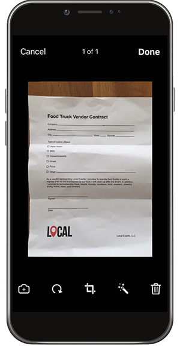

# 在桌面或移动设备上填写和签署任何表单

从桌面、浏览器或移动应用程序中快速填写、签名和发送表单。 Adobe Sensei可识别并保存常用数据以用于PDF表单。 通过绘制、导入扫描内容或键入姓名来创建签名，然后将其安全地应用于文档。

在本练习中，您将使用移动设备导入、填写、签名和发送文档。

以下是 [演示文件](assets/03_FillSignScan.zip) 用于本练习。

**第1步：** 下载 [!DNL Adobe Fill & Sign] 应用程序 [!DNL Apple App] 商店或 [!DNL Google Play]的

**第2步：** 打开应用程序，点按 **[!UICONTROL 选择要填写的表单]**&#x200B;的

**第3步：** 选择其中一个导入选项。 在本练习中，我们将拍照。

**第4步：** 使用白色按钮拍照，然后点击 **[!UICONTROL 使用照片]**&#x200B;的 点按 **[!UICONTROL 完成]** （位于右上角）。

**第5步：** 在应用程序底部，点按 **[!UICONTROL 裁剪]** 工具，然后使用参考线 [裁剪图像](Https://www.adobe.com/acrobat/online/crop-pdf.html)的 点按 **[!UICONTROL 完成]** 完成时。

**第6步：** 如有必要，请使用魔棒工具来清洁图像。 点按 **[!UICONTROL 完成]** 完成时。

**第7步：** 点按页面上的任意位置以创建一个字段，并将所需信息添加到您的文档。 选择椭圆以查看更多选项。

**第8步：** 点按 **[!UICONTROL 签名]** 按钮添加您的签名。

**第9步：** 使用手写笔或手指在签名字段中签名。 移动并放置签名字段。

**第10步：** 点按 **[!UICONTROL 个人资料]** 按钮以获得预填充值，如您的姓名和日期。 您只需填写此信息一次，然后即可将其用于将来通过Fill &amp; Sign应用程序填写的所有表单。

**第11步：** 完成表单后，点按右下角的共享按钮以发送电子邮件。

## 回顾：

* 打开电子邮件中的文件，或者使用设备相机拍摄纸质表单的图片。

* 点按以在表单字段中输入文本或勾形标记。 为提升速度，可使用自定义自动填充条目。

* 使用手指或触笔创建签名。 然后，将其应用于表单，或在需要时添加缩写签名。
