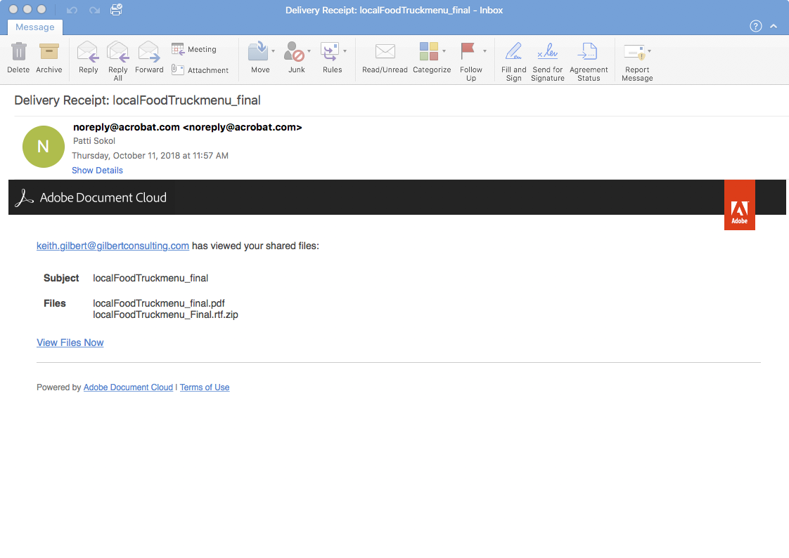

# 共享PDF文件并联机审阅

使用Adobe Document Cloud审阅服务从Acrobat桌面应用程序、Document CloudWeb或Acrobat Reader移动应用程序中轻松共享PDF文件以供审阅。 当审阅人通过计算机单击邀请电子邮件中的URL后，就可以十分方便地在浏览器中提供反馈，无需登录或安装任何其他软件。

在本练习中，我们将回顾如何、

* 发送个性化邀请以进行评论
* 以电子邮件的形式发送匿名或公共链接

以下是 [演示文件](assets/01_Review.zip) 用于本练习。

## 发送个性化邀请以进行评论

**第1步：** 打开 `localFoodTruckmenu_start.pdf` 文件。

**第2步：** 单击 **[!UICONTROL Send for Comments]** ，或者 **[!UICONTROL 与他人共享此文件]**   图标。

**第3步：** 输入收件人的电子邮件地址。 您可以向收件人输入消息或添加审阅的截止日期。

收件人查看您的文件后，您将会收到电子邮件通知。

## 审阅者体验

审阅人会收到一封电子邮件邀请，其中包含指向审阅 PDF 的链接。当他们单击链接或 **[!UICONTROL 审阅]** 按钮，该PDF将在Web浏览器中打开。 审阅人可以使用注释工具向 PDF 添加注释。他们也可以使用 Acrobat Reader 或 Acrobat 桌面应用程序来添加注释。

## 以电子邮件的形式发送匿名或公共链接

**第1步：** 打开 `localFoodTruckmenu_start.pdf` 文件。

**第2步：** 单击 **[!UICONTROL 共享链接]** 的 共享链接立即生成；您无需等待文件上传到云端。 默认情况下， [!UICONTROL 允许添加注释] 开关已打开。

**第3步：** 单击 **[!UICONTROL 复制链接]** 并与收件人共享链接。

## 添加注释

**第1步：** 单击 **[!UICONTROL 注释]** 图标。

**第2步：** 使用顶部功能区工具标记文档和/或键入注释。

您的评论会自动保存，以便其他人查看。

## 将PDF注释导入InDesign

InDesignCC 2019允许您直接从文档文件导入PDF。 只需单击一次，即可导入、接受和应用更改。 在新的“PDF注释”面板中选择注释将会在文档文件中查找并突出显示InDesign注释。

**第1步：** 下载包PDF注释的文件。

**第2步：** 打开InDesign文件。

**第3步：** 单击 **[!UICONTROL 文件]** 菜单。

**第4步：** 单击 **[!UICONTROL 导入PDF注释]** 的下拉菜单。

**第5步：** 打开PDF中包含注释。

评论显示在用户界面中。

## 回顾：

使用Acrobat审阅和共享设计版本。 Acrobat允许您，

* 发送指向PDF的链接以供他人审阅。
* 随时随地审阅 — 桌面、浏览器、移动设备。
* 在单个文档中收集。
* 在一个整理好的位置管理反馈。
* 您只需要一个浏览器。

在一个位置轻松发送和跟踪评论。 收件人即使没有Acrobat，也可以查看！ 您可以通过浏览器邀请其他人进行评论。 节省时间和精力。
