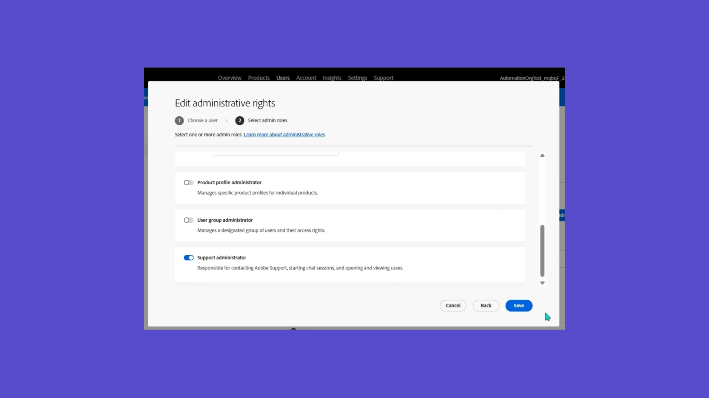
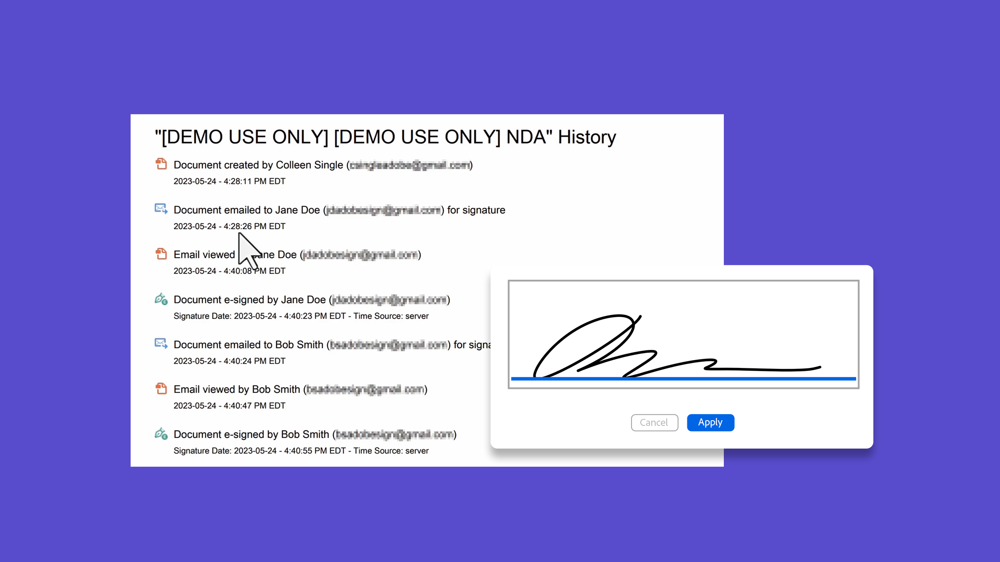
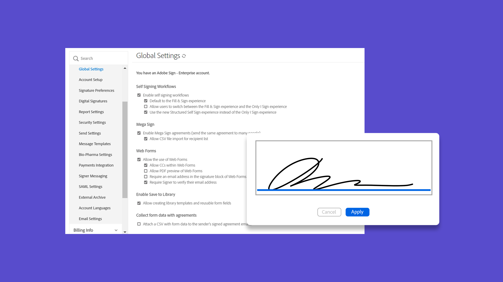
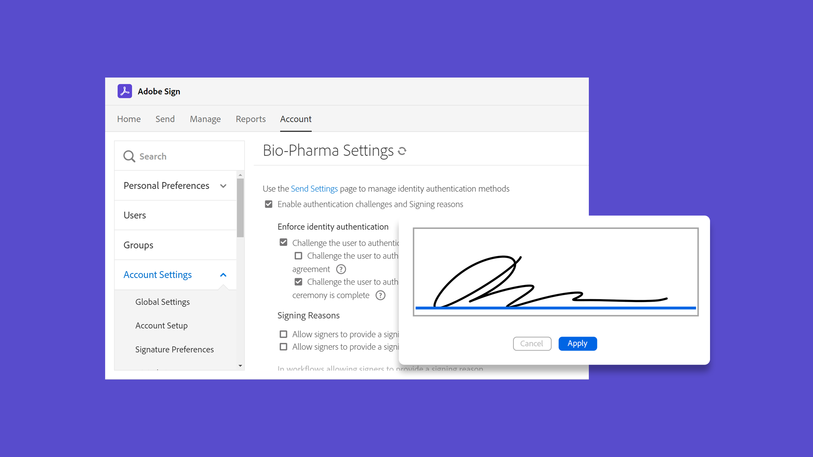

# 管理员概述

了解如何向帐户添加用户、设置组、共享访问权限以及设置工作流程、外部归档和共享事件及警告。 这些教程面向已经过了安装阶段并且准备好开始管理Acrobat Sign的管理员。 高级任务涵盖涵盖涵盖多个主题，涵盖范围从管理员设置扩展至定义全局设置、帐户访问和共享以及文本标记。

## 新增功能

>[!BEGINTABS]

>[!TAB 启用自动用户分配规则]

了解如何设置[自动分配规则](automatic-assignment-rules.md)，以向用户授予对Admin Console中Acrobat Sign的访问权限。

>[!TAB 迁移Docusign模板]

了解如何通过三个简单的步骤无缝[迁移Docusign模板](docusign-templates.md)和工作流。

>[!TAB 添加新用户]

了解如何[向Acrobat Sign添加新用户](add-users-to-your-account.md)。

>[!ENDTABS]

## 开始使用

<table style="table-layout:fixed">
<tr>
  <td>
    
    

    <a href="get-started-admin.md"><strong>新管理员快速入门</strong></a>
    

    <em>在这个全面的视频指南中，了解使您的组织启动并运行Acrobat Sign所需的所有工具</em>
     
  </td>
  <td>
    
    

    <a href="up-and-running-admin.md"><strong>为管理员启动并运行</strong></a>
    

    <em>管理员可在Acrobat Sign中快速启动和运行的7个关键领域概述</em>
     
  </td>
  <td>
    
    

    <a href="docusign-templates.md"><strong>迁移Docusign模板</strong></a>
    

    <em>了解如何无缝迁移Docusign模板和工作流</em>
     
  </td>
  <td>
    
    

    <a href="add-users-to-your-account.md"><strong>添加新用户</strong></a>
    

    <em>了解如何向Acrobat Sign添加新用户</em>
     
  </td>
</tr>
<tr>
  <td>
    
    

    <a href="automatic-assignment-rules.md"><strong>启用自动用户分配规则</strong></a>
    

    <em>了解如何设置自动分配Admin Console，以向用户授予对Acrobat Sign的访问权限</em>
     
  </td>
  <td>
    
    

    <a href="add-admin.md"><strong>添加新帐户管理员</strong></a>
    

    <em>了解如何创建新用户或将现有用户提升为Acrobat Sign管理员角色</em>
     
  </td>
    <td>
      
      

      <a href="promote-admin.md"><strong>分配产品和支持管理员角色</strong></a>
      

      <em>了解如何在Admin Console中分配Acrobat Sign用户产品管理员和支持管理员角色</em>
       
    </td>
    <td>
      
      

      <a href="create-and-manage-groups.md"><strong>创建和管理组</strong></a>
      

      <em>创建组、将用户添加到组和编辑组设置</em>
       
    </td>
</tr>
<tr>
 <td>
      
      

      <a href="set-up-your-external-archive.md"><strong>设置外部归档</strong></a>
      

      <em>为已签名协议的备份副本创建外部归档</em>
       
    </td>
  <td>
    
    

    <a href="../sign-advanced-users/create-a-template.md"><strong>正在创建文档模板</strong></a>
    

    <em>创建可重复使用的文档模板以提高速度和一致性</em>
     
  </td>
  <td>
    
    

    <a href="../sign-advanced-users/creating-a-report.md"><strong>报告和交易使用情况</strong></a>
    

    <em>了解如何生成报告和跟踪交易使用情况</em>
     
  </td>
  <td>
    
    

    <a href="report-options.md"><strong>用户的报告选项</strong></a>
    

    <em>了解如何为用户设置报告选项</em>
     
  </td>
</tr>  
<tr>
   <td>
    
    

    <a href="../sign-advanced-users/webform.md"><strong>正在创建Web表单</strong></a>
    

    <em>创建可以在您的网站上直接进行电子签名的文档</em>
     
  </td>
  <td>
    
    

    <a href="../sign-advanced-users/modify-webform.md"><strong>修改现有Web表单</strong></a>
    

    <em>了解如何禁用、编辑和重新启用现有Web表单</em>
     
  </td>
  <td>
    
    

    <a href="../sign-advanced-users/megasign.md"><strong>批量发送</strong></a>
    

    <em>一次为任何文档收集数千个签名</em>
     
  </td>
  <td>
    
    

    <a href="building-a-custom-workflow.md"><strong>设置工作流</strong></a>
    

    <em>自动化文档工作流以快速获取电子签名和数据</em>
     
  </td>
</tr>
<tr>
     <td>
    
    

    <a href="audit-reports.md"><strong>审核报告</strong></a>
    

    <em>了解如何访问、利用和配置审核报告</em>
     
    </td>
    <td>
      
      

      <a href="set-up-shared-events-and-alert.md"><strong>配置事件和警告的通知</strong></a>
      

      <em>为您的帐户配置事件和警告通知</em>
       
    </td>
    <td>
      
      

       
    </td>
    <td>
      
      

       
    </td>
</tr>    
</table>

## 高级任务

<table style="table-layout:fixed">
<tr>
  <td>
    
    

    <a href="learn-about-global-settings.md"><strong>全局设置</strong></a>
    

    <em>全局编辑整个组织或特定组的产品设置</em>
     
  </td>
  <td>
      
    

    <a href="share-account-access.md"><strong>共享帐户访问权限</strong></a>
    

    <em>设置对另一个用户帐户中的事务的仅查看访问权限</em>
     
  </td>
  <td>
    
    

    <a href="advanced-account-sharing.md"><strong>高级帐户共享</strong></a>
    

    <em>设置帐户共享以允许管理员和用户委派其发送、修改和查看权限</em>
     
  </td>
  <td>
    
    

    <a href="bulk-download-tool.md"><strong>批量下载工具</strong></a>
    

    <em>了解如何使用批量下载工具快速下载所有已签名的协议</em>
     
  </td> 
</tr>
<tr>
   <td>
     
    

    <a href="../sign-advanced-users/adobe-sign-text-tagging.md"><strong>Acrobat Sign文本标记</strong></a>
    

    <em>使用Adobe Acrobat通过文本标记构建Acrobat Sign表单字段</em>
     
  </td>
  <td>
    
    

    <a href="use-bio-pharma-settings.md"><strong>使用生物识别设置</strong></a>
    

    <em>设置生物识别设置，以使您符合FDA 21 CFR Part 11要求</em>
     
  </td>
  <td>
    
    

    <a href="privacy.md"><strong>如何设置隐私管理员</strong></a>
    

    <em>了解如何设置和使用隐私管理员</em>
     
  </td>
  <td>
    
    

     
  </td>
</tr>
</table>
