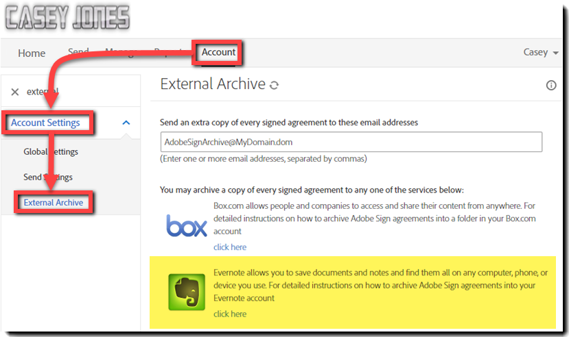

# 设置外部归档

了解如何为已发送协议的备份副本创建外部归档。 您可以将签名协议的副本存档到任何电子邮件地址或Box和Evernote。 “已签名并存档”电子邮件的副本将发送到电子邮件地址或您设置的服务。

## 外部归档：电子邮件地址

1. 以帐户管理员身份登录。

1. 单击[!UICONTROL 帐户]选项卡下的&#x200B;**[!UICONTROL 帐户设置]** > **[!UICONTROL 外部归档]**。

   

1. 输入存档电子邮件地址，然后单击&#x200B;**[!UICONTROL 保存更改]**。

   

## 外部归档：Box.com

1. 以帐户管理员身份登录。

1. 单击[!UICONTROL 帐户]选项卡下的&#x200B;**[!UICONTROL 帐户设置]** > **[!UICONTROL 外部归档]**。

1. 选择Box徽标右侧的[!UICONTROL 单击此处]链接。

   

1. 按照弹出窗口中特定于 Box 的指示执行操作。

   

## 外部归档：Evernote

1. 以帐户管理员身份登录。

1. 单击[!UICONTROL 帐户]选项卡下的&#x200B;**[!UICONTROL 帐户设置]** > **[!UICONTROL 外部归档]**。

1. 选择Evernote徽标右侧的&#x200B;**[!UICONTROL 单击此处]**&#x200B;链接。

   

1. 按照弹出窗口中特定于 Evernote 的指示执行操作。

   
