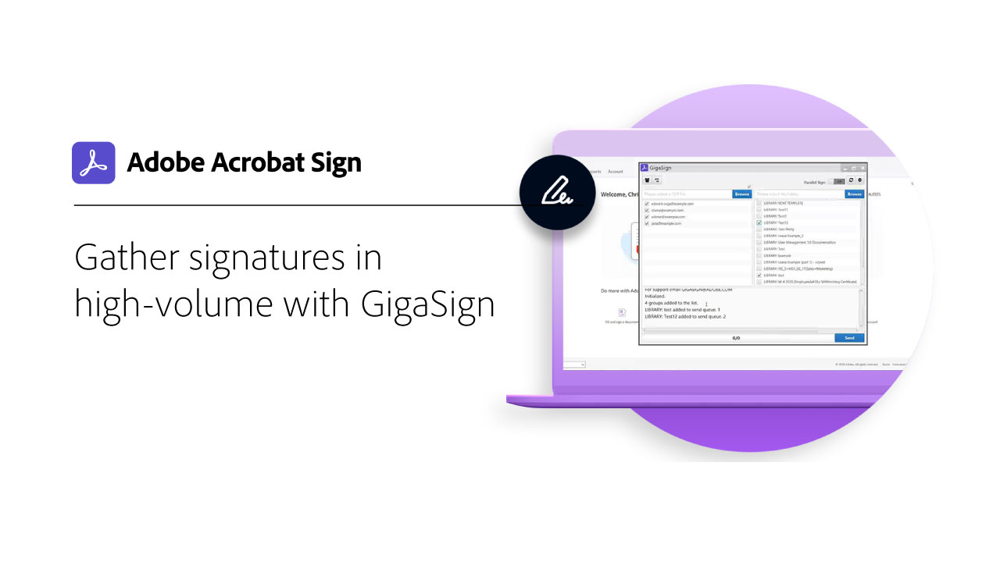

# 开发概述

Adobe Sign中40%的协议是使用API创建的。 使用API为您的团队、合作伙伴和客户创建自定义应用程序。

<table style="table-layout:fixed">
<tr>
  <td>
    
    

    <a href="https://www.adobe.io/apis/documentcloud/sign.html" target="_blank"><strong>快速入门</strong></a>
    

    <em>立即创建开发人员帐户以开始使用</em>
     
  </td>
  <td>
    
    

    <a href="https://www.adobe.io/apis/documentcloud/sign/docs.html" target="_blank"><strong>了解您可以做什么</strong></a>
    

    <em>了解如何将Adobe Sign的功能并入任何外部应用程序</em>
     
  </td>  
  <td>
    
    

    <a href="gigasign.md"><strong>使用GigaSign收集大容量文档</strong></a>
    

    <em>同时向数千人发送、收集和跟踪文档以供签名</em>
     
  </td>
</tr>
<tr>
  <td>
    
    

    <a href="embeddedesignature.md"><strong>创建嵌入式电子签名和文档体验</strong></a>
    

    <em>了解如何使用Adobe Sign API将电子签名和文档体验嵌入Web平台、内容和文档管理系统</em>
     
  </td>
  <td>
    
    

     
  </td>
  <td>
    
    

     
  </td>
</tr>
</table>
