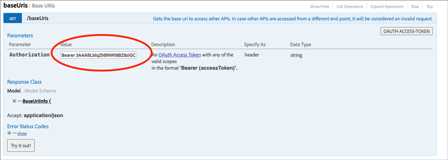
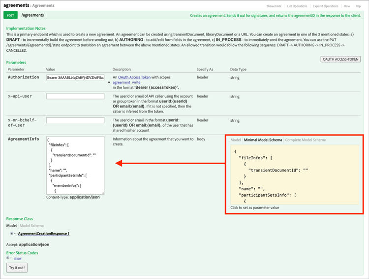
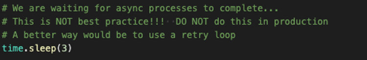

# 创建嵌入式电子签名和文档体验

了解如何使用Acrobat Sign API将电子签名和文档体验嵌入到Web平台以及内容和文档管理系统。 本动手教程分为四个部分。

## 第1部分：您需要什么

在第1部分中，了解如何开始使用第2-4部分所需的一切。 让我们从获取API凭据开始。

+++查看有关如何获取API凭据的详细信息

* [Acrobat Sign 开发人员帐户](https://www.adobe.com/acrobat/business/developer-form.html)
* [入门代码](https://github.com/benvanderberg/adobe-sign-api-tutorial)
* [VS代码（或您选择的编辑器）](https://code.visualstudio.com)
* Python 3.x
   * Mac — Homebrew
   * Linux — 内置安装程序
   * Windows — Chocolatey
   * 全部 — https://www.python.org/downloads/

+++

## 第2部分：低代码/无代码 — Web表单的强大功能

在第2部分中，了解使用Web表单的低代码/无代码选项。 最好先看看是否可以避免编写代码。

+++查看有关如何创建Web表单的详细信息

1. 使用您的开发人员帐户访问Acrobat Sign。

1. 在主页上选择&#x200B;**Publish Web表单**。

   

1. 创建您的协议。

   

1. 将协议嵌入到平面HTML页面上。

1. 尝试动态添加查询参数。

   

+++

## 第3部分：发送包含表单的协议并合并数据

在第3部分中，动态创建协议。

+++查看有关如何动态创建协议的详细信息

首先，您需要建立访问权限。 使用Acrobat Sign，有两种方法通过API进行连接。 OAuth令牌和集成密钥。 除非您有非常具体的原因要在应用程序中使用OAuth，否则您应首先探索集成密钥。

1. 在Acrobat Sign的&#x200B;**“帐户”**&#x200B;选项卡下的&#x200B;**“API信息”**&#x200B;菜单中选择&#x200B;**“集成密钥”**。

   

现在您有权访问并可与API交互，请查看您可以对API执行哪些操作。

1. 导航至[Acrobat Sign REST API Version 6方法](http://adobesign.com/public/docs/restapi/v6)。

   

1. 将令牌用作“持有人”值。

   

要发送您的第一个协议，最好了解如何使用API。

1. 创建临时文档并发送。

>[!NOTE]
>
>基于JSON的请求调用具有“模型”和“最小模型架构”选项。 这将提供规范和最小负载集。

在首次发送协议后，您就可以添加逻辑了。 建立一些帮助者以尽量减少重复始终是个好主意。 以下是一些示例：

**验证**

**标头/身份验证**

**基本URI**

请留意Sign生态系统宏伟计划内的临时文档落点。
临时 — >协议
临时 — >模板 — >协议
临时 — >构件 — >协议

此示例使用模板作为文档源。 这通常是最佳路径，除非您有充分理由动态生成文档以供签名（例如，生成旧版代码或文档）。

代码相当简单；它使用库文档（模板）作为文档源。 第一和第二签名者被动态分配。 `IN_PROCESS`状态表示文档将立即发送。 此外，还利用`mergeFieldInfo`动态填充字段。

+++

## 第4部分：嵌入签名体验、重定向等

在许多情况下，您可能需要允许触发参与者立即签署协议。 这对于面向客户的应用程序和信息亭非常有用。

+++查看有关如何嵌入签名体验的详细信息

如果您不希望触发第一个发送的电子邮件，一种管理行为的简单方法是修改API调用。

以下是如何控制签名后重定向：

更新协议创建过程后，最后一步是生成签名URL。 此调用也非常简单，可生成一个签名者可用于访问其签名过程的URL。

>[!NOTE]
>
>请注意，协议创建调用从技术上讲是异步的。 这意味着可以进行“POST”协议调用，但协议尚未就绪。 最佳做法是建立重试循环。 重试或采用适合您环境的最佳实践。

当所有内容都整合在一起时，解决方案非常简单。 您正在创建一个协议，然后生成一个签名URL，以供签名者单击并开始进行签名仪式。

+++

## 其他主题

* [JS事件](https://www.adobe.io/apis/documentcloud/sign/docs.html#!adobedocs/adobe-sign/master/events.md)
* Webhook事件
   * [REST API](https://sign-acs.na1.echosign.com/public/docs/restapi/v6#!/webhooks/createWebhook)
   * [Acrobat Sign v6中的Webhook](https://www.adobe.io/apis/documentcloud/sign/docs.html#!adobedocs/adobe-sign/master/webhooks.md)
* [重新激活请求电子邮件（包含事件）](https://sign-acs.na1.echosign.com/public/docs/restapi/v6#!/agreements/updateAgreement)
* [将超时替换为重试](https://stackoverflow.com/questions/23267409/how-to-implement-retry-mechanism-into-python-requests-library)
* 自定义提醒
   * 通过初始创建

     

   * 或添加一个[正在运行中](https://sign-acs.na1.echosign.com/public/docs/restapi/v6#!/agreements/createReminderOnParticipant)
