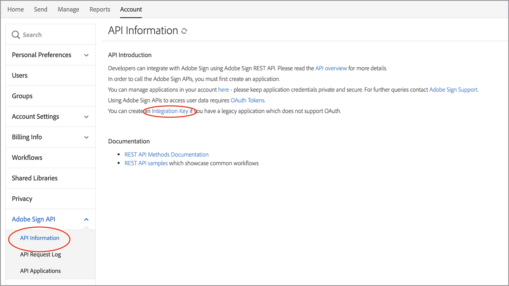

# 创建嵌入式电子签名和文档体验

了解如何使用Adobe Sign API将电子签名和文档体验嵌入Web平台、内容和文档管理系统。 下面的链接概述了此动手教程的四个部分：

<table style="table-layout:fixed">
<tr>
  <td>
    
    

    <a href="embeddedesignature.md#part1"><strong>第1部分：您需要的</strong></a>
    

  </td>
  <td>
    
    

    <a href="embeddedesignature.md#part2"><strong>第二部分：低/无代码 — Web表单的强大功能</strong></a>
    

  </td>
  <td>
   
    

    <a href="embeddedesignature.md#part3"><strong>第三部分：使用表单发送协议并合并数据</strong></a>
    

  </td>
  <td>
   
    

    <a href="embeddedesignature.md#part4"><strong>第四部分：嵌入签名体验、重定向等</strong></a>
    

  </td>
</tr>
</table>

## 第1部分：您需要的 {#part1}

在第1部分中，您将学习如何开始使用第2-4部分所需的一切。 让我们从获取API凭据开始。

* [Adobe Sign 开发人员帐户](https://acrobat.adobe.com/cn/zh-Hans/sign/developer-form.html)
* [起始代码](https://github.com/benvanderberg/adobe-sign-api-tutorial)
* [VS代码（或您选择的编辑器）](https://code.visualstudio.com)
* Python 3.x
   * Mac — Homebrew
   * Linux — 内置安装程序
   * Windows — 巧克力
   * 全部 — https://www.python.org/downloads/

## 第二部分：低/无代码 — Web表单的强大功能 {#part2}

在第2部分中，您将在使用Web表单时探索低/无代码选项。 最好先看看能否避免编写代码。

1. 使用您的开发人员帐户访问Adobe Sign。
1. 单击主页上的&#x200B;**发布Web表单**。

   

1. 创建协议。

   

1. 将协议嵌入到简单的HTML页面。
1. 尝试动态添加查询参数。

   

## 第三部分：使用表单发送协议并合并数据 {#part3}

在第3部分，您将动态创建协议。

首先，您需要建立访问权限。 使用Adobe Sign，可通过API进行两种连接。 OAuth令牌和集成密钥。 除非您有非常明确的理由将OAuth用于应用程序，否则您首先需要浏览集成密钥。

1. 在Adobe Sign中&#x200B;**帐户**&#x200B;选项卡下的“API信息”**菜单中，选择**&#x200B;集成密钥&#x200B;**。**

   

现在，您可以访问并与API进行交互，了解可以使用API做什么。

1. 导航到[Adobe Sign REST API版本6方法](http://adobesign.com/public/docs/restapi/v6)。

   

1. 将令牌用作“承载”值。

   

要发送您的第一份协议，最好了解如何使用API。

1. 创建一个“临时文档”并发送它。

>[!NOTE]
>
>基于JSON的请求调用具有“模型”和“最小模型架构”选项。 这提供了规格和最小负载集。

首次发送协议后，您已准备好添加逻辑。 总是一个好主意，应该设立一些帮手来尽量减少重复。 以下提供了一些示例：

**验证**

**标头/身份验证**

**基本URI**

请注意Transient docs在Sign生态系统的宏计划内的位置。
瞬态 — >协议
瞬态 — >模板 — >协议
“瞬态” — >“构件” — >“协议”

此示例使用模板作为文档源。 这通常是最佳途径，除非您有充分理由动态生成文档以供签名（例如，旧代码或文档生成）。

代码相当简单；它使用库文档（模板）作为文档源。 动态分配第一个和第二个签名者。 `IN_PROCESS`状态表示文档正被立即发送。 此外，还利用`mergeFieldInfo`动态填写字段。

## 第四部分：嵌入签名体验、重定向等 {#part4}

在许多情况下，您可能希望允许触发参与者立即签署协议。 这对于面向客户的应用程序和信息亭非常有用。

如果不希望第一个发送电子邮件触发，则管理该行为的简单方法是修改API调用。

以下是如何控制签名后重定向：

更新协议创建过程后，最后一步是生成签名URL。 此调用也非常简单，它会生成一个URL，签名者可以使用该URL访问其在签名过程中的部分。

>[!NOTE]
>
>请注意，协议创建调用在技术上是异步的。 这意味着可以发出“POST”协议调用，但协议尚未准备好。 最佳做法是建立重试循环。 请使用重试或任何最适合您的环境的最佳做法。

当所有事情都汇总在一起时，解决方案就相当简单。 您正在签署协议，然后生成签名URL，供签名者单击并开始签名仪式。

### 其他主题

* [JS事件](https://www.adobe.io/apis/documentcloud/sign/docs.html#!adobedocs/adobe-sign/master/events.md)
* Webhook事件
   * [REST API](https://sign-acs.na1.echosign.com/public/docs/restapi/v6#!/webhooks/createWebhook)
   * [Adobe Sign v6中的Webhooks](https://www.adobe.io/apis/documentcloud/sign/docs.html#!adobedocs/adobe-sign/master/webhooks.md)
* [重新激活请求电子邮件（包含事件）](https://sign-acs.na1.echosign.com/public/docs/restapi/v6#!/agreements/updateAgreement)
* [将超时替换为重试](https://stackoverflow.com/questions/23267409/how-to-implement-retry-mechanism-into-python-requests-library)

     
* 自定义提醒
   * 初始创建时

      

   * 或添加一个[in-flight](https://sign-acs.na1.echosign.com/public/docs/restapi/v6#!/agreements/createReminderOnParticipant)

## 其他资源

http://bit.ly/Summit21-T126

包括：
* Adobe Sign 开发人员帐户
* Adobe Sign API文档
* 示例代码
* Visual Studio代码
* Python
