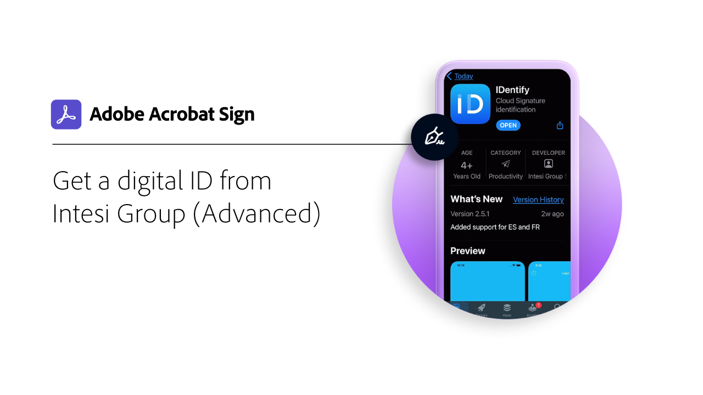
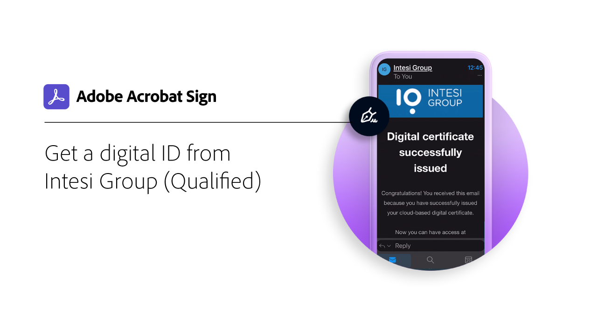
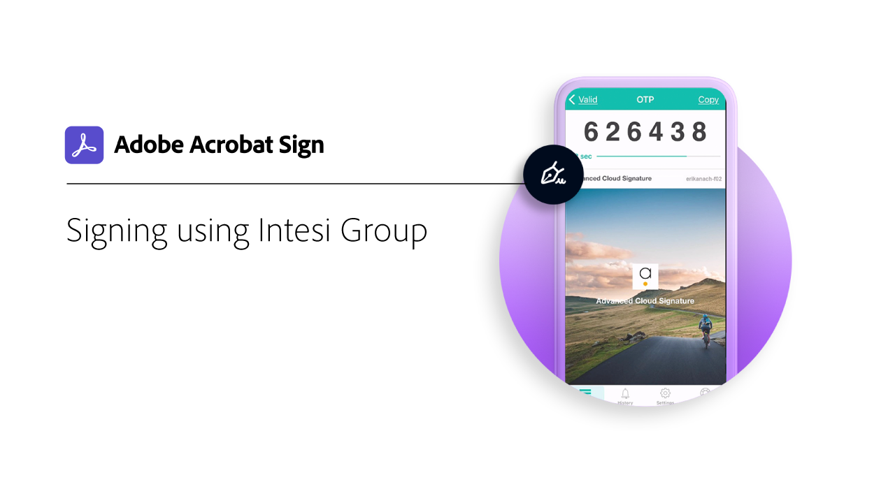

# 数字身份证概述

与电子形式的护照类似，数字身份（数字ID）允许您安全地证明您是所宣称的身份。 此外，在Acrobat Sign中进行电子签名时，使用数字ID可以提供更高级别的保证，保证您已授权对该特定文档进行电子签名。 以下教程将向您介绍如何通过Acrobat Sign使用来自世界各地的数字ID。

>[!NOTE]
>
>请首先与组织的管理员核实是否已在Acrobat Sign中启用提供商的解决方案，然后才能使用数字身份证和云签名。

## 新增功能

>[!BEGINTABS]

>[!TAB 使用Digidentity注册和签名]

了解如何在Acrobat Sign中注册和使用您的[[!DNL Digidentity]](digidentity-sign.md)数字身份证。

>[!TAB 使用D-Trust进行注册和签名]

了解如何向[[!DNL D-Trust]](d-trust.md)注册您的身份，然后在Acrobat Sign中对文档使用[!DNL D-Trust]数字签名。

>[!ENDTABS]

## [!DNL Aadhaar]

<table style="table-layout:fixed">
<tr>
 <td>
    
    

    <a href="aadhaar-sign.md"><strong>使用[!DNL Aadhaar]</strong></a>进行签名
    

    <em>了解如何在Acrobat Sign中使用您的[!DNL Aadhaar]数字ID</em>
     
  </td>
  <td>
    
    

     
  </td>
  <td>
    
    

     
  </td>
  <td>
    
    

     
  </td>
</tr>
</table>

## [!DNL Digidentity]

<table style="table-layout:fixed">
<tr>
  <td>
    
    

    <a href="digidentity-sign.md"><strong>使用[!DNL Digidentity]</strong></a>注册和签名
    

    <em>了解如何在Acrobat Sign中注册和使用您的[!DNL Digidentity]数字身份证</em>
     
  </td>
  <td>
    
    

     
  </td>
  <td>
    
    

     
  </td>
  <td>
    
    

     
  </td>
</tr>
</table>

## [!DNL D-Trust]

<table style="table-layout:fixed">
<tr>
  <td>
    
    

    <a href="d-trust.md"><strong>使用D-Trust进行注册和签名</strong></a>
    

    <em>了解如何向[!DNL D-Trust]注册您的身份，然后在Acrobat Sign中对文档使用[!DNL D-Trust]数字签名</em>
     
  </td>
  <td>
    
    

     
  </td>
  <td>
    
    

     
  </td>
  <td>
    
    

     
  </td>
  </tr>
  </table>

## [!DNL Intesi Group]

<table style="table-layout:fixed">
<tr>
  <td>
    
    

    <a href="intesi-advanced.md"><strong>从[!DNL Intesi Group]获取数字ID（高级）</strong></a>
    

    <em>了解如何从[!DNL Intesi Group]</em>获取高级数字签名证书
     
  </td>
  <td>
    
    

    <a href="intesi-qualified.md"><strong>从[!DNL Intesi Group]获取数字ID （限定）</strong></a>
    

    <em>了解如何从[!DNL Intesi Group]</em>获取合格数字签名证书
     
  </td>
  <td>
    
    

    <a href="intesi-sign.md"><strong>使用[!DNL Intesi Group]</strong></a>进行签名
    

    <em>了解如何在Acrobat Sign中使用您的[!DNL Intesi Group]数字ID</em>
     
  </td>
  <td>
    
    

     
  </td>
</tr>
</table>
