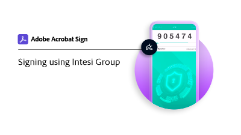

# 从[!DNL Intesi Group]获取数字ID （限定）

了解如何从[!DNL Intesi Group]获取合格的数字签名证书。 注册并验证您的身份后，[!DNL Intesi Group]将向您发放用于应用Acrobat Sign云签名的数字ID。

>[!VIDEO](https://video.tv.adobe.com/v/3449038?captions=chi_hans&quality=12&learn=on&hidetitle=true)

  

**选择下面的图像，了解如何在Acrobat Sign中使用限定的[!DNL Intesi Group]数字ID。**

