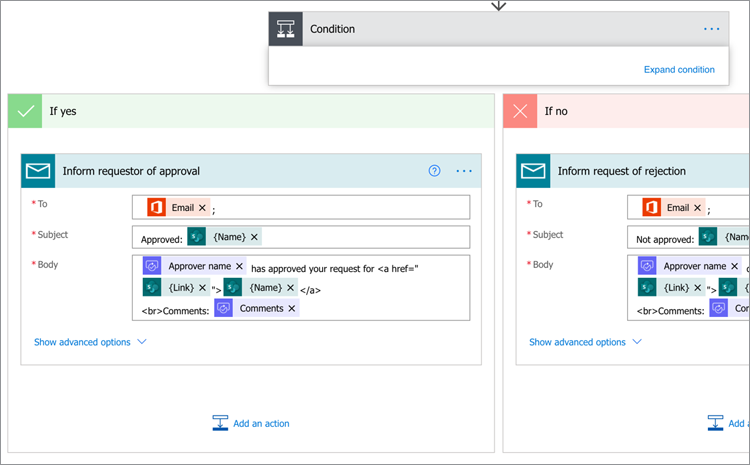
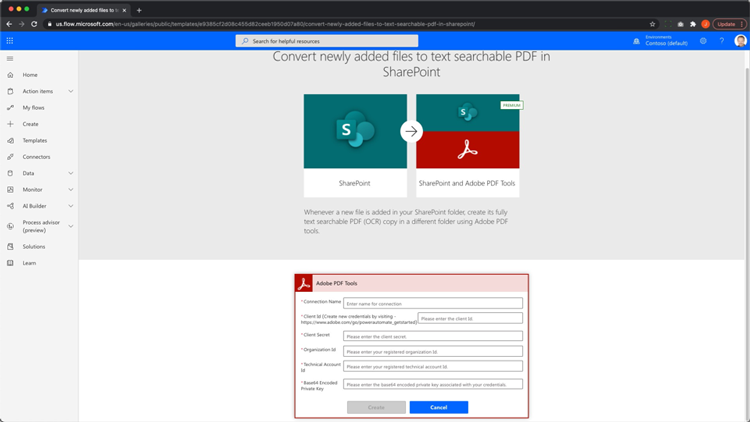
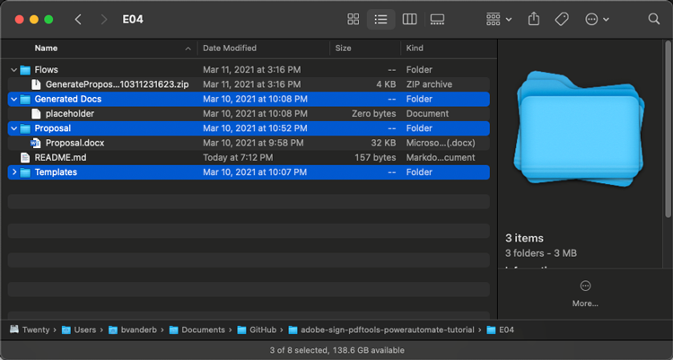

# 适用于Microsoft的Acrobat Sign功能平台的文档自动化

了解如何激活和使用适用于Microsoft Power Apps的Acrobat Sign和Adobe PDF Tools连接器。 构建无需任何代码即可快速安全地自动化业务审批和签名流程的工作流。 此实际操作教程分为四个部分，如下面的链接所示：

<table style="table-layout:fixed">
<tr>
  <td>
    
    

    <a href="documentautomation.md#part1"><strong>第1部分：使用Acrobat Sign在SharePoint中存储已签署的协议</strong></a>
    

  </td>
  <td>
    
    

    <a href="documentautomation.md#part2"><strong>第2部分：使用Acrobat Sign获取电子签名的自动审批流程</strong></a>
    

  </td>
  <td>
   
    

    <a href="documentautomation.md#part3"><strong>第3部分：使用Adobe PDF Tools自动执行文档OCR</strong></a>
    

  </td>
  <td>
   
    

    <a href="documentautomation.md#part4"><strong>第4部分：使用Adobe PDF Tools自动组装文档</strong></a>
    

  </td>
</tr>
</table>

## 先决条件

* 熟悉Microsoft 365和Power Automate
* Acrobat Sign知识
* 有权访问SharePoint和Power Automate的Microsoft 365帐户(Acrobat Sign基本版，Adobe PDF Tools高级版)
* Acrobat Sign企业版或Acrobat Sign开发人员帐户

**练习1和2**

* 有权访问API的Acrobat Sign帐户。 开发人员帐户或企业帐户。
* 您拥有编辑权限的Power Automate可访问的SharePoint站点。 建议使用完全管理员访问权限。
* 签名批准请求和签名的示例文档。

**练习3和4**

在[此处](https://github.com/benvanderberg/adobe-sign-pdftools-powerautomate-tutorial)下载材料

## 第1部分：使用Acrobat Sign在SharePoint中存储已签名的协议 {#part1}

第一部分中，您将使用Power Automate工作流模板来设置自动化工作流，以将所有已签名协议保存到您的SharePoint站点。

1. 导航到Power Automate。
1. 搜索Acrobat Sign。

   

1. 选择&#x200B;**将Acrobat Sign已完成协议保存到SharePoint库**。

   

1. 查看屏幕并配置任何所需的连接。 启用Acrobat Sign连接。
1. 单击蓝色`+`符号。

   

1. 输入您的Acrobat Sign帐户电子邮件，然后单击新窗口中的密码字段。

   

   请稍等片刻，以便Adobe检查您的帐户。

   >[!NOTE]
   >
   >如果您使用的是Adobe ID或我们的企业SSO，则此检查将引导您前往相应的登录名。

1. 完成登录。
1. 单击&#x200B;**继续**&#x200B;以转到流程编辑屏幕。
1. 命名触发器。

   

1. 配置SharePoint设置。

   

   **站点地址：**您的SharePoint站点
   **文件夹路径：**要使用的共享文档的路径
   **文件名：**接受默认值
   **文件内容：**&#x200B;接受默认值

1. 保存工作流。

   

1. 使用蓝色返回箭头导航到工作流概述屏幕。 您将在第2部分中测试此流程。

   

您将在下一部分中测试此流程。

## 第2部分：使用Acrobat Sign获取电子签名的自动审批流程 {#part2}

在第二部分中，我们在第一部分的基础上构建了一个更强大的流，并测试两个流以查看它们的实际运行情况。

1. 从Power Automate界面的左侧选择&#x200B;**模板**。

   

1. 搜索“经理批准”。
1. 为所选文件选择&#x200B;**请求管理器批准**。

   

   查看连接并添加任何缺少的连接。

   >[!NOTE]
   >
   >如果这是您对批准执行的第一个流，则在流运行时将对其进行完全配置。

1. 单击“**继续**”以转到流编辑屏幕。

   此流程包含许多预配置步骤，包括错误检查和嵌套条件步骤。

1. 为所选文件&#x200B;**配置**，如下所示：
   **站点地址：**您的SharePoint站点
   **库名称：**&#x200B;您的文档存储库
1. 按如下方式添加输入：
   **类型**：电子邮件
   **姓名**：签名者电子邮件

   

1. 按如下方式配置&#x200B;**获取文件属性：**：
   **站点地址：**您的SharePoint站点
   **库名称：**&#x200B;您的文档存储库

1. 向下滚动并查找&#x200B;**如果是**。

   

1. 单击&#x200B;**如果是**&#x200B;框（不是最底部的）中的&#x200B;**添加操作**&#x200B;以添加要发送以请求签名的步骤。

   

1. 搜索&#x200B;**SharePoint get file content**，然后选择&#x200B;**Get file content**。

   

1. 按如下方式配置&#x200B;**获取文件内容**：

   

   **站点地址：**您的SharePoint站点。
   **文件标识符：**&#x200B;搜索“标识符”，然后从&#x200B;**获取文件属性**&#x200B;步骤中选择标识符。
1. 搜索“Adobe”并选择&#x200B;**Acrobat Sign**&#x200B;以添加其他操作。

   

1. 在Acrobat Sign的搜索框中输入“上传”，然后选择&#x200B;**上传文档并获取文档ID**。
1. 搜索动态变量&#x200B;**Name**&#x200B;以在&#x200B;**文件名**&#x200B;下获取触发器中所选项目/文档的名称。
1. 在&#x200B;**文件内容**&#x200B;下的变量助手中单击&#x200B;**表达式**。

   

1. 添加单个撇号，然后重新单击&#x200B;**动态内容**，删除您的撇号，选择&#x200B;**文件内容**，然后单击&#x200B;**确定**。

   请确保没有其他撇号，并且看起来与以下示例类似。

   

1. 在Acrobat Sign搜索区域中搜索“创建”以添加另一个Acrobat Sign操作。
1. 选择&#x200B;**从上传的文档创建和协议，并发送以供签名**。

   

1. 配置所需信息：
从**协议名称**&#x200B;中的动态变量助理中选择&#x200B;**名称**。
从**文档ID**&#x200B;中的动态变量助理中选择&#x200B;**文档ID**。
从**参与者电子邮件**&#x200B;中的动态变量助理中选择&#x200B;**签名者电子邮件**。
按**参与者顺序**输入“1”。
从**参与者角色**&#x200B;的下拉列表中选择&#x200B;**签名者**。

   

1. **保存**&#x200B;工作流。

### 测试工作流

转到SharePoint站点的文档存储库以对其进行测试。

1. 选择文档并选择&#x200B;**自动**&#x200B;和刚刚创建的&#x200B;**流**。

   

1. 启动工作流以验证连接（仅首次运行工作流）。
1. 在&#x200B;**消息**&#x200B;中输入一条给审批人的好消息。
1. 在&#x200B;**签名者电子邮件**&#x200B;中输入文档签名者的电子邮件。
1. 单击&#x200B;**运行流**。

为启动工作流的用户配置的审批人将收到审批请求。 您可以通过电子邮件或Power Automate“措施项”菜单进行批准。
批准后，签署您的文档。 根据您的用户以及他们已登录到Sign，您可能需要在专用浏览器窗口中打开签名窗口。

完成签名，然后查看SharePoint文件夹。

## 第3部分：使用Adobe PDF Tools自动执行文档OCR {#part3}

第三部分将介绍如何在PDF导入Microsoft SharePoint时自动执行OCR。 这解决了在SharePoint中无法搜索的PDF扫描文档存在的问题。

### 在SharePoint中设置文件夹

转到您要用来存储文档的Microsoft SharePoint。

1. 单击“**+新建**”以创建一个名为“已处理合同”的新文件夹。
1. 单击“**+新建**”以创建一个名为“Old Contracts”的新文件夹。

   

这些文件夹现在被引用为Power Automate工作流的一部分。

### 从模板创建工作流

1. 登录到https://flow.microsoft.com。
1. 在侧边栏中单击&#x200B;**模板**。

   

1. 选择&#x200B;**在SharePoint中将新添加的文件转换为可搜索文本PDF**。
1. 单击Adobe PDF Tools旁边的&#x200B;**+**&#x200B;符号。

   

1. 在新选项卡中导航到https://www.adobe.com/go/powerautomate_getstarted 。
1. 单击&#x200B;**开始**。

   

1. 使用您的 Adobe ID 登录。

   

1. 输入凭据名称和凭据说明，然后单击&#x200B;**创建凭据**。

   

   保持打开凭据窗口。 您需要将它们输入Microsoft Power Automate。

   

1. 输入凭据，然后单击&#x200B;**在Microsoft Power Automate中创建**。

   

1. 单击&#x200B;**继续**。

   

   现在，您可以看到工作流的视图，并且需要为您的环境配置它。

1. 选择“站点地址”字段，并在名为“**”的触发器下选择您正在使用的SharePoint站点。在文件夹**&#x200B;中创建文件时。

   

1. 单击文件夹图标以导航至“Folder ID”（文件夹ID）下的Old Contracts（旧合同）文件夹。

   

1. 在工作流底部编辑&#x200B;**创建文件**&#x200B;操作：

   将&#x200B;**站点地址**更改为您的站点地址。
指定文件夹路径中“已处理合同”文件夹的位置。

1. 单击右上角的&#x200B;**“保存”**。
1. 单击&#x200B;**测试**。
1. 选择&#x200B;**手动**。
1. 单击&#x200B;**测试**。

   

### 试用新流程

1. 导航到SharePoint中的“旧合同”文件夹。
1. 在下载的练习文件中导航到“E03/Old Contracts”。
1. 将ReleaseFormXX.pdf文件复制到SharePoint中的“Old Contracts”文件夹中。

   

现在，如果您导航到“已处理的合同”文件夹，则可以看到在工作流获得片刻运行时间后您的PDF仍可用。 如果打开PDF，可以看到文本是可选的。
此外，SharePoint还为文档编制索引，使您可以从SharePoint的搜索栏中搜索文档内容。

## 第4部分：使用Adobe PDF Tools自动组装文档 {#part4}

在第四部分中，您将学习如何根据在从Microsoft SharePoint选择和开始工作流时提供的信息，将多个文档合并在一起。 在此方案中，工作流将：

* 询问客户相关信息，以选择包中要为客户提供的内容。
* 根据所提供的资料，它把许多文件合并在一起。 这些文档包括封面和可选白皮书。
* 合并后的文档将保存到SharePoint。

### 将练习文件导入SharePoint

1. 打开练习文件中的“E04”文件夹。
1. 将提案、模板和生成的文档文件夹导入SharePoint。

   

这些文件夹将用作参考。 尤其是，您将使用Proposal.docx文件作为提案。

在Templates文件夹中，有一个Covers文件夹，其中包含针对不同城市的封面设计。 此外，还有一个白皮书文件夹，其中包含可选的附加白皮书，如果选定该文件夹，则会将其附加到末端。

### 将流导入Microsoft Power Automate

1. 登录到Microsoft Power Automate (https://flow.microsoft.com)。
1. 单击&#x200B;**我的流**。

   

1. 单击&#x200B;**导入**。

   

1. 单击&#x200B;**上传**，然后在E04/Flows/中选择GenerateProposal_20210311231623.zip文件夹。

   

1. 单击&#x200B;**导入**。

1. 单击&#x200B;**将提案发送给客户**&#x200B;旁边操作下的扳手图标。

   

1. 在设置下选择&#x200B;**创建为新版本**。
1. 在“资源名称”下设置流的名称。
1. 单击&#x200B;**保存**。

   对其他“相关”资源重复此步骤，并选择您的连接。

   

1. 完成所有连接后，单击“**导入**”。

### 为所选文件设置

创建工作流后，请执行以下操作：

1. 单击&#x200B;**编辑**。

   

1. 为所选文件&#x200B;**选择触发器**。

   在站点地址中添加您的SharePoint站点。
在“库”中添加您的库。

   

### 设置templateFolderPath

1. 单击templateFolderPath变量。
1. 设置Templates文件夹在导入的SharePoint站点内的路径。

### 设置封面获取文件内容

1. 单击“**封面**”操作，这将扩展范围。
1. 展开&#x200B;**封面：获取文件内容**。

   将站点地址设置为您的SharePoint站点。

   

### 设置所选文件

1. 展开&#x200B;**所选文件**&#x200B;作用域操作。

   在&#x200B;**获取文件属性**下，将站点地址和库名称分别更改为您的SharePoint站点和库。
在**获取文件内容**&#x200B;下将站点地址更改为您的SharePoint站点。

   

### 设置白皮书

1. 单击&#x200B;**白皮书**&#x200B;操作。
1. 展开&#x200B;**条件：添加白皮书**。

   

1. 展开&#x200B;**白皮书1：使用路径**获取文件内容。
编辑指定SharePoint站点的站点地址。

对&#x200B;**条件：添加白皮书2**&#x200B;重复相同的步骤。

### 设置创建文件

1. 展开&#x200B;**创建文件**。

   编辑已生成文档文件夹所在的SharePoint站点和路径的站点地址和文件夹路径。

1. 单击&#x200B;**保存**。

### 测试流量

1. 导航到SharePoint中的Proposal文件夹。
1. 选择Proposal.docx文件夹。

   

1. 在&#x200B;**自动**&#x200B;菜单下选择您的流。

   

1. 单击&#x200B;**继续**&#x200B;开始工作流。

   

1. 选择您的封面和要附加的白皮书。
1. 单击&#x200B;**运行流**。

   

导航至“生成文档”文件夹。 您现在应该可以看到自己生成的PDF文件。

### 添加Protect和其他要排列的操作

成功创建了文件流后，您将要编辑文件流，使用口令加密PDF文档。 还将介绍如何使用其他操作。

1. 导航回工作流的末尾。
1. 单击&#x200B;**合并PDF**&#x200B;和&#x200B;**创建文件**&#x200B;之间的&#x200B;**+**&#x200B;符号。

   

1. 选择&#x200B;**添加操作**。
1. 搜索“Adobe PDF工具”。

   

1. 选择&#x200B;**从查看中PDFProtect**。
1. 使用“动态内容”将“文件名”字段设置为&#x200B;**合并PDF中的PDF文件名**。

   

   在触发器中，有一个密码字段是启动表单的一部分。 我们可以在这里使用它。

1. 使用动态内容搜索&#x200B;**密码字段**，并将其放置在“密码”字段中。

   

1. 使用“动态内容”将其设置为&#x200B;**“文件PDF”字段中合并PDF的文件内容**。
1. 更改&#x200B;**创建文件**&#x200B;以从ProtectPDF获取文件内容，而不是合并PDF。
1. 展开&#x200B;**创建文件**。
1. 清除文件内容字段。
1. 使用动态内容置入&#x200B;**ProtectPDF中来自查看的** PDF文件内容&#x200B;****。

### 测试流量

1. 导航到SharePoint中的Proposal文件夹。
1. 选择Proposal.docx。

   

1. 选择&#x200B;**自动**&#x200B;以选择您的工作流。

   

1. 单击&#x200B;**继续**&#x200B;开始工作流。

   

1. 选择要附加的封面和白皮书。
1. 将密码字段设置为要设置的密码。
1. 单击&#x200B;**运行流**。

   

1. 导航至“生成文档”文件夹。
您应看到生成的PDF文件。 打开PDF文件，系统会提示您输入PDF密码。

   
