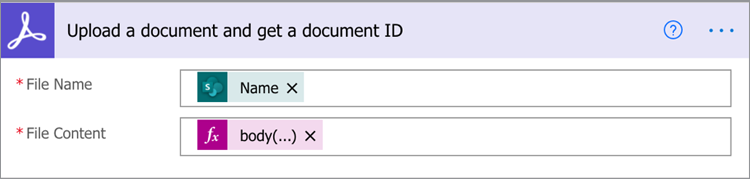
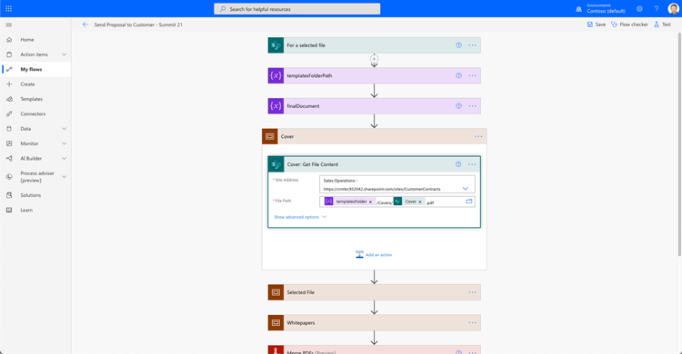
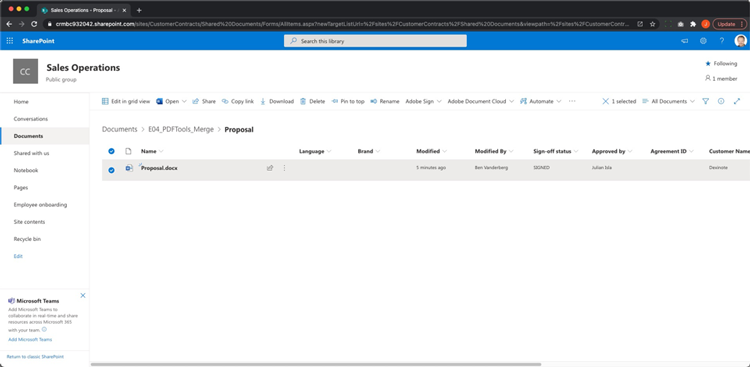
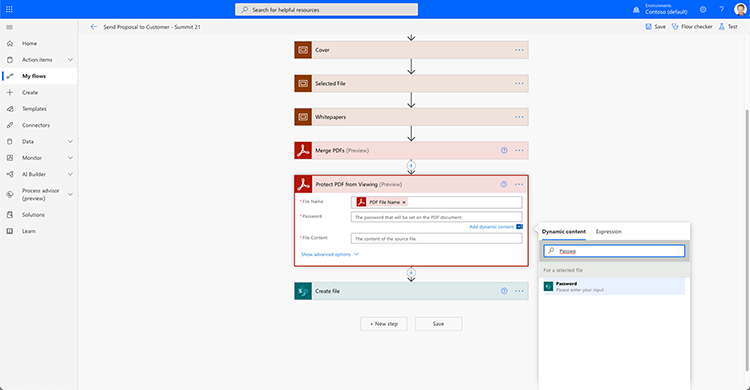

# 用于Microsoft Power Platform的Acrobat Sign的文档自动化

了解如何为Microsoft Power Apps激活和使用Acrobat Sign和Adobe PDF Tools连接器。 构建工作流程，无需任何代码即可快速安全地实现业务审批和签名流程的自动化。 该动手教程包含四个部分，其概述如下：

<table style="table-layout:fixed">
<tr>
  <td>
    
    

    <a href="documentautomation.md#part1"><strong>第1部分：将签名的协议存储在SharePoint和Acrobat Sign</strong></a>
    

  </td>
  <td>
    
    

    <a href="documentautomation.md#part2"><strong>第二部分：使用Acrobat Sign自动执行审批流程以获取电子签名</strong></a>
    

  </td>
  <td>
   
    

    <a href="documentautomation.md#part3"><strong>第三部分：使用Adobe PDF Tools实现自动化文档OCR</strong></a>
    

  </td>
  <td>
   
    

    <a href="documentautomation.md#part4"><strong>第四部分：使用Adobe PDF Tools自动编排文档</strong></a>
    

  </td>
</tr>
</table>

## 先决条件

* Microsoft 365和Power Automate熟悉
* Acrobat Sign知识
* 有权访问SharePoint和Power Automate的Microsoft 365帐户(Acrobat Sign基本版、Adobe PDF工具高级版)
* 适用于企业的Acrobat Sign或Acrobat Sign开发人员帐户

**练习1和2**

* 有权访问API的Acrobat Sign帐户。 开发人员帐户或企业帐户。
* 您有权编辑的Power Automate可访问的SharePoint站点。 建议具有完全管理员访问权限。
* 用于签名审批请求和签名的示例文档。

**练习3和4**

下载材料 [此处](https://github.com/benvanderberg/adobe-sign-pdftools-powerautomate-tutorial)

## 第1部分：将签名的协议存储在SharePoint和Acrobat Sign {#part1}

在第一部分中，您将使用Power Automate流模板设置一个自动工作流程，以将所有签名协议保存到您的SharePoint站点。

1. 导航到Power Automate。
1. 搜索Acrobat Sign。

   

1. 选择 **将Acrobat Sign完成的协议保存到SharePoint库**&#x200B;的

   

1. 查看屏幕并配置任何需要的连接。 启用Acrobat Sign连接。
1. 单击蓝色 `+` 符号。

   

1. 输入您的Acrobat Sign帐户电子邮件，然后单击新窗口中的密码字段。

   

   请稍等Adobe检查您的帐户。

   >[!NOTE]
   >
   >如果您使用的是Adobe ID或我们的企业SSO，则此检查将引导您进行相应的登录。

1. 完成登录。
1. 单击 **继续** 以转到流编辑屏幕。
1. 为触发器命名。

   

1. 配置SharePoint设置。

   

   **站点地址：** 您的SharePoint Site
   **文件夹路径：** 要使用的共享文档的路径
   **文件名：** 接受默认值
   **文件内容：** 接受默认值

1. 保存流程.

   

1. 使用蓝色后退箭头导航到流程概述屏幕。 您将在第2部分测试此流。

   

您将在下一部分中测试此流。

## 第二部分：使用Acrobat Sign自动执行审批流程以获取电子签名 {#part2}

在第二部分中，我们将第一部分构建一个更强健的流，并测试两个流以查看它们如何运行。

1. 选择 **模板** Power Automate界面的左侧。

   

1. 搜索“经理批准”。
1. 选择 **请求经理批准选定的文件**&#x200B;的

   

   查看连接并添加缺少的任何连接。

   >[!NOTE]
   >
   >如果这是您进行批准的第一个流，则当流运行时，这些流将完全配置。

1. 单击 **继续** 以转到流编辑屏幕。

   此流程包含许多预配置的步骤，其中包括错误检查和嵌套条件步骤。

1. 配置 **对于所选文件** 如下：
   **站点地址：** 您的SharePoint站点
   **库名称：** 您的文档存储库
1. 按如下方式添加输入：
   **文字**:电子邮件
   **名称**:签名者电子邮件

   

1. 配置 **获取文件属性：** 如下：
   **站点地址：** 您的SharePoint站点
   **库名称：** 您的文档存储库

1. 向下滚动并查找 **如果是**&#x200B;的

   

1. 单击 **添加动作** 的 **如果是** 框（不是最底部的一个）添加发送以供签名的步骤。

   

1. 搜索 **SharePoint获取文件内容** 然后选择 **获取文件内容**&#x200B;的

   

1. 配置 **获取文件内容** 如下：

   

   **站点地址：** 您的SharePoint站点。
   **文件标识符：** 搜索“标识符”，然后从 **获取文件属性** 命令。
1. 搜索“Adobe”并选择 **Acrobat Sign** 添加另一个动作。

   

1. 在Acrobat Sign的搜索框中输入“upload”，然后选择 **上传文档并获取文档ID**&#x200B;的
1. 搜索动态变量 **名称** 获取在 **文件名**&#x200B;的
1. 单击 **表达式** 在变量助理下 **文件内容**&#x200B;的

   

1. 添加单个撇号，然后单击“返回” **动态内容**，删除您的撇号，选择 **文件内容** 然后单击 **确定**&#x200B;的

   确保没有其他撇号，并且它看起来像下面的示例。

   

1. 在Acrobat Sign搜索区域中搜索“create”以添加另一个Acrobat Sign动作。
1. 选择 **通过已上传的文档创建并签署协议，然后发送以请求签名**&#x200B;的

   

1. 配置所需信息：选择 **名称** 从动态变量助手 **协议名称**的
选择 **文档ID** 从动态变量助手 **文档ID**的
选择 **签名者电子邮件** 从动态变量助手 **参与者电子邮件**的
输入“1” **参与者订单**的
选择 **签名者** 从下拉列表中 **参与者角色**&#x200B;的

   

1. **保存** 流。

### 测试流程

转到SharePoint站点的文档存储库进行测试。

1. 选择文档，然后选择 **自动** 和 **流量** 您刚刚创建。

   

1. 启动流以验证连接（仅第一次运行流）。
1. 在中向审批人输入一封不错的消息 **消息**&#x200B;的
1. 输入文档签名者的电子邮件 **签名者电子邮件**&#x200B;的
1. 单击 **运行流程**&#x200B;的

为启动流的用户配置的审批人将收到审批请求。 您可以通过电子邮件或通过Power Automate的“措施项”菜单进行审批。
批准后，对文档进行签名。 根据您的用户以及他们是否登录到Sign，您可能需要在专用浏览器窗口中打开签名窗口。

完成签名，然后返回您的SharePoint文件夹。

## 第三部分：使用Adobe PDF Tools实现自动化文档OCR {#part3}

第三部分中，您将了解在PDF导入Microsoft SharePoint时，如何实现OCR自动化。 这可以解决无法在SharePoint中搜索的扫描PDF文档中出现的问题。

### 在SharePoint中设置文件夹

转到Microsoft SharePoint，您想要在其中存储文档。

1. 单击 **+新建** 新建一个名为“Processed Contracts”的文件夹。
1. 单击 **+新建** 新建一个名为“Old Contracts”的文件夹。

   

这些文件夹现在作为Power Automate流程的一部分进行引用。

### 从模板创建流

1. 登录到https://flow.microsoft.com。
1. 单击 **模板** 工具栏。

   

1. 选择 **在SharePoint中将新添加的文件转换为文本可搜索PDF**&#x200B;的
1. 单击 **+** 符号。

   

1. 在新选项卡中导航到https://www.adobe.com/go/powerautomate_getstarted。
1. 单击&#x200B;**开始**。

   

1. 使用您的 Adobe ID.

   

1. 输入凭据名称和凭据说明，然后单击 **创建凭据**&#x200B;的

   

   保持打开凭据窗口。 您需要将它们输入到Microsoft Power Automate中。

   

1. 输入凭据，然后单击 **在Microsoft Power Automate中创建**&#x200B;的

   

1. 单击“**继续**”。

   

   现在，您可以看到工作流程的视图，并且需要针对您的环境对其进行配置。

1. 选择“站点地址”字段，并选择您要通过调用的触发器使用哪个SharePoint站点 **在文件夹中创建文件时**&#x200B;的

   

1. 单击文件夹图标以导航至文件夹ID下的旧合同文件夹。

   

1. 编辑 **创建文件** 操作位于流程底部：

   更改 **站点地址** 到您的站点地址。
指定“文件夹路径”中“已处理合同”文件夹的位置。

1. 单击 **保存** （位于右上角）。
1. 单击 **测试**&#x200B;的
1. 选择 **手动**&#x200B;的
1. 单击 **测试**&#x200B;的

   

### 尝试新流程

1. 导航到SharePoint中的Old Contracts文件夹。
1. 导航至您下载的练习文件中的E03/Old Contracts。
1. 将ReleaseFormXX.pdf文件复制到SharePoint中的Old Contracts文件夹中。

   

现在，如果您导航至Processed Contracts文件夹，则可以在流程获得一些运行时间后看到可用的PDF。 如果打开PDF，可以看到文本是可选的。
此外，SharePoint还为文档编制索引，允许您从SharePoint的搜索栏中搜索文档的内容。

## 第四部分：使用Adobe PDF Tools自动编排文档 {#part4}

第四部分中，您将学习如何在从Microsoft SharePoint中选择并启动流时根据所提供的信息将多个文档合并在一起。 在此方案中，流程将：

* 询问信息以选择要在客户程序包中包含的内容。
* 它根据所提供的信息将许多文件合并在一起。 这些文档包括封面和可选白皮书。
* 合并后的文档将保存到SharePoint。

### 将练习文件导入SharePoint

1. 打开练习文件中的E04文件夹。
1. 将建议、模板和生成的文档文件夹导入SharePoint。

   

这些文件夹将用作参考。 具体来说，您将使用Proposale.docx文件作为您的建议书。

在Templates文件夹中，有一个Covers文件夹，其中包含适用于不同城市的封面设计。 还有一个“Whitepapers”（白皮书）文件夹，其中包含可选的其他白皮书，如果选中，这些白皮书将附加到末尾。

### 将流导入Microsoft Power Automate

1. 登录到Microsoft Power Automate(https://flow.microsoft.com)。
1. 单击 **我的流程**&#x200B;的

   

1. 单击&#x200B;**导入**.

   

1. 单击 **上传** 并在E04/Flows/中20210311231623择GenerateProposal_.zip文件夹。

   

1. 单击&#x200B;**导入**.

1. 单击“操作”旁边的“扳手”图标 **向客户发送建议书**&#x200B;的

   

1. 选择 **新建为** 在“设置”下。
1. 在“资源名称”下设置流的名称。
1. 单击&#x200B;**保存**。

   为其他相关资源重复此步骤，然后选择连接。

   

1. 单击 **导入** 在你建立所有关系之后。

### 为选定文件设置

创建流后，请执行以下操作：

1. 单击&#x200B;**编辑**.

   

1. 选择触发器 **对于所选文件**&#x200B;的

   在“站点地址”中添加您的SharePoint站点。
将您的库添加到库中。

   

### Set templateFolderPath

1. 单击templateFolderPath变量。
1. 设置导入的SharePoint站点内Templates文件夹所在的路径。

### 设置封面获取文件内容

1. 单击 **封面** 操作，从而扩展范围。
1. 扩展 **封面：获取文件内容**&#x200B;的

   将站点地址设置为您的SharePoint站点。

   

### 设置所选文件

1. 展开 **选定的文件** 作用域操作。

   将站点地址和库名称分别更改为下面的SharePoint站点和库 **获取文件属性**的
将站点地址更改为下面的SharePoint站点 **获取文件内容**&#x200B;的

   

### 设置白皮书

1. 单击 **白皮书** 操作。
1. 扩展 **条件：添加白皮书**&#x200B;的

   

1. 扩展 **白皮书1:使用路径获取文件内容**的
将站点地址编辑到指定的SharePoint站点。

对重复相同的步骤 **条件：添加白皮书2**&#x200B;的

### 设置创建文件

1. 扩展 **创建文件**&#x200B;的

   编辑SharePoint站点的站点地址和文件夹路径以及Generated Docs文件夹所在的路径。

1. 单击&#x200B;**保存**。

### 测试流程

1. 导航到SharePoint中的“建议”文件夹。
1. 选择Proposal.docx文件夹。

   

1. 在 **自动** 菜单。

   

1. 单击 **继续** 以开始流程。

   

1. 选择封面和您要追加的白皮书。
1. 单击 **运行流程**&#x200B;的

   

导航到“生成文档”文件夹。 您现在应该可以看到生成的PDF文件。

### 将Protect和其他操作添加到流

现在您已成功创建流，接下来要编辑流以使用口令加密PDF文档。 还将介绍如何利用其他操作。

1. 导航回流程的末尾。
1. 单击 **+** 符号 **合并PDF** 和 **创建文件**&#x200B;的

   

1. 选择 **添加动作**&#x200B;的
1. 搜索“Adobe PDF Tools”。

   

1. 选择 **ProtectPDF不显示**&#x200B;的
1. 使用动态内容将“文件名”字段设置为 **PDF来自合并PDF的文件名**&#x200B;的

   

   在触发器中，有一个密码字段是启动表单的一部分。 我们可以在这里使用。

1. 搜索 **密码字段** 并将其放置在“密码”字段中。

   

1. 使用动态内容将其设置为 **PDF合并PDF中的文件内容** 文件内容字段中。
1. 更改 **创建文件** 从ProtectPDF而不是合并PDF。
1. 扩展 **创建文件**&#x200B;的
1. 清除“文件内容”字段。
1. 使用动态内容 **PDF文件内容** 从 **ProtectPDF不显示**&#x200B;的

### 测试流程

1. 导航到SharePoint中的“建议”文件夹。
1. 选择Proposal.docx。

   

1. 选择 **自动** 以选择流程。

   

1. 单击 **继续** 以开始流程。

   

1. 选择封面和您要追加的白皮书。
1. 将“密码”字段设置为要设置的密码。
1. 单击 **运行流程**&#x200B;的

   

1. 导航到“生成文档”文件夹。
您应看到生成的PDF文件。 打开PDF文件，文件会提示您输入PDF密码。

   
