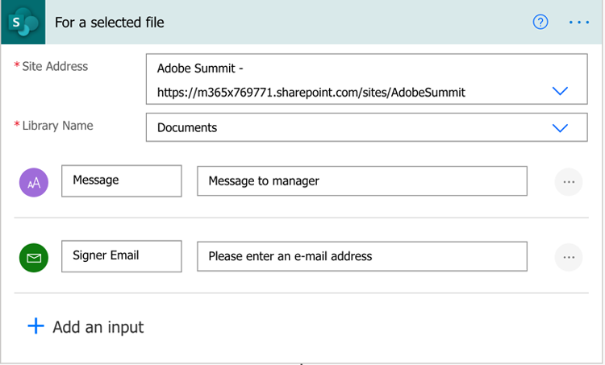
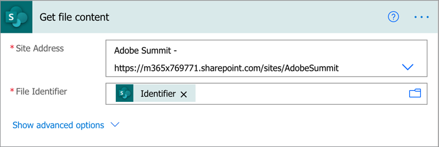
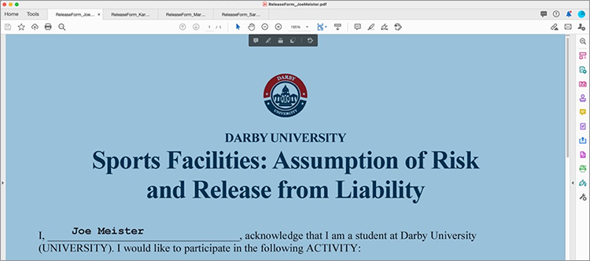

# 使用Adobe Sign for Microsoft Power Platform实现文档自动化

了解如何激活和使用Adobe Sign和Adobe PDF Tools的Microsoft Power Apps连接器。 构建无需任何代码即可快速安全地自动化业务审批和签名流程的工作流程。 下面的链接概述了此动手教程的四个部分：

<table style="table-layout:fixed">
<tr>
  <td>
    
    

    <a href="documentautomation.md#part1"><strong>第1部分：将签名协议存储在SharePoint中与Adobe Sign</strong></a>
    

  </td>
  <td>
    
    

    <a href="documentautomation.md#part2"><strong>第二部分：通过Adobe Sign获得电子签名的自动审批流程</strong></a>
    

  </td>
  <td>
   
    

    <a href="documentautomation.md#part3"><strong>第三部分：使用Adobe PDF工具自动化文档OCR</strong></a>
    

  </td>
  <td>
   
    

    <a href="documentautomation.md#part4"><strong>第四部分：使用Adobe PDF工具自动化文档汇编</strong></a>
    

  </td>
</tr>
</table>

## 先决条件

* Microsoft 365和Power Automate熟悉度
* Adobe Sign知识
* 可访问SharePoint和Power Automate的Microsoft 365帐户(Basic for Adobe Sign, Premium for Adobe PDF Tools)
* Adobe Sign企业版或Adobe Sign开发人员帐户

**练习1和2**

* Adobe Sign帐户。 开发人员帐户或企业帐户。
* Power Automate可访问您具有编辑权限的SharePoint站点。 建议完全管理员访问权限。
* 签名批准请求和签名的示例文档。

**练习3和4**

下载材料[此处](https://github.com/benvanderberg/adobe-sign-pdftools-powerautomate-tutorial)

## 第1部分：将签名协议存储在SharePoint中与Adobe Sign {#part1}

在第一部分中，您将使用Power Automate Flow模板来设置一个自动化工作流，该工作流将所有签名协议保存到您的SharePoint站点。

1. 导航至Power Automate。
1. 搜索 Adobe Sign.

   

1. 选择&#x200B;**将Adobe Sign已完成的协议保存到SharePoint库**。

   

1. 查看屏幕并配置任何需要的连接。 启用Adobe Sign连接。
1. 单击蓝色`+`符号。

   

1. 输入Adobe Sign帐户电子邮件，然后在新窗口中单击密码字段。

   

   等待Adobe检查您的帐户。

   >[!NOTE]
   >
   >如果您使用的是Adobe ID或我们的公司SSO，此检查会将您路由到相应的登录。

1. 完成登录。
1. 单击&#x200B;**继续**&#x200B;以转到流编辑屏幕。
1. 命名触发器。

   

1. 配置SharePoint设置。

   

   **站点地址：** 您的SharePoint站点
   **文件夹路** 径：要使用的共享文档的路径
   **文件名：** 接受默认值
   **文件内容：** 接受默认值

1. 保存流程.

   

1. 使用蓝色向后箭头导航到流概述屏幕。 在第2部分测试此流。

   

您将在下一部分测试此流。

## 第二部分：通过Adobe Sign获得电子签名的自动审批流程 {#part2}

在第二部分，我们使用更强大的Flow构建第一部分，并测试这两个Flow以查看它们的实际运行情况。

1. 从“电源自动化”界面的左侧选择&#x200B;**模板**。

   

1. 搜索“经理批准”。
1. 为所选文件&#x200B;**选择**&#x200B;请求管理器批准。

   

   查看连接并添加您缺少的任何连接。

   >[!NOTE]
   >
   >如果这是您使用批准进行的第一个流，则在流运行时将完全配置它们。

1. 单击&#x200B;**继续**&#x200B;以转到流编辑屏幕。

   此流包含许多预配置步骤，包括错误检查和嵌套条件步骤。

1. 为所选文件&#x200B;**配置**，如下所示：
   **站点地址：** 您的SharePoint站点
   **库名称：文** 档存储库
1. 按如下方式添加输入：
   **类型**:电子邮件
   **名称**:签名者电子邮件

   

1. 配置&#x200B;**获取文件属性：**，如下所示：
   **站点地址：** 您的SharePoint站点
   **库名称：文** 档存储库

1. 向下滚动并查找&#x200B;**If yes**。

   

1. 单击&#x200B;**如果是**&#x200B;框中的&#x200B;**添加操作**（不是最底层），添加要发送以请求签名的步骤。

   

1. 搜索&#x200B;**SharePoint获取文件内容**，然后选择&#x200B;**获取文件内容**。

   

1. 按如下方式配置&#x200B;**获取文件内容**:

   

   **站点地址：** 您的SharePoint站点。
   **文件标识符：** 搜索“标识符”，然后从“获取文件属性”步 **骤中选择** 标识符。
1. 搜索“Adobe”，然后选择&#x200B;**Adobe Sign**&#x200B;以添加其他操作。

   

1. 在Adobe Sign的搜索框中输入“upload”，然后选择&#x200B;**上传文档并获取文档ID**。
1. 搜索动态变量&#x200B;**名称**，以在&#x200B;**文件名**&#x200B;下获取触发器中选择的项目/文档的名称。
1. 单击&#x200B;**文件内容**&#x200B;下的变量助手中的&#x200B;**表达式**。

   

1. 添加单个撇号，然后单击返回&#x200B;**动态内容**，删除您的撇号，选择&#x200B;**文件内容**，然后单击&#x200B;**确定**。

   请确保没有其他撇号，并且它看起来与下面的示例类似。

   

1. 在Adobe Sign搜索区域中搜索“create”以添加另一个Adobe Sign操作。
1. 选择&#x200B;**从已上载的文档创建和协议并发送以请求签名**。

   

1. 配置所需信息：
从**协议名称**&#x200B;的动态变量助手中选择&#x200B;**名称**。
从**文档ID**&#x200B;的动态变量助手中选择&#x200B;**文档ID**。
从**参与者电子邮件**&#x200B;中的动态变量助手中选择&#x200B;**签名者电子邮件**。
在**参与者订单**中输入“1”。
从**参与者角色**&#x200B;的下拉菜单中选择&#x200B;**签名者**。

   

1. **保** 存流。

### 测试流

转到SharePoint站点的文档存储库以测试它。

1. 选择文档并选择&#x200B;**自动**&#x200B;和您刚刚创建的&#x200B;**流**。

   

1. 启动流以验证连接（仅首次运行流）。
1. 在&#x200B;**Message**&#x200B;中为审批人输入一条好消息。
1. 在&#x200B;**签名者电子邮件**&#x200B;中为文档签名者输入电子邮件。
1. 单击&#x200B;**运行流**。

为启动流的用户配置的审批人将收到审批请求。 您可以通过电子邮件或通过“自动执行动作项”菜单进行审批。
批准后，请签署文档。 根据您的用户以及他们是否登录了Sign，您可能需要在专用浏览器窗口中打开签名窗口。

完成签名，然后在SharePoint文件夹中回顾。

## 第三部分：使用Adobe PDF工具自动化文档OCR {#part3}

第三部分，您将学习在将PDF中的OCR导入Microsoft SharePoint时如何自动执行。 这解决了扫描的PDF文档在SharePoint中无法搜索的问题。

### 在SharePoint中设置文件夹

转到Microsoft SharePoint，以便存储文档。

1. 单击&#x200B;**+ New**&#x200B;以创建一个名为“已处理的合同”的新文件夹。
1. 单击&#x200B;**+ New**&#x200B;以创建一个名为“旧合同”的新文件夹。

   

这些文件夹现在作为Power Automate流程的一部分引用。

### 从模板创建流

1. 登录到https://flow.microsoft.com。
1. 单击侧栏中的&#x200B;**模板**。

   

1. 在SharePoint **中，选择“将新添加的文件转换为可搜索文本的PDF”。**
1. 单击“Adobe PDF工具”旁边的&#x200B;**+**&#x200B;符号。

   

1. 在新选项卡中导航到https://www.adobe.com/go/powerautomate_getstarted。
1. 单击&#x200B;**开始**。

   

1. 使用Adobe ID登录。

   

1. 输入凭据名称和凭据说明，然后单击&#x200B;**创建凭据**。

   

   在凭据处于打开状态时保持窗口。 您需要将它们输入Microsoft Power Automate中。

   

1. 输入凭据，然后单击“在Microsoft Power中创建自动&#x200B;**”。**

   

1. 单击“**继续**”。

   

   现在，您可以看到工作流的视图，并且需要为您的环境配置它。

1. 选择“站点地址”字段，然后在名为&#x200B;**的触发器下选择您正在使用的SharePoint站点。当在文件夹**&#x200B;中创建文件时。

   

1. 单击文件夹图标以导航到文件夹ID下的旧合同文件夹。

   

1. 编辑流底部的&#x200B;**创建文件**&#x200B;动作：

   将&#x200B;**站点地址**更改为站点地址。
在文件夹路径中指定“已处理的合同”文件夹的位置。

1. 单击右上角的&#x200B;**保存**。
1. 单击&#x200B;**测试**。
1. 选择&#x200B;**手动**。
1. 单击&#x200B;**测试**。

   

### 尝试新流程

1. 导航到SharePoint中的“旧合同”文件夹。
1. 在您下载的练习文件中导航到E03/旧合同。
1. 将ReleaseFormXX.pdf文件复制到SharePoint的Old Contracts文件夹中。

   

现在，如果您导航至“已处理的合同”文件夹，您可以在流程被指定运行几分钟后看到可用的PDF。 如果打开PDF，您可以看到文本是可选的。
此外，SharePoint还为文档编制了索引，使您可以从SharePoint的搜索栏中搜索文档的内容。

## 第四部分：使用Adobe PDF工具自动化文档汇编 {#part4}

在第四部分中，您将学习如何根据从Microsoft SharePoint中选择和启动流时提供的信息将多个文档合并在一起。 在这种情况下，流将：

* 询问信息，以选择要包含在客户包中的内容。
* 根据提供的信息，它将许多文档合并在一起。 这些文档包括封面和可选白皮书。
* 合并的文档将存储到SharePoint中。

### 将练习文件导入SharePoint

1. 打开“练习”文件中的E04文件夹。
1. 将“建议书”、“模板”和“生成的文档”文件夹导入SharePoint。

   

这些文件夹将用于参考。 具体而言，您将使用Proposal.docx文件来处理您的建议。

在Templates文件夹中，有一个Covers文件夹，其中包含针对不同城市的封面设计。 还有一个白皮书文件夹，其中包含可选的附加白皮书，如果选中，这些白皮书将附加到末尾。

### 将流导入Microsoft Power自动化

1. 登录到Microsoft Power Automate(https://flow.microsoft.com)。
1. 单击&#x200B;**我的流量**。

   

1. 单击&#x200B;**导入**.

   

1. 单击&#x200B;**上载**&#x200B;并选择E04/Flows/中的GeneratePosal_20210311231623.zip文件夹。

   

1. 单击&#x200B;**导入**.

1. 单击&#x200B;**向客户**&#x200B;发送建议书旁边的“操作”下的“扳手”图标。

   

1. 在“设置”下选择“创建为新&#x200B;**”。**
1. 在资源名称下设置流的名称。
1. 单击&#x200B;**保存**。

   对其他相关资源重复此操作，然后选择连接。

   

1. 建立所有连接后，单击&#x200B;**导入**。

### 为选定文件设置

创建流后，请执行以下操作：

1. 单击&#x200B;**编辑**.

   

1. 为所选文件&#x200B;**选择触发器**。

   在“站点地址”中添加您的SharePoint站点。
在库中添加库。

   

### 设置templateFolderPath

1. 单击templateFolderPath变量。
1. 设置Templates文件夹在导入的SharePoint站点内的路径。

### 设置封面获取文件内容

1. 单击&#x200B;**Cover**&#x200B;动作，该动作将扩展范围。
1. 展开&#x200B;**封面：获取文件内容**。

   将站点地址设置为SharePoint站点。

   

### 设置选定文件

1. 展开&#x200B;**所选文件**&#x200B;范围操作。

   将“站点地址”和“库名称”分别更改为&#x200B;**获取文件属性**下的SharePoint站点和库。
在**获取文件内容**&#x200B;下将“站点地址”更改为SharePoint站点。

   

### 设置白皮书

1. 单击&#x200B;**白皮书**&#x200B;动作。
1. 展开&#x200B;**条件：添加白皮书**。

   

1. 展开&#x200B;**白皮书1:使用路径**获取文件内容。
编辑指定SharePoint站点的站点地址。

对&#x200B;**条件重复相同步骤：添加白皮书2**。

### 设置创建文件

1. 展开&#x200B;**创建文件**。

   编辑SharePoint站点的Site Address和Folder Path（站点地址和文件夹路径）和Generated Docs文件夹所在的路径。

1. 单击&#x200B;**保存**。

### 测试流

1. 导航到SharePoint中的Proposal文件夹。
1. 选择Proposal.docx文件夹。

   

1. 在&#x200B;**自动**&#x200B;菜单下选择流。

   

1. 单击&#x200B;**继续**&#x200B;开始流。

   

1. 选择封面和要追加的白皮书。
1. 单击&#x200B;**运行流**。

   

导航到“生成文档”文件夹。 您现在应该可以看到生成的PDF文件。

### 添加Protect和其他动作以进行流

现在，您已成功创建流，即将编辑流以使用口令加密PDF文档。 此外，还介绍了如何利用其他动作。

1. 导航回流的末尾。
1. 单击&#x200B;**合并PDF**&#x200B;和&#x200B;**创建文件**&#x200B;之间的&#x200B;**+**&#x200B;符号。

   

1. 选择&#x200B;**添加动作**。
1. 搜索“Adobe PDF工具”。

   

1. 从查看&#x200B;**中选择** Protect PDF。
1. 使用“动态内容”将“文件名”字段设置为“合并PDF **的PDF文件名”。**

   

   在触发器中，有一个密码字段是启动表单的一部分。 我们可以用这个。

1. 使用动态内容搜索&#x200B;**密码字段**，并将其放入“密码”字段。

   

1. 在“文件内容”字段中，使用“动态内容”将其设置为“合并PDF中的&#x200B;**PDF文件内容”。**
1. 更改&#x200B;**创建文件**&#x200B;以从Protect PDF获取文件内容，而不是合并PDF。
1. 展开&#x200B;**创建文件**。
1. 清除“文件内容”字段。
1. 使用“动态内容”从“查看&#x200B;**”的** Protect PDF中置入&#x200B;**PDF文件内容**。

### 测试流

1. 导航到SharePoint中的Proposal文件夹。
1. 选择Proposal.docx。

   

1. 选择&#x200B;**自动**&#x200B;以选择流。

   

1. 单击&#x200B;**继续**&#x200B;开始流。

   

1. 选择要追加的封面和白皮书。
1. 将“密码”字段设置为要设置的密码。
1. 单击&#x200B;**运行流**。

   

1. 导航到“生成文档”文件夹。
您应看到生成的PDF文件。 打开PDF文件，它会提示您输入PDF密码。

   
