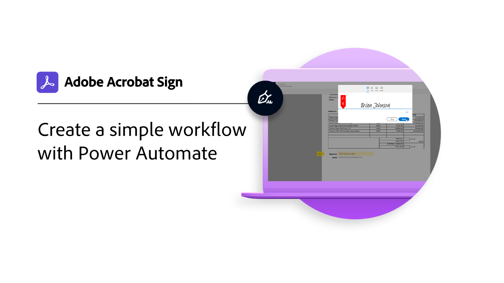
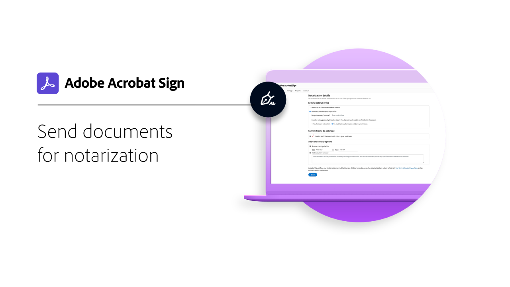
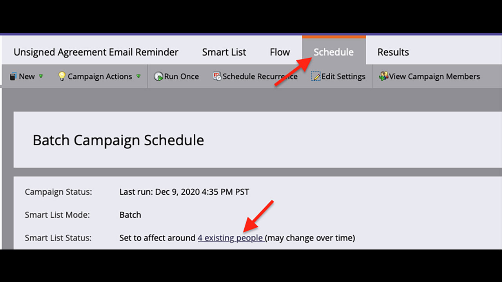

# 集成概述

您可以在公司已使用的其他应用程序(例如Microsoft、Salesforce、Workday和Marketo)中使用Acrobat Sign。 通过这些集成指南和教程，了解如何简化电子签名工作流程。

>[!NOTE]
> 如果您在访问这些功能时遇到了问题，请联系您组织的管理员，确保集成已启用。

## 新增功能

>[!BEGINTABS]

>[!TAB 设置大文件和推送映射]

了解如何在Salesforce中设置[大文档和推送协议服务](salesforce-large-files.md)。

>[!TAB 设置自动更新]

了解如何轻松地将您的帐户链接到Salesforce以获取[自动更新](salesforce-automatic-updates.md)。

>Microsoft Teams的[!TAB “文档”选项卡集成]

了解如何直接从[!DNL Microsoft Teams]中的[“文档”选项卡](acrobat-sign-teams-documents-tab.md)发送文档以供签名。

>[!ENDTABS]

## Microsoft集成教程

<table style="table-layout:fixed">
<tr>
  <td>
    
    

    <a href="fill-and-sign-doc-microsoft-outlook.md"><strong>填写并登录Microsoft Outlook</strong></a>
    

    <em>直接在Microsoft Outlook中填写并签署表单</em>
     
  </td>
  <td>
    
    

    <a href="send-for-signature-with-outlook.md"><strong>在Outlook中发送以供签名</strong></a>
    

    <em>直接在Microsoft Outlook中发送文档以供签名</em>
     
  </td>
  <td>
    
    

    <a href="send-for-signature-with-sharepoint-online.md"><strong>在SharePoint Online中发送以供签名</strong></a>
    

    <em>直接在Sharepoint Online中发送文档以供签名</em>
     
  </td>
   <td>
    
    

    <a href="track-an-agreement-with-sharepoint-online.md"><strong>在SharePoint Online中跟踪</strong></a>
    

    <em>直接在Microsoft Sharepoint中跟踪协议的进度</em>
     
  </td>
</tr>
<tr>
  <td>
    
    

    <a href="integrate-web-form-sharepoint-online.md"><strong>将Web表单与[!DNL SharePoint Online]</strong></a>集成
    

    <em>了解如何将从Web表单收集的数据映射到[!DNL SharePoint]列表</em>
     
  </td>
  <td>
    
    

    <a href="auto-archive-sharepoint-power-automate.md"><strong>使用[!DNL Power Automate]</strong></a>自动存档[!DNL SharePoint]中的文件
    

    <em>了解如何使用[!DNL Power Automate]</em>将已签名的文档自动存档到[!DNL SharePoint]库
     
  </td>
  <td>
    
    

    <a href="documentautomation.md"><strong>使用[!DNL Acrobat Sign for Microsoft Power Platform]</strong></a>实现文档自动化
    

    <em>了解如何为[!DNL Microsoft Power]个应用程序激活和使用[!DNL Acrobat Sign]和[!DNL Adobe PDF Tools]连接器</em>
     
  </td>
   <td>
    
    

    <a href="adobe-sign-teams-mortgage.md"><strong>在[!DNL Microsoft Teams]</strong></a>中发送以供签名
    

    <em>直接在[!DNL Microsoft Teams]</em>内发送文档以供签名
     
  </td>
</tr>
<tr>
  <td>
    
    

    <a href="live-sign-microsoft-teams.md"><strong>适用于[!DNL Microsoft Teams]</strong></a>的Adobe Acrobat Sign实时登录
    

    <em>了解如何创建类似于[!DNL Microsoft Teams]会议期间的亲自签名的在线签名体验</em>
     
  </td>
   <td>
    
    

    [!DNL Microsoft Teams]</strong></a>的<a href="acrobat-sign-teams-documents-tab.md"><strong>“文档”选项卡集成
    

    <em>了解如何直接从[!DNL Microsoft Teams]</em>中的“文档”选项卡发送文档以供签名
     
  </td>
 <td>
    
    

    <a href="simple-workflow-power-automate.md"><strong>使用[!DNL Power Automate]</strong></a>创建简单的工作流
    

    <em>了解如何使用[!DNL Power Automate]连接器创建简单的工作流</em>
     
  </td>
  <td>
    
    

    <a href="advanced-workflow-power-automate.md"><strong>使用Power Automate创建高级工作流</strong></a>
    

    <em>了解如何使用[!DNL Power Automate]连接器创建高级工作流</em>
     
  </td>
<tr>
  <td>
    
    

    <a href="dynamics-customer-service.md"><strong>Microsoft Dynamics 365 for Customer Service</strong></a>
    

    <em>了解如何使用Acrobat Sign和[!DNL Microsoft Dynamics 365] for Customer Service在自助服务客户Web门户上提高客户满意度</em>
     
  </td>
  <td>
    
    

    <a href="dynamics-field-service.md"><strong>Microsoft Dynamics 365 for Field Service</strong></a>
    

    <em>了解如何使用Acrobat Sign、[!DNL Power Automate]和[!DNL Microsoft Dynamics 365]外勤服务来简化客户现场服务</em>
     
  </td>
  <td>
    
    

    <a href="dynamics-sales.md"><strong>Microsoft Dynamics 365 for Sales</strong></a>
    

    <em>了解如何使用Acrobat Sign和[!DNL Microsoft Dynamics 365]销售版自动执行销售报价签名流程</em>
     
  </td>
  <td>
    
    

     
  </td>
</tr>
</table>

## [!DNL Notarize]个集成教程

<table style="table-layout:fixed">
<tr>
  <td>
    
    

    <a href="send-document-notarize.md"><strong>发送文档进行公证</strong></a>
    

    <em>了解如何发送文档进行公证</em>
     
  </td>
  <td>
    
    

     
  </td>
  <td>
    
    

     
  </td>
  <td>
    
    

     
  </td>
</tr>
</table>

## Salesforce集成教程

<table style="table-layout:fixed">
<tr>
  <td>
    
    

    <a href="create-an-agreement-template.md"><strong>适用于[!DNL Salesforce]</strong></a>的Document Builder
    

    <em>了解如何使用Document Builder为[!DNL Salesforce]</em>创建可重复使用的文档模板
     
  </td>
  <td>
    
    

    <a href="set-up-data-mapping.md"><strong>设置数据映射</strong></a>
    

    <em>在签署协议后将数据拉回Salesforce</em>
     
  </td>
  <td>
    
    

    <a href="set-up-merging-map.md"><strong>在Salesforce中设置合并映射</strong></a>
    

    <em>了解如何将Salesforce中的数据直接合并到Acrobat Sign文档中</em>
     
  </td>
  <td>
    
    

    <a href="create-a-custom-button.md"><strong>创建自定义按钮</strong></a>
    

    <em>创建自定义按钮，以启动发送流程并自动填充Salesforce中的协议</em>
     
  </td>
</tr>
<tr>
  <td>
    
    

    <a href="salesforce-automatic-updates.md"><strong>设置自动更新</strong></a>
    

    <em>了解如何轻松地将您的帐户链接到Salesforce以获取自动更新</em>
     
  </td>
 <td>
    
    

    <a href="salesforce-large-files.md"><strong>设置大文件和推送映射</strong></a>
    

    <em>了解如何在Salesforce中设置大文档和推送协议服务</em>
     
  </td>
  <td>
      
      

       
  </td>
  <td>
      
      

       
  </td>
</tr>
</table>

## Workday集成教程

<table style="table-layout:fixed">
<tr>
 <td>
    
    

    <a href="acrobat-sign-workday-onboarding.md"><strong>Acrobat Sign + Workday新员工入职</strong></a>
    

    <em>了解如何使用Acrobat Sign + Workday简化入门培训工作流程</em>
     
  </td>
 <td>
    
    

     
  </td>
  <td>
    
    

     
  </td>
  <td>
    
    

     
  </td>
</tr>
</table>

## Marketo集成教程和配置指南

<table style="table-layout:fixed">
<tr>
  <td>
    
    

    <a href="marketo-salesforce-sms.md"><strong>使用适用于Salesforce的Acrobat Sign和Marketo发送通知</strong></a>
    

    <em>了解如何发送短信、电子邮件或推送通知来让签名者知道协议正在执行中</em>
     
  </td>
  <td>
    
    

    <a href="marketo-salesforce-reminder.md"><strong>使用适用于Salesforce的Adobe Sign和Marketo视频教程发送提醒</strong></a>
    

    <em>了解当协议在一段时间后仍未签名时，如何从Marketo发送电子邮件提醒</em>
     
  </td>
  <td>
    
    

    <a href="marketo-salesforce-reminder.md"><strong>使用适用于Salesforce的Acrobat Sign和Marketo配置指南发送提醒</strong></a>
    

    <em>了解当协议在一段时间后仍未签名时，如何从Marketo发送电子邮件提醒</em>
     
  </td>
   <td>
    
    

    <a href="marketo-dynamics-reminder.md"><strong>使用Acrobat Sign for Microsoft Dynamics和Marketo发送提醒</strong></a>
    

    <em>了解如何在协议在一段时间后仍未签名时发送电子邮件提醒</em>
     
  </td>
</tr>
<tr>
  <td>
    
    

    <a href="marketo-dynamics-sms.md"><strong>使用Acrobat Sign for Microsoft Dynamics和Marketo发送通知</strong></a>
    

    <em>了解如何发送短信、电子邮件或推送通知来让签名者知道协议正在执行中</em>
     
  </td>
  <td>
    
    

     
  </td>
  <td>
    
    

     
  </td>
  <td>
    
    

     
  </td>
</tr>
</table>
