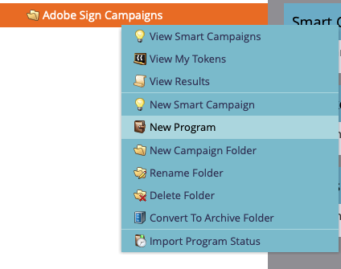
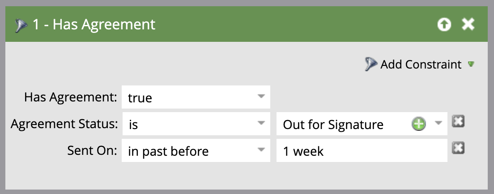

# 使用Acrobat Sign for Microsoft Dynamics 365和Marketo发送提醒

了解当协议在一段时间后仍未签名时，如何发送电子邮件提醒。 此集成使用Acrobat Sign、Acrobat Sign for Microsoft Dynamics、Marketo和Marketo Microsoft Dynamics Sync。

## 先决条件

1. 安装Marketo Microsoft Dynamics Sync。

   [此处](https://experienceleague.adobe.com/docs/marketo/using/product-docs/crm-sync/microsoft-dynamics/marketo-plugin-releases-for-microsoft-dynamics.html?lang=zh-Hans)提供了Microsoft Dynamics Sync的信息和最新插件。

1. 安装[Acrobat Sign for Microsoft Dynamics](https://appsource.microsoft.com/zh-cn/product/dynamics-365/adobesign.f3b856fc-a427-4d47-ad4b-d5d1baba6f86)。

   [此处](https://helpx.adobe.com/ca/sign/using/microsoft-dynamics-integration-installation-guide.html)提供了有关此插件的信息。

## 查找自定义对象

完成Marketo Microsoft Dynamics Sync和Acrobat Sign for Dynamics配置后，Marketo管理终端中会显示两个新选项。


1. 单击&#x200B;**[!UICONTROL Dynamics实体同步]**。

   在同步自定义实体之前，必须禁用同步。 如果这是您第一次这样做，请单击&#x200B;**同步架构**。 否则，请单击&#x200B;**刷新架构**。

   

## 同步自定义对象

1. 在右侧，找到基于[!UICONTROL 潜在客户]、[!UICONTROL 联系人]和[!UICONTROL 帐户]的自定义对象。

   * 若要在[!UICONTROL 潜在顾客]尚未在Dynamics中签署协议时发送提醒，请为&#x200B;**[!UICONTROL 潜在顾客]**&#x200B;下的对象启用&#x200B;**同步**。

   * 若要在[!UICONTROL 联系人]尚未在Dynamics中签署协议时发送提醒，请为&#x200B;**[!UICONTROL 联系人]**&#x200B;下的对象启用&#x200B;**同步**。

   * 若要在[!UICONTROL 帐户]尚未在Dynamics中签署协议时发送提醒，请为&#x200B;**[!UICONTROL 帐户]**&#x200B;下的对象启用&#x200B;**同步**。

   * 在所需的&#x200B;**[!UICONTROL 主页]**（[!UICONTROL 潜在客户]、[!UICONTROL 联系人]或[!UICONTROL 帐户]）下为协议对象&#x200B;**启用同步**。

   

1. 在新窗口中，在“协议”下选择您想要的属性，然后启用“**约束**”和“**触发器**”下的框，以便向您的营销活动显示它们。

   

   

1. 在自定义对象上启用同步后重新激活同步。

   返回管理员终端，单击&#x200B;**Microsoft Dynamics**，然后单击&#x200B;**启用同步**。

   

   

## 创建程序和令牌

1. 在Marketo的“营销活动”部分，右键单击左边栏上的&#x200B;**“营销活动”**。

   选择“**新建营销活动文件夹**”，并为其命名。

   

1. 右键单击已创建的文件夹，选择&#x200B;**新建程序**，然后为其命名。

   将其余所有内容保留为默认值，然后单击“**创建**”。

   

   

1. 单击“**我的令牌**”，然后将“**电子邮件脚本**”拖到画布上。

   

1. 为其命名，然后单击&#x200B;**单击以编辑**。

   

1. 在右侧展开&#x200B;**[!UICONTROL 自定义对象]**，然后展开&#x200B;**[!UICONTROL 协议]**&#x200B;对象。

   查找[!UICONTROL 姓名]、协议状态、发送日期和当前签名者URL并将其拖动到画布上。

1. 使用这些令牌编写Velocity脚本以显示为期一周未签名的协议的协议URL。 以下示例将当前日期与“发送日期”进行比较：

   ```
   #foreach($agreement in $adobe_agreementList)
       #if($agreement.adobe_esagreementstatus == "Out for Signature")
           #set($todayCalObj = $date.toCalendar($date.toDate("yyyy-MM-dd",$date.get('yyyy-MM-dd'))) )
           #set($dateSentCalObj = $date.toCalendar($date.toDate("yyyy-MM-dd",$agreement.adobe_datesent)) )
           #set($dateDiff = ($todayCalObj.getTimeInMillis() - $dateSentCalObj.getTimeInMillis()) / 86400000 )
   
           #if($dateDiff >= 7)
               #set($agreementName = $agreement.adobe_name)
               #set($agreementURL = $agreement.adobe_currentsignerurl.substring(8))
               #break
           #else
           #end
       #else
       #end
   #end
   
   #if(${agreementName})
       <a href="https://${agreementURL}">${agreementName}</a>
   #else
       Please contact us. 
   #end
   ```

1. 单击&#x200B;**[!UICONTROL 保存]**。

## 创建提醒并添加个性化设置

个性化设置示例包括：签名者的姓名、协议名称、协议链接等。

1. 右键单击您创建的程序，单击&#x200B;**[!UICONTROL 新建本地资源]**，然后选择&#x200B;**[!UICONTROL 电子邮件]**。

   

1. 在新选项卡中，为电子邮件输入&#x200B;**[!UICONTROL 名称]**&#x200B;和&#x200B;**[!UICONTROL 描述]**，然后从模板选取器中选择一个模板。

   

1. 单击&#x200B;**[!UICONTROL 创建]**。

1. 设置&#x200B;**[!UICONTROL 发件人姓名]**&#x200B;和&#x200B;**[!UICONTROL 发件人地址]**。

   

1. 单击消息正文以激活编辑器。

   单击&#x200B;**[!UICONTROL 插入令牌]**&#x200B;按钮，查找您创建的自定义协议URL令牌，然后单击&#x200B;**[!UICONTROL 插入]**。 完成自定义电子邮件，然后单击&#x200B;**[!UICONTROL 保存]**。

   

1. 使用分配了协议的配置文件进行预览。

   您应该会看到一个指向以协议名称作为标签的URL的链接。

   

## 设置Smart Campaign筛选器

1. 右键单击您创建的程序，然后单击&#x200B;**[!UICONTROL 新建Smart Campaign]**。

   

1. 为它指定您选择的名称，然后单击“**[!UICONTROL 创建]**”。

   

1. 搜索，然后单击并将&#x200B;**[!UICONTROL 具有协议]**&#x200B;拖动到智能列表中。

   

   在&#x200B;**[!UICONTROL 添加约束]**&#x200B;中应提供您向触发器公开的字段。

1. 选择&#x200B;**[!UICONTROL 协议状态]**&#x200B;以及您希望作为筛选依据的任何其他字段。

   对于添加的每个字段，定义作为筛选依据的值。 在这种情况下，仅当&#x200B;**[!UICONTROL 协议状态]**&#x200B;为&#x200B;*已发出进行签名*&#x200B;且&#x200B;**[!UICONTROL 发送日期]**&#x200B;在1周前&#x200B;*时*&#x200B;才会触发。

   

   >[!NOTE]
   >
   > 如果您希望此市场活动仅针对某些协议运行，请向约束添加唯一标识符，如&#x200B;**Name**。

1. 确认市场活动受众，并在“计划”选项卡中查看符合条件的受众。

   

## 设置智能营销活动流

由于使用了市场活动过滤器&#x200B;**距到期日天数**，因此您可以对该市场活动使用计划的重复周期。

1. 单击[!UICONTROL 智能营销活动]中的&#x200B;**[!UICONTROL 流]**&#x200B;选项卡。

   搜索&#x200B;**发送电子邮件**&#x200B;流并将其拖动到画布上，然后选择您在上一部分中创建的提醒电子邮件。

   

1. 单击“智能营销活动”中的&#x200B;**[!UICONTROL 计划]**&#x200B;选项卡。 请确保在&#x200B;**智能营销活动设置**&#x200B;中，营销活动流限制为每个人仅运行一次。 然后，单击&#x200B;**计划定期**&#x200B;选项卡。

   

1. 将&#x200B;**计划**&#x200B;设置为&#x200B;_每天_。 如有必要，选择市场活动的起始日期、时间以及终止日期。

   
