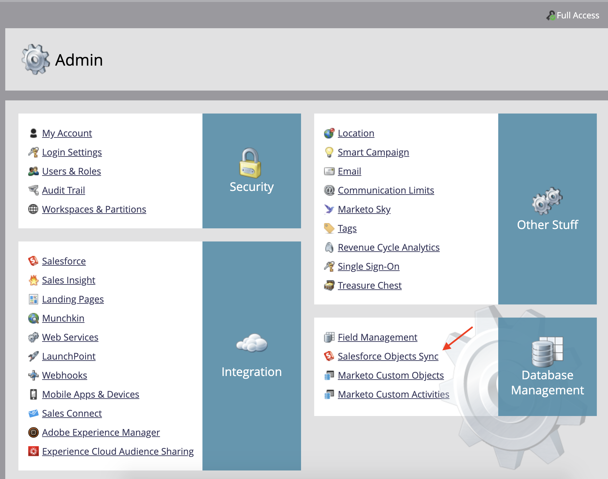
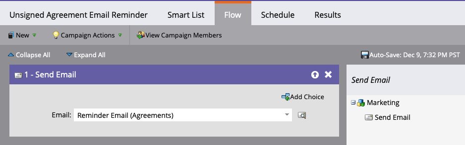
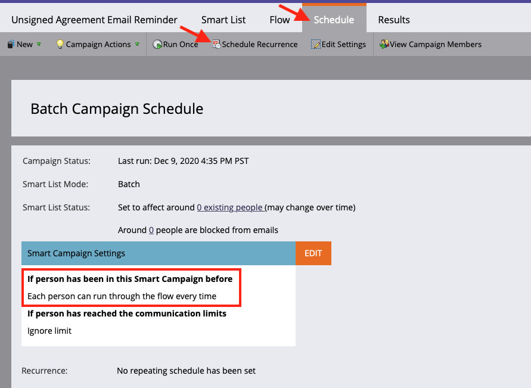

# 使用适用于Salesforce的Acrobat Sign和Marketo配置指南发送提醒

了解当协议在一段时间后仍未签名时，如何从Marketo发送电子邮件提醒。 此集成使用Acrobat Sign、适用于Salesforce的Acrobat Sign、Marketo以及Marketo和Salesforce Sync。

## 先决条件

1. 安装Marketo Salesforce Sync。

   提供了用于Salesforce同步的信息和最新插件 [此处。](https://experienceleague.adobe.com/docs/marketo/using/product-docs/crm-sync/salesforce-sync/understanding-the-salesforce-sync.html)

1. 安装适用于 Salesforce 的 Acrobat Sign.

   有关此增效工具的信息 [此处。](https://helpx.adobe.com/ca/sign/using/salesforce-integration-installation-guide.html)

## 查找自定义对象

当Marketo Salesforce同步和适用于Salesforce的Acrobat Sign配置完成时，Marketo管理终端中会显示几个新选项。




1. 单击 **同步架构** 如果是第一次了。 否则，请单击 **刷新架构**&#x200B;的

   

1. 如果全局同步正在运行，请单击 **禁用全局同步**&#x200B;的

   

1. 单击 **刷新架构**&#x200B;的

   

## 同步自定义对象

在右侧，查看潜在客户、联系人和基于帐户的自定义对象。

**启用同步** 如果您希望在潜在客户尚未在Salesforce中签署协议时发送提醒，请为潜在客户下的对象发送提醒。

**启用同步** 如果您希望在联系人尚未在Salesforce中签署协议时发送提醒，请选中联系人下的对象。

**启用同步** 如果您希望在帐户未在Salesforce中签署协议时发送提醒，请为帐户下的对象发送提醒。

1. **启用同步** 对于 **协议** 在所需父级（潜在客户、联系人或帐户）下显示的对象。 对要同步的任何其他自定义对象执行此操作。

   

1. 以下资源演示如何 **启用同步**&#x200B;的

   

   

## 向触发器公开自定义对象字段

1. 取消激活全局同步后，选择您已为其启用同步的协议自定义对象，然后 **编辑可见字段**&#x200B;的

1. 选中触发器列中的“协议名称”字段，将其公开给您的营销活动操作触发器。 选中要过滤的任何其他字段，然后 **保存**&#x200B;的

   

   

1. 完成在自定义对象上启用同步并显示触发器值后，请记住重新激活同步：

   

## 创建程序和令牌

1. 在Marketo的“营销活动”部分，右键单击 **营销活动** 在左侧栏中，选择 **新的Campaign文件夹**，并为其命名。

   

1. 右键单击创建的文件夹，选择 **新计划**，并为其命名。 将所有其他内容保留为默认值，然后单击 **创建**&#x200B;的

   

   

1. 单击 **我的令牌**，然后拖动  **电子邮件脚本** 到画布上。

   

1. 为其命名，然后单击 **单击以编辑**&#x200B;的

   

1. 扩展 **自定义对象** ，然后将 **协议** 对象。 查找协议名称、协议状态、签名日期和签名URL并将其拖到画布上。

1. 使用这些令牌编写Velocity脚本，以显示一周内未签名的协议的协议URL。 下面的示例将当前日期与发送日期进行比较：

   ```
   #foreach($agreement in $echosign_dev1__SIGN_Agreement__cList)
       #if($agreement.echosign_dev1__Status__c == "Out for Signature")
           #set($todayCalObj = $date.toCalendar($date.toDate("yyyy-MM-dd",$date.get('yyyy-MM-dd'))) )
           #set($dateSentCalObj = $date.toCalendar($date.toDate("yyyy-MM-dd",$agreement.echosign_dev1__DateSent__c)) )
           #set($dateDiff = ($todayCalObj.getTimeInMillis() - $dateSentCalObj.getTimeInMillis()) / 86400000 )
   
           #if($dateDiff >= 7)
               #set($agreementName = $agreement.Name)
               #set($agreementURL = $agreement.echosign_dev1__Signing_URL__c.substring(8))
               #break
           #else
           #end
       #else
       #end
   #end
   
   #if(${agreementName})
       <a href="https://${agreementURL}">${agreementName}</a>
   #else
       Please contact us. 
   #end
   ```

1. 单击&#x200B;**保存**。

## 创建提醒并添加个性化

个性化示例包括：签名者的姓名、协议名称、协议链接等。

1. 右键单击您创建的程序，然后单击 **新建本地资源**，然后选择。 **电子邮件**&#x200B;的

   

1. 在新选项卡中，输入 **名称** 和 **说明** ，然后从模板选取器中选择一个模板。 单击&#x200B;**创建**.

   

1. 设置 **源名称** 和 **发件人地址**&#x200B;的

   

1. 单击消息正文以激活编辑器。 单击 **插入令牌** 按钮，找到您创建的自定义协议URL令牌，然后单击 **插入**&#x200B;的 完成自定义电子邮件，然后单击 **保存**&#x200B;的

   

1. 使用分配了协议的配置文件进行预览。 您应看到一个指向URL的链接，其中“协议名称”为标签。

   

## 设置智能营销活动过滤器

1. 右键单击您创建的程序，然后单击 **新的智能营销活动**&#x200B;的

   

1. 为其指定您选择的名称，然后单击 **创建**&#x200B;的

   

1. 搜索，然后单击并拖动 **有协议** 到“智能列表”。

   

1. 您向触发器显示的字段现在应可在 **添加约束**&#x200B;的 选择 **协议状态** 以及要作为筛选依据的任何其他字段。 对于添加的每个字段，定义筛选依据的值。 在这种情况下，只有当 **协议状态** 已发出进行签名，并且 **发送日期** 已经过了7天。

   

   >[!NOTE]
   >
   > 为约束定义一个唯一标识符，例如 **协议名称**，如果您希望仅针对某些协议运行此营销活动。

1. 确认营销活动受众，并查看谁将有资格访问“计划”选项卡。

   

## 设置智能活动流程

因为营销活动筛选器 **未签名的天数** 已使用，您可以为市场活动使用预设的重复项。

1. 单击 **流量** 选项卡。 搜索并拖动 **发送电子邮件** 排列到画布上，并选择您在上一部分中创建的提醒电子邮件。

   

1. 单击 **计划** 选项卡。 确保在 **智能营销活动设置**&#x200B;的 然后，单击 **计划重复次数** 选项卡。

   

1. 设置 **计划** 至“每天”，根据需要选择市场活动的起始日期和时间以及终止日期。

   

>[!TIP]
>
>本教程是课程的一部分 [利用适用于Salesforce的Acrobat Sign和Marketo加快销售周期](https://experienceleague.adobe.com/?recommended=Sign-U-1-2021.1) 免费下载Experience League!
