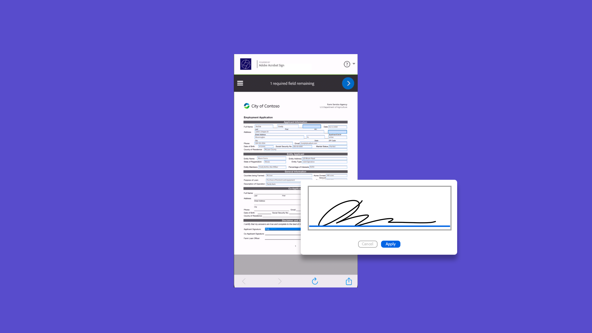

# 移动设备概述

在移动设备上发送文档以供签名、跟踪电子签名进度并获取实时更新。

## 新增功能

>[!BEGINTABS]

>[!TAB 适合移动设备的视图]

了解如何使用[移动友好视图](mobile-friendly.md)在移动设备上填写表单。

>[!TAB 创建适合移动设备的视图]

了解如何无缝生成[移动友好](create-mobile-friendly.md)文档，无需任何开发人员支持。

>[!ENDTABS]

<table style="table-layout:fixed">
<tr>
  <td>
    
    

    <a href="sign-mobile.md"><strong>随时随地签署文档</strong></a>
    

    <em>了解如何使用Acrobat Sign移动应用程序签署文档</em>
     
  </td>
  <td>
    
    

    <a href="mobile-friendly.md"><strong>适合移动设备的视图</strong></a>
    

    <em>了解如何使用适合移动设备的视图在移动设备上填写表单</em>
     
  </td>  
  <td>
    
    

    <a href="create-mobile-friendly.md"><strong>创建适合移动设备的视图</strong></a>
    

    <em>了解如何无缝生成对移动设备友好的文档，无需任何开发人员支持</em>
     
  </td>
   <td>
    
    

    <a href="liquidmode.md"><strong>Acrobat Sign中的Liquid Mode</strong></a>
    

    <em>了解Liquid Mode如何改善移动签名体验</em>
     
  </td>
</tr>
<tr>
  <td>
    
    

    <a href="https://apps.apple.com/us/app/adobe-acrobat-sign/id481082197_blank"><strong>下载适用于iOS的Acrobat Sign移动应用程序</strong></a>
    

    <em>从App Store下载Acrobat Sign移动应用程序</em>
     
  </td>
  <td>
    
    

    <a href="https://play.google.com/store/apps/details?id=com.adobe.echosign&hl=en&pli=1_blank"><strong>下载适用于Android的Acrobat Sign移动应用程序</strong></a>
    

    <em>从Google Play下载Acrobat Sign移动应用程序</em>
     
  </td>
  <td>
    
    

     
  </td>
  <td>
    
    

     
  </td>
</tr>
</table>
