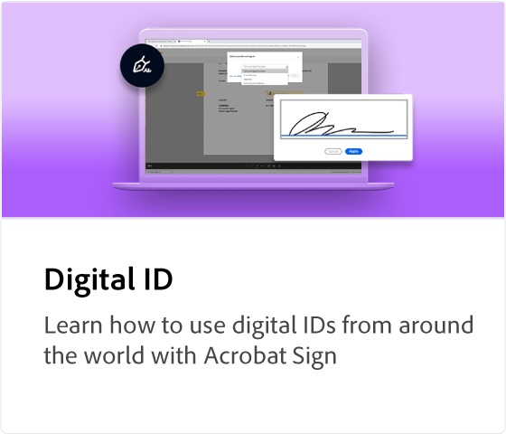
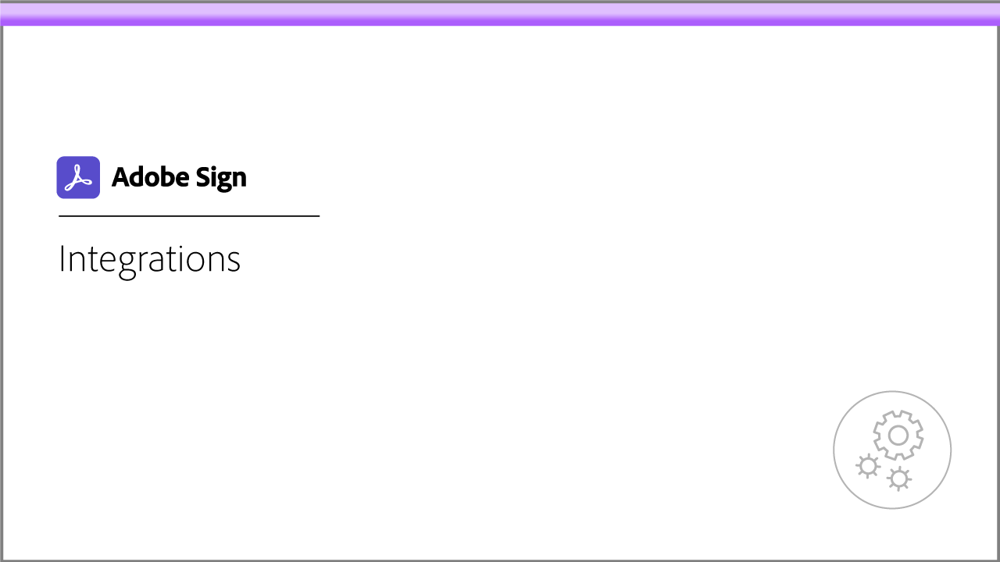
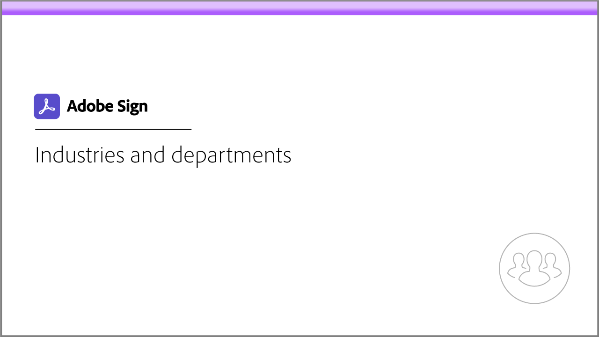

# Acrobat Sign教程

Acrobat Sign是Adobe Document Cloud解决方案，可通过集成、API、高级身份验证、其他管理员功能等进行扩展，以满足组织的需求。 在这里，您可以找到各种专为让初学者和管理员快速掌握Acrobat Sign而设计的学习体验。

## 学习路径

<table style="table-layout:fixed">
<tr>
  <td>
    
  </td>
  <td>
    
  </td>  
  <td>
    
  </td>
  <td>
    
  </td>
</tr>
<tr>
  <td>
    
  </td>
  <td>
    
  </td>
  <td>
    
  </td>
   <td>
    
  </td>
</tr>
<tr>
  <td>
    
  </td>  
</tr>
</table>
