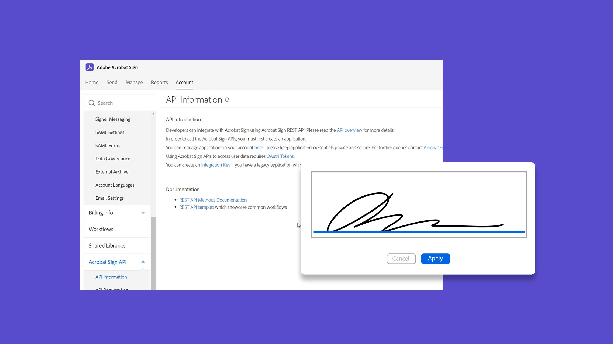

# Acrobat Sign教程

Acrobat Sign是一款Adobe Document Cloud解决方案，可进行扩展以满足您组织的需求，包括集成、API、高级身份验证、其他管理员功能等。 您可以在此处找到大量学习体验，旨在快速让初学者和管理者了解Acrobat Sign的最新版本。

## 学习路径

<table style="table-layout:fixed">
<tr>
  <td>
    
    

      <a href="sign-beginner-tutorials/beginner-users-overview.md"><strong>快速入门</strong></a>
      

      <em>了解如何发送、签署和跟踪文档</em>
       
  </td>
  <td>
    
    

      <a href="sign-advanced-users/advanced-users-overview.md"><strong>高级任务</strong></a>
      

      <em>通过特定的任务和自动化超越基础知识</em>
       
  </td>  
  <td>
    
    

      <a href="admin/intro-admin-overview.md"><strong>管理</strong></a>
      

      <em>您的组织的基本到高级设置提示</em>
       
  </td>
  <td>
    
     

      <a href="digitalid/digitalid-overview.md"><strong>数字ID</strong></a>
      

      <em>了解如何在Acrobat Sign中使用单词周围的数字身份证</em>
       
  </td>
</tr>
<tr>
  <td>
    
    

      <a href="integrations/integrations-overview.md"><strong>集成</strong></a>
      

      <em>直接将Acrobat Sign添加到您的组织已使用的其他应用程序中</em>
       
  </td>
  <td>
    
    

      <a href="sign-usecase/expand-inspire-overview.md"><strong>行业和部门</strong></a>
      

      <em>探索现实行业和部门的用例</em>
       
  </td>
  <td>
    
    

      <a href="develop/develop-overview.md"><strong>修改照片</strong></a>
      

      <em>获取有关Acrobat Sign I/O的开发资源</em>
       
  </td>
   <td>
    
    

      <a href="deploy-overview.md"><strong>部署</strong></a>
      

      <em>在组织内部署Acrobat Sign的洞察力和最佳实践</em>
       
  </td>
</tr>
<tr>
  <td>
    
    

      <a href="mobile/mobile-overview.md"><strong>移动设备</strong></a>
      

      <em>在移动设备上发送、签名和获取实时更新</em>
       
  </td>  
</tr>
</table>
