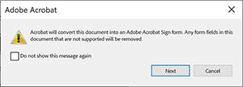

# Acrobat Sign文本标记

了解如何构建带有文本标记的Acrobat Sign表单字段。 文本标记可以直接添加到创作工具(例如Microsoft Word、Adobe InDesign)中，或者如果您有PDF，也可以在Acrobat中添加。 它们可显着减少在Acrobat Sign中使用的文档准备工作。 在Acrobat Sign中上传带标签的文档后，可将它设置为模板 — 无需任何人为其文档添加字段。

## 入门

文本标记是放置在文档中任意位置的带有唯一格式的文本片段，这些文本片段
上传到Acrobat Sign时自动识别为字段。

    ！[文本标记的语法](../assets/syntax.png)

可将文本标记直接添加到创作工具，如Microsoft Word、Adobe InDesign，或者
你有一个PDF— Acrobat。 文本标记可显着减少准备工作量
在Acrobat Sign中使用的文档。

## 在Microsoft Word中添加标签

要将文本标记添加到Microsoft Word文档，请观看此[视频教程](text-tagging-word.md)。

## 在Acrobat中添加标签

Adobe Acrobat具有强大的拖放表单创作环境。 通过在Acrobat中应用文本标签，可以利用Acrobat Sign中提供的其他功能。

1. 在Acrobat中打开表单。

1. 从&#x200B;**[!UICONTROL 所有工具]**&#x200B;面板中选择&#x200B;**[!UICONTROL 准备表单]**。

1. 选择&#x200B;**[!UICONTROL 创建表单]**。

1. 从&#x200B;**[!UICONTROL 选项]**&#x200B;面板下拉菜单中选择&#x200B;**[!UICONTROL 准备表单以进行电子签名]**。

   

1. 选择“**[!UICONTROL 下一步]**”进行确认。

   

1. 双击某个字段以显示&#x200B;**[!UICONTROL 属性]**&#x200B;对话框。

   使用[Acrobat Sign文本标记指南](https://helpx.adobe.com/cn/sign/using/text-tag.html)中详述的语法更改表单字段名称。

1. 例如，您可以在字段名称中键入&#x200B;*OInt_es_:signer1:optinitials*，以使缩写签名字段成为可选字段。

   

   文本标记会添加到表单字段名称中，并且与在Microsoft Word（或其他创作工具）中使用的语法不同，大括号不包含在内。

   只需重命名表单字段，即可在“字段”面板中添加文本标记。

   

1. 保存并关闭该文件。

1. 在Acrobat Sign中上传文件，并创建可重复使用的模板，如下一部分所述。

## 创建可重用模板

创建加标签的文档后，将其设置为可重复使用的模板，无需任何人为文档添加字段。

若要创建可重复使用的模板，请查看此[视频教程](../sign-advanced-users/create-a-template.md)。
