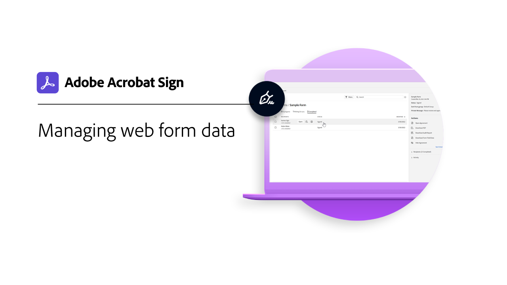

# 高级任务概述

了解如何立即将文档发送给数百个收件人以供签名、为您的网站设置可签名文档、管理签名事务，以及创建和管理文档模板。 这些教程适用于任何熟悉发送和请求签名基本知识并希望了解Acrobat Sign如何为其工作的人。

## 新增功能

>[!BEGINTABS]

>[!TAB 批量发送]

了解如何只需几个简单的步骤，即可同时[收集任何文档的数千个](megasign.md)签名。

>[!TAB Acrobat Sign中的身份验证方法]

了解Acrobat Sign中可用的一系列方法，以[验证](authentication-methods.md)签名文档的人员的身份。

>[!ENDTABS]

## 发送

<table style="table-layout:fixed">
<tr>
  <td>
    
    

    <a href="setting-up-routing.md"><strong>设置签名顺序</strong></a>
    

    <em>设置多个签名者的签名顺序</em>
     
  </td>
  <td>
      
    

    <a href="delegate-signature.md"><strong>使用委派人角色</strong></a>
    

    <em>使用委派人角色将文档发送给中介，然后中介可将文档路由以供签名</em>
     
  </td>
  <td>
    
    

    <a href="add-an-approver.md"><strong>使用审批人角色</strong></a>
    

    <em>向合同审批流程添加审批人角色</em>
     
  </td>
  <td>
    
    

    <a href="authentication-methods.md"><strong>Acrobat Sign中的身份验证方法</strong></a>
    

    <em>了解Acrobat Sign中可用的身份验证方法范围</em>
     
  </td>
</tr>
<tr>
  <td>
      
      

      <a href="manage-form-data.md"><strong>管理表单数据</strong></a>
      

      <em>了解如何合并文档中的表单数据</em>
       
    </td>
  <td>
    
    

    <a href="set-up-online-payments.md"><strong>设置在线付款</strong></a>
    

    <em>了解如何在您的文档中设置和接受在线付款</em>
     
  </td>
  <td>
      
      

      <a href="megasign.md"><strong>批量发送</strong></a>
      

      <em>只需几个简单的步骤，即可一次为任何文档收集数百个签名</em>
       
  </td>
 <td>
      
      

      <a href="webform.md"><strong>正在创建Web表单</strong></a>
      

      <em>了解如何创建可以在您的网站上直接进行电子签名的文档</em>
       
  </td>
</tr>
<tr>
  <td>
      
      

      <a href="adobe-sign-text-tagging.md"><strong>Acrobat Sign文本标记</strong></a>
      

      <em>使用Adobe Acrobat通过文本标记构建Acrobat Sign表单字段</em>
       
    </td>
  <td>
    
    

    <a href="text-tagging-word.md"><strong>在[!DNL Microsoft Word]</strong></a>中使用文本标记
    

    <em>了解如何通过在[!DNL Microsoft Word]</em>中添加Acrobat Sign文本标记来创建可重用的文档模板
     
  </td>
  <td>
    
    

     
  </td>
  <td>
    
    

     
  </td>
</tr>
</table>

## 管理

<table style="table-layout:fixed">
<tr>
<td>
    
    

    <a href="creating-a-report.md"><strong>报告和交易使用情况</strong></a>
    

    <em>了解如何生成报告和跟踪交易使用情况</em>
     
  </td>
  <td>
    
    

    <a href="edit-a-template.md"><strong>管理文档模板</strong></a>
    

    <em>编辑或删除库中的模板</em>
     
  </td>
  <td>
    
    

    <a href="modify-webform.md"><strong>修改现有Web表单</strong></a>
    

    <em>了解如何禁用、编辑和重新启用现有Web表单</em>
     
  </td>  
  <td>
    
    

    <a href="manage-webform-data.md"><strong>管理Web表单数据</strong></a>
    

    <em>了解如何跟踪、管理和导出Web表单中的数据</em>
     
  </td>  
</tr>
</table>