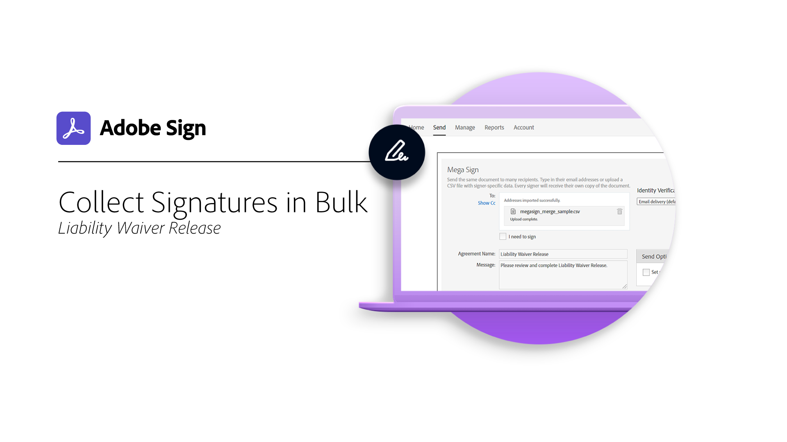

# 高级任务概述

了解如何一次性向100个收件人发送文档以供签名、为网站设置可供签名的文档、管理签名事务以及创建和管理文档模板。 本教程面向已经熟悉发送和请求签名基础知识并希望了解Acrobat Sign为其工作的更多方式的任何人。

## 新增功能

* [Acrobat Sign中的身份验证方法](authentication-methods.md)
了解Acrobat Sign中可用于验证文档签名者身份的方法范围
* [设置在线支付](set-up-online-payments.md)
了解如何在文档中设置和接受在线支付

## 发送

<table style="table-layout:fixed">
<tr>
  <td>
    
    

    <a href="setting-up-routing.md"><strong>设置签名顺序</strong></a>
    

    <em>为多个签名者设置签名顺序</em>
     
  </td>
  <td>
      
    

    <a href="delegate-signature.md"><strong>使用委派人角色</strong></a>
    

    <em>使用委派人角色将文档发送给中介人，然后中介人可以路由文档以供签名</em>
     
  </td>
  <td>
    
    

    <a href="add-an-approver.md"><strong>使用审批人角色</strong></a>
    

    <em>将审批人角色添加到合同审批流程中</em>
     
  </td>
  <td>
    
    

    <a href="authentication-methods.md"><strong>Acrobat Sign中的身份验证方法</strong></a>
    

    <em>了解Acrobat Sign中提供的各种身份验证方法</em>
     
  </td>
</tr>
<tr>
  <td>
      
      

      <a href="manage-form-data.md"><strong>管理表单数据</strong></a>
      

      <em>了解如何整合文档中的表单数据</em>
       
    </td>
  <td>
    
    

    <a href="set-up-online-payments.md"><strong>设置在线支付</strong></a>
    

    <em>了解如何在文档中设置和接受在线支付</em>
     
  </td>
  <td>
      
      

      <a href="megasign.md"><strong>批量发送和收集签名</strong></a>
      

      <em>只需几个简单的步骤，即可一次性收集任意文档的数百个签名</em>
       
  </td>
 <td>
      
      

      <a href="webform.md"><strong>创建Web表单</strong></a>
      

      <em>了解如何创建可以直接在您的网站上以电子方式签名的文档</em>
       
  </td>
</tr>
<tr>
  <td>
      
      

      <a href="adobe-sign-text-tagging.md"><strong>Acrobat Sign文本标记</strong></a>
      

      <em>使用Adobe Acrobat通过文本标记构建Acrobat Sign表单域</em>
       
    </td>
  <td>
    
    

    <a href="text-tagging-word.md"><strong>使用文本标记 [!DNL Microsoft Word]</strong></a>
    

    <em>了解如何通过将Acrobat Sign文本标记添加到 [!DNL Microsoft Word]</em>
     
  </td>
  <td>
    
    

     
  </td>
  <td>
    
    

     
  </td>
</tr>
</table>

## 管理

<table style="table-layout:fixed">
<tr>
<td>
    
    

    <a href="creating-a-report.md"><strong>创建报告</strong></a>
    

    <em>了解如何构建您自己的报告，以便了解文档签名流程</em>
     
  </td>
  <td>
    
    

    <a href="edit-a-template.md"><strong>管理文档模板</strong></a>
    

    <em>从库中编辑或删除模板</em>
     
  </td>
  <td>
    
    

    <a href="modify-webform.md"><strong>修改现有Web表单</strong></a>
    

    <em>了解如何禁用、编辑和重新启用现有Web表单</em>
     
  </td>  
  <td>
    
    

    <a href="manage-webform-data.md"><strong>管理Web表单数据</strong></a>
    

    <em>了解如何从Web表单跟踪、管理和导出数据</em>
     
  </td>  
</tr>
</table>