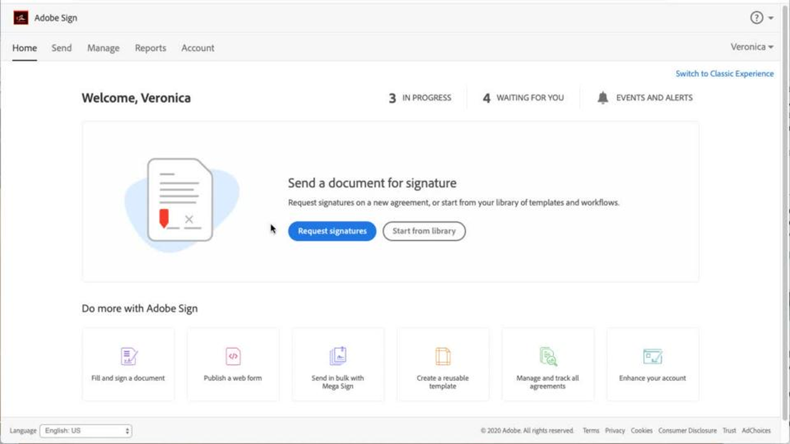
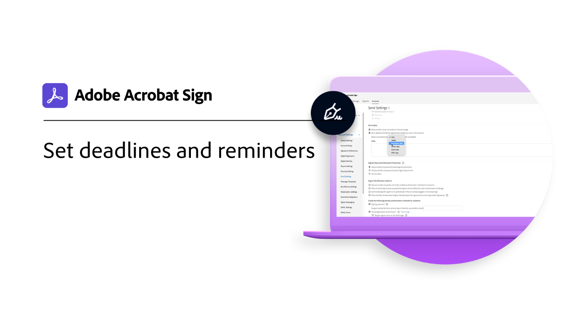

# 快速入门概述

通过这些简短的分步教程，快速了解如何发送、签署和跟踪文档。 快速浏览Acrobat Sign，然后跳转到向一个或多个人发送文档。 此内容旨在让您轻松完成电子签名工作流程。

## 新增功能

* [Acrobat Sign快速入门](new-sender.md)
您是初次使用Acrobat Sign吗？ 本教程是一个很好的起点。
* [设置截止日期和提醒](set-deadlines-reminders.md)
了解如何发送定期电子邮件提醒和截止日期，以帮助快速签署文档

## 发送

<table style="table-layout:fixed">
<tr>
 <td>
    
    

    <a href="quick-tour.md"><strong>工作区基础知识</strong></a>
    

    <em>快速浏览Acrobat Sign工作区以启动并运行</em>
     
  </td>
  <td>
    
    

    <a href="new-sender.md"><strong>Acrobat Sign快速入门</strong></a>
    

    <em>本综合教程是开始使用Acrobat Sign中新发件人的好办法</em>
     
  </td>
  <td>
    
    

    <a href="send-to-single-recipient.md"><strong>发送给单个收件人</strong></a>
    

    <em>登录并了解如何轻松地发送文档以供签名</em>
     
  </td>
  <td>
    
    

    <a href="send-to-multiple-recipients.md"><strong>发送给多个接收者</strong></a>
    

    <em>按照您想要的顺序，将文档发送给多个人进行电子签名</em>
     
  </td>
</tr>
<tr>
  <td>
    
    

    <a href="sending-options.md"><strong>配置发送选项</strong></a>
    

    <em>了解如何在发送文档以请求签名时配置各种选项</em>
     
  </td>
  <td>
    
    

    <a href="adding-fields.md"><strong>向文档中添加字段</strong></a>
    

    <em>了解如何向文档添加不同类型的字段</em>
     
  </td>
  <td>
    
    

    <a href="modify-in-flight.md"><strong>发送后修改文档</strong></a>
    

    <em>修改已在进行的文档</em>
     
  </td>
  <td>
    
    

    <a href="replace-signer.md"><strong>替换签名者</strong></a>
    

    <em>了解如何更改已在进行中的文档的签名者</em>
      
  </td>
</tr>
<tr>
  <td>
      
      

      <a href="set-deadlines-reminders.md"><strong>设置截止日期和提醒</strong></a>
      

      <em>了解如何发送定期电子邮件提醒和截止日期，以帮助快速签署文档</em>
       
    </td> 
  <td>
      
      

       
    </td>
    <td>
      
      

       
    </td>
    <td>
      
      

       
    </td>
</tr>
</table>

## 签名

<table style="table-layout:fixed">
<tr>
  <td>
    
    

    <a href="electronically-sign-a-document.md"><strong>对文档进行电子签名</strong></a>
    

    <em>了解如何使用Acrobat Sign签署发送给您的文档</em>
     
  </td>
  <td>
    
    

    <a href="fill-and-sign.md"><strong>填写并签署文档</strong></a>
    

    <em>填写表单并将电子签名添加到文档</em>
     
  </td>
  <td>
    
    

    <a href="sign-in-person.md"><strong>获取亲自签名</strong></a>
    

    <em>使用Acrobat Sign移动应用程序亲自获取他人的签名</em>
     
  </td>
  <td>
    
    

    <a href="delegate-signing.md"><strong>将签名委派给其他人</strong></a>
    

    <em>了解如何将文档的签名委派给其他人</em>
     
  </td>
</tr>
<tr>
  <td>
    
    

    <a href="sign-with-a-digital-signature.md"><strong>什么是数字签名</strong></a>
    

    <em>了解基于证书的数字签名</em>
     
  </td>
  <td>
    
    

    <a href="sign-with-a-stamp.md"><strong>使用图章进行签名</strong></a>
    

    <em>使用图章将文档标记为已批准或已完成</em>
      
  </td> 
 <td>
    
    

     
  </td>
  <td>
    
    

     
  </td>
</tr>  
</table>

## 管理

<table style="table-layout:fixed">
<tr>
  <td>
    
    

    <a href="manage-and-track.md"><strong>管理和跟踪协议</strong></a>
    

    <em>了解如何管理和跟踪发送以供签名的协议</em>
     
  </td>
  <td>
    
    

    <a href="../sign-advanced-users/create-a-template.md"><strong>创建文档模板</strong></a>
    

    <em>创建可重复使用的文档模板，以提高企业速度和一致性</em>
     
  </td>
  <td>
    
    

     
  </td>
  <td>
    
    

     
  </td>
</tr>
</table>
