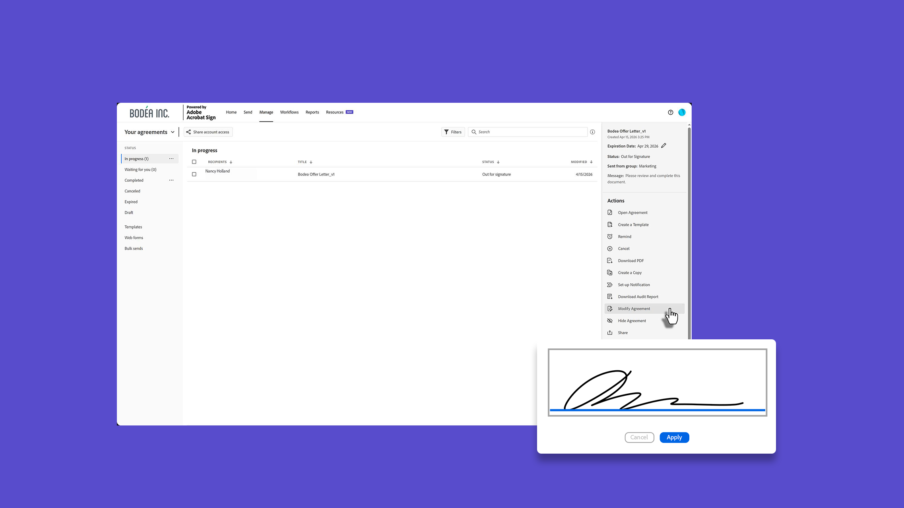
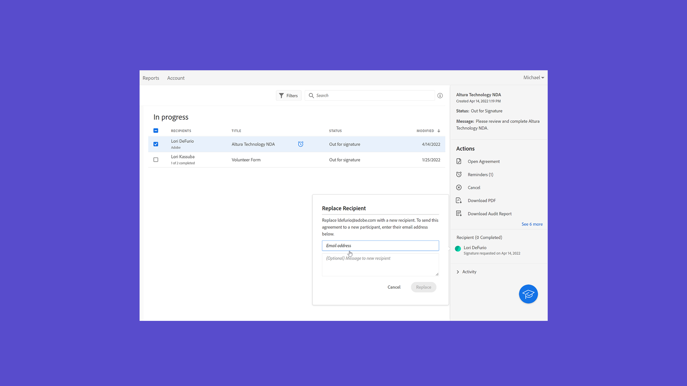
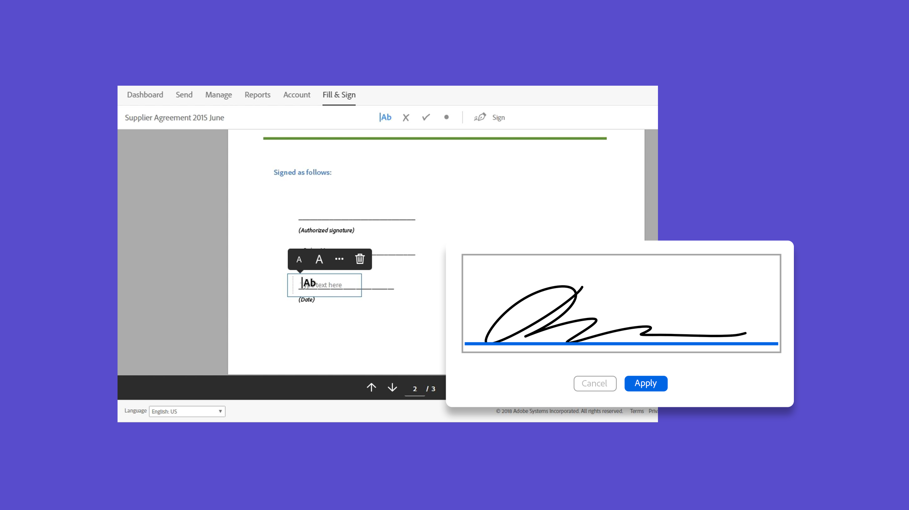
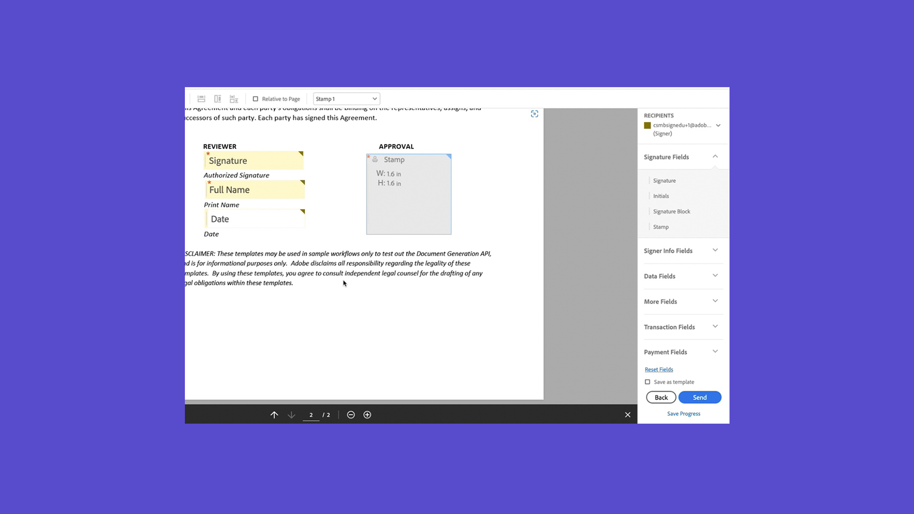

# 快速入门概述

通过这些简短的分步教程，快速了解如何发送、签署和跟踪文档。 快速浏览Acrobat Sign，然后跳转到向一个或多个人发送文档。 此内容旨在让您轻松完成电子签名工作流程。

## 新增功能

>[!BEGINTABS]

>[!TAB 发送后修改文档]

了解如何[修改已发送以供签名的文档](../sign-beginner-tutorials/manage-and-track.md)。

>[!TAB 管理和跟踪协议]

了解如何[管理和跟踪发送以供签名的协议](../sign-beginner-tutorials/manage-and-track.md)。

>[!TAB 对文档进行电子签名]

了解如何[签署](../sign-beginner-tutorials/electronically-sign-a-document.md)通过Acrobat Sign发送给您的文档。

>[!TAB 创建可重复使用的模板]

了解如何创建[可重复使用的文档模板](../sign-advanced-users/create-a-template.md)。

>[!ENDTABS]

## 发送

<table style="table-layout:fixed">
<tr>
  <td>
    
    

    <a href="new-sender.md"><strong>开始使用Acrobat Sign</strong></a>
    

    本教程是 Acrobat Sign 新用户的理想入门之选
     
  </td>
 <td>
    
    

    <a href="quick-tour.md"><strong>工作区基础知识</strong></a>
    

    快速浏览Acrobat Sign工作区以启动并运行
     
  </td>
  <td>
    
    

    <a href="send-to-single-recipient.md"><strong>将文档发送给一位签名者</strong></a>
    

    立即体验，了解发送文档进行签名是如此简单
     
  </td>
  <td>
    
    

    <a href="send-to-multiple-recipients.md"><strong>发送给多个签名者</strong></a>
    

    按您指定的确切顺序，将文档发送给多人进行电子签名
     
  </td>
</tr>
<tr>
  <td>
    
    

    <a href="sending-options.md"><strong>配置发送选项</strong></a>
    

    了解在发送文档以供签名时如何配置各种选项
     
  </td>
  <td>
    
    

    <a href="adding-fields.md"><strong>向文档中添加字段</strong></a>
    

    了解如何向文档添加不同类型的字段
     
  </td>
  <td>
    
    

    <a href="modify-in-flight.md"><strong>发送后修改文档</strong></a>
    

    了解如何修改已在进行的文档
     
  </td>
  <td>
    
    

    <a href="replace-signer.md"><strong>替换签名者</strong></a>
    

    了解如何更改已在进行中的文档的签名者
      
  </td>
</tr>
<tr>
  <td>
      
      

      <a href="set-deadlines-reminders.md"><strong>设置截止日期和提醒</strong></a>
      

      了解如何发送定期电子邮件提醒和截止日期，以帮助快速签署文档
       
    </td> 
  <td>
    
    

    <a href="../sign-advanced-users/create-a-template.md"><strong>创建可重复使用的模板</strong></a>
    

    创建可重复使用的文档模板，为您的组织提升效率并确保风格一致
     
  </td>
    <td>
     
    

    <a href="checkbox-groups.md"><strong>使用复选框组引导所需的选择</strong></a>
    

    了解如何使用复选框组来控制签名者可以在表单上选择多少个选项
     
    </td>
    <td>
      
      

       
    </td>
</tr>
</table>

## 签名

<table style="table-layout:fixed">
<tr>
  <td>
    
    

    <a href="electronically-sign-a-document.md"><strong>对文档进行电子签名</strong></a>
    

    了解使用 Acrobat Sign 来签署他人发送给您的文档是多么简单
     
  </td>
  <td>
    
    

    <a href="fill-and-sign.md"><strong>填写并签署文档</strong></a>
    

    填写表单并将电子签名添加到文档
     
  </td>
  <td>
    
    

    <a href="sign-in-person.md"><strong>获取亲自签名</strong></a>
    

    使用Acrobat Sign移动应用程序亲自获取他人的签名
     
  </td>
  <td>
    
    

    <a href="delegate-signing.md"><strong>将签名委派给其他人</strong></a>
    

    了解如何将文档的签名委派给其他人
     
  </td>
</tr>
<tr>
  <td>
    
    

    <a href="sign-with-a-digital-signature.md"><strong>什么是数字签名</strong></a>
    

    了解基于证书的数字签名
     
  </td>
  <td>
    
    

    <a href="sign-with-a-stamp.md"><strong>使用图章进行签名</strong></a>
    

    使用图章将文档标记为已批准或已完成
      
  </td> 
 <td>
    
    

     
  </td>
  <td>
    
    

     
  </td>
</tr>  
</table>

## 管理

<table style="table-layout:fixed">
<tr>
  <td>
    
    

    <a href="manage-and-track.md"><strong>管理和跟踪您的协议</strong></a>
    

    了解如何管理和跟踪已发送以供签名的协议
     
  </td>
  <td>
    
    

     
  </td>
  <td>
    
    

     
  </td>
  <td>
    
    

     
  </td>
</tr>
</table>
